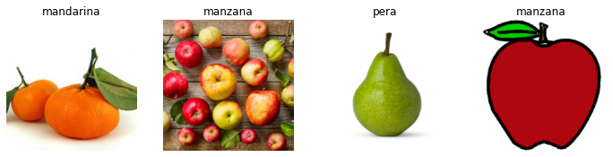
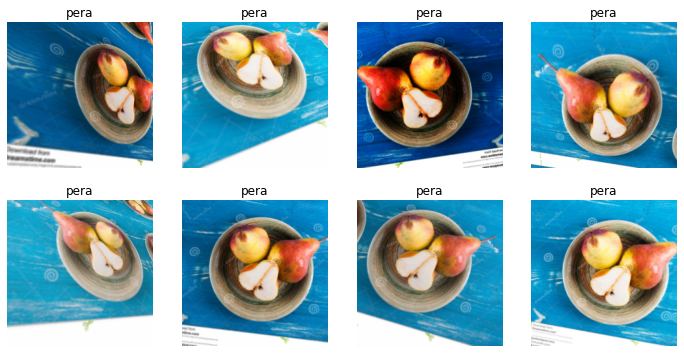
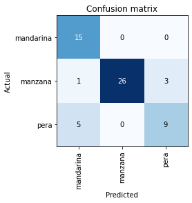
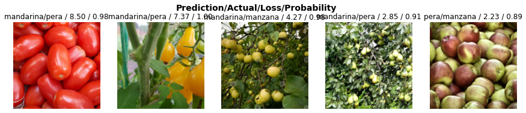

## Preparación del dataset
Para la generación de nuestro dataset, utilizaremos el método de **fastai** *search_images_ddg*. Primero, importamos las dependencias necesarias:


```python
!pip install -Uqq fastbook

from fastai.vision.widgets import * # Importación general del las bibliotecas de visión de fastai
from pathlib import Path

import fastbook
fastbook.setup_book()
from fastbook import *
```

         |████████████████████████████████| 720 kB 5.3 MB/s 
         |████████████████████████████████| 187 kB 37.6 MB/s 
         |████████████████████████████████| 1.2 MB 34.0 MB/s 
         |████████████████████████████████| 49 kB 2.0 MB/s 
         |████████████████████████████████| 56 kB 1.7 MB/s 
         |████████████████████████████████| 561 kB 27.4 MB/s 
         |████████████████████████████████| 51 kB 194 kB/s 
         |████████████████████████████████| 130 kB 37.3 MB/s 
    [?25hMounted at /content/gdrive


Como las descargas se realizarán aleatoriamente de distintas páginas de internet, lo primero que hacemos antes de lanzar la búsqueda es declarar una función auxiliar que nos permita definir un timeout a cada descarga; eso nos evitará errores y tiempos de espera innecesarios:


```python
import signal

def signal_handler(signum, frame):
    raise Exception("Timed out alcanzado")
```

A continuación, definimos unos términos a descargar y los procesamos de forma que se creen directorios con el mismo nombre, para usarlos de salida en las búsquedas de DuckDuckGo:


```python
fruit_types = 'manzana','pera','mandarina'
path = Path('frutas')

if not path.exists():
  path.mkdir()
  for o in fruit_types:
    
    dest = (path/o)
    dest.mkdir(exist_ok=True)
    results = search_images_ddg(f'{o} jpg', max_images=60) # Añadimos la coletilla 'jpg' para reducir errores
    cont = 0
    
    for i in results:
        
        signal.signal(signal.SIGALRM, signal_handler)
        signal.alarm(10) # El timeout para cada imagen será de 10 segundos
        
        print('Descargando imagen número ',cont,' de la clase ',dest)
        try: # Utilizamos un try-except para evitar errores de ejecución por mensajes de error HTTP (404, 522, etc.)
          download_url(i, str(dest) + "/" + str(cont) + ".jpg")
        except:
          print('Error al descargar la imagen')
        
        cont += 1
```

    Descargando imagen número  0  de la clase  frutas/manzana


<style>
    /* Turns off some styling */
    progress {
        /* gets rid of default border in Firefox and Opera. */
        border: none;
        /* Needs to be in here for Safari polyfill so background images work as expected. */
        background-size: auto;
    }
    .progress-bar-interrupted, .progress-bar-interrupted::-webkit-progress-bar {
        background: #F44336;
    }
</style>


<div>
  <progress value='147456' class='' max='147041' style='width:300px; height:20px; vertical-align: middle;'></progress>
  100.28% [147456/147041 00:00<00:00]
</div>


    Descargando imagen número  1  de la clase  frutas/manzana


<style>
    /* Turns off some styling */
    progress {
        /* gets rid of default border in Firefox and Opera. */
        border: none;
        /* Needs to be in here for Safari polyfill so background images work as expected. */
        background-size: auto;
    }
    .progress-bar-interrupted, .progress-bar-interrupted::-webkit-progress-bar {
        background: #F44336;
    }
</style>


<div>
  <progress value='1515520' class='' max='1509927' style='width:300px; height:20px; vertical-align: middle;'></progress>
  100.37% [1515520/1509927 00:00<00:00]
</div>


    Descargando imagen número  2  de la clase  frutas/manzana


<style>
    /* Turns off some styling */
    progress {
        /* gets rid of default border in Firefox and Opera. */
        border: none;
        /* Needs to be in here for Safari polyfill so background images work as expected. */
        background-size: auto;
    }
    .progress-bar-interrupted, .progress-bar-interrupted::-webkit-progress-bar {
        background: #F44336;
    }
</style>


<div>
  <progress value='237568' class='' max='234175' style='width:300px; height:20px; vertical-align: middle;'></progress>
  101.45% [237568/234175 00:00<00:00]
</div>


    Descargando imagen número  3  de la clase  frutas/manzana


<style>
    /* Turns off some styling */
    progress {
        /* gets rid of default border in Firefox and Opera. */
        border: none;
        /* Needs to be in here for Safari polyfill so background images work as expected. */
        background-size: auto;
    }
    .progress-bar-interrupted, .progress-bar-interrupted::-webkit-progress-bar {
        background: #F44336;
    }
</style>


<div>
  <progress value='131072' class='' max='129682' style='width:300px; height:20px; vertical-align: middle;'></progress>
  101.07% [131072/129682 00:00<00:00]
</div>


    Descargando imagen número  4  de la clase  frutas/manzana


<style>
    /* Turns off some styling */
    progress {
        /* gets rid of default border in Firefox and Opera. */
        border: none;
        /* Needs to be in here for Safari polyfill so background images work as expected. */
        background-size: auto;
    }
    .progress-bar-interrupted, .progress-bar-interrupted::-webkit-progress-bar {
        background: #F44336;
    }
</style>


<div>
  <progress value='32768' class='' max='31509' style='width:300px; height:20px; vertical-align: middle;'></progress>
  104.00% [32768/31509 00:00<00:00]
</div>


    Descargando imagen número  5  de la clase  frutas/manzana


<style>
    /* Turns off some styling */
    progress {
        /* gets rid of default border in Firefox and Opera. */
        border: none;
        /* Needs to be in here for Safari polyfill so background images work as expected. */
        background-size: auto;
    }
    .progress-bar-interrupted, .progress-bar-interrupted::-webkit-progress-bar {
        background: #F44336;
    }
</style>


<div>
  <progress value='24576' class='' max='19110' style='width:300px; height:20px; vertical-align: middle;'></progress>
  128.60% [24576/19110 00:00<00:00]
</div>


    Descargando imagen número  6  de la clase  frutas/manzana


<style>
    /* Turns off some styling */
    progress {
        /* gets rid of default border in Firefox and Opera. */
        border: none;
        /* Needs to be in here for Safari polyfill so background images work as expected. */
        background-size: auto;
    }
    .progress-bar-interrupted, .progress-bar-interrupted::-webkit-progress-bar {
        background: #F44336;
    }
</style>


<div>
  <progress value='32768' class='' max='28334' style='width:300px; height:20px; vertical-align: middle;'></progress>
  115.65% [32768/28334 00:00<00:00]
</div>


    Descargando imagen número  7  de la clase  frutas/manzana


<style>
    /* Turns off some styling */
    progress {
        /* gets rid of default border in Firefox and Opera. */
        border: none;
        /* Needs to be in here for Safari polyfill so background images work as expected. */
        background-size: auto;
    }
    .progress-bar-interrupted, .progress-bar-interrupted::-webkit-progress-bar {
        background: #F44336;
    }
</style>


<div>
  <progress value='90112' class='' max='85421' style='width:300px; height:20px; vertical-align: middle;'></progress>
  105.49% [90112/85421 00:00<00:00]
</div>


    Descargando imagen número  8  de la clase  frutas/manzana


<style>
    /* Turns off some styling */
    progress {
        /* gets rid of default border in Firefox and Opera. */
        border: none;
        /* Needs to be in here for Safari polyfill so background images work as expected. */
        background-size: auto;
    }
    .progress-bar-interrupted, .progress-bar-interrupted::-webkit-progress-bar {
        background: #F44336;
    }
</style>


<div>
  <progress value='114688' class='' max='113289' style='width:300px; height:20px; vertical-align: middle;'></progress>
  101.23% [114688/113289 00:00<00:00]
</div>


    Descargando imagen número  9  de la clase  frutas/manzana


<style>
    /* Turns off some styling */
    progress {
        /* gets rid of default border in Firefox and Opera. */
        border: none;
        /* Needs to be in here for Safari polyfill so background images work as expected. */
        background-size: auto;
    }
    .progress-bar-interrupted, .progress-bar-interrupted::-webkit-progress-bar {
        background: #F44336;
    }
</style>


<div>
  <progress value='65536' class='' max='63942' style='width:300px; height:20px; vertical-align: middle;'></progress>
  102.49% [65536/63942 00:00<00:00]
</div>


    Descargando imagen número  10  de la clase  frutas/manzana


<style>
    /* Turns off some styling */
    progress {
        /* gets rid of default border in Firefox and Opera. */
        border: none;
        /* Needs to be in here for Safari polyfill so background images work as expected. */
        background-size: auto;
    }
    .progress-bar-interrupted, .progress-bar-interrupted::-webkit-progress-bar {
        background: #F44336;
    }
</style>


<div>
  <progress value='163840' class='' max='158790' style='width:300px; height:20px; vertical-align: middle;'></progress>
  103.18% [163840/158790 00:00<00:00]
</div>


    Descargando imagen número  11  de la clase  frutas/manzana


<style>
    /* Turns off some styling */
    progress {
        /* gets rid of default border in Firefox and Opera. */
        border: none;
        /* Needs to be in here for Safari polyfill so background images work as expected. */
        background-size: auto;
    }
    .progress-bar-interrupted, .progress-bar-interrupted::-webkit-progress-bar {
        background: #F44336;
    }
</style>


<div>
  <progress value='122880' class='' max='117169' style='width:300px; height:20px; vertical-align: middle;'></progress>
  104.87% [122880/117169 00:00<00:00]
</div>


    Descargando imagen número  12  de la clase  frutas/manzana


<style>
    /* Turns off some styling */
    progress {
        /* gets rid of default border in Firefox and Opera. */
        border: none;
        /* Needs to be in here for Safari polyfill so background images work as expected. */
        background-size: auto;
    }
    .progress-bar-interrupted, .progress-bar-interrupted::-webkit-progress-bar {
        background: #F44336;
    }
</style>


<div>
  <progress value='180224' class='' max='174265' style='width:300px; height:20px; vertical-align: middle;'></progress>
  103.42% [180224/174265 00:00<00:00]
</div>


    Descargando imagen número  13  de la clase  frutas/manzana


<style>
    /* Turns off some styling */
    progress {
        /* gets rid of default border in Firefox and Opera. */
        border: none;
        /* Needs to be in here for Safari polyfill so background images work as expected. */
        background-size: auto;
    }
    .progress-bar-interrupted, .progress-bar-interrupted::-webkit-progress-bar {
        background: #F44336;
    }
</style>


<div>
  <progress value='933888' class='' max='929864' style='width:300px; height:20px; vertical-align: middle;'></progress>
  100.43% [933888/929864 00:00<00:00]
</div>


    Descargando imagen número  14  de la clase  frutas/manzana


<style>
    /* Turns off some styling */
    progress {
        /* gets rid of default border in Firefox and Opera. */
        border: none;
        /* Needs to be in here for Safari polyfill so background images work as expected. */
        background-size: auto;
    }
    .progress-bar-interrupted, .progress-bar-interrupted::-webkit-progress-bar {
        background: #F44336;
    }
</style>


<div>
  <progress value='81920' class='' max='78686' style='width:300px; height:20px; vertical-align: middle;'></progress>
  104.11% [81920/78686 00:00<00:00]
</div>


    Descargando imagen número  15  de la clase  frutas/manzana


<style>
    /* Turns off some styling */
    progress {
        /* gets rid of default border in Firefox and Opera. */
        border: none;
        /* Needs to be in here for Safari polyfill so background images work as expected. */
        background-size: auto;
    }
    .progress-bar-interrupted, .progress-bar-interrupted::-webkit-progress-bar {
        background: #F44336;
    }
</style>


<div>
  <progress value='40960' class='' max='40373' style='width:300px; height:20px; vertical-align: middle;'></progress>
  101.45% [40960/40373 00:00<00:00]
</div>


    Descargando imagen número  16  de la clase  frutas/manzana


<style>
    /* Turns off some styling */
    progress {
        /* gets rid of default border in Firefox and Opera. */
        border: none;
        /* Needs to be in here for Safari polyfill so background images work as expected. */
        background-size: auto;
    }
    .progress-bar-interrupted, .progress-bar-interrupted::-webkit-progress-bar {
        background: #F44336;
    }
</style>


<div>
  <progress value='49152' class='' max='47052' style='width:300px; height:20px; vertical-align: middle;'></progress>
  104.46% [49152/47052 00:00<00:00]
</div>


    Descargando imagen número  17  de la clase  frutas/manzana


<style>
    /* Turns off some styling */
    progress {
        /* gets rid of default border in Firefox and Opera. */
        border: none;
        /* Needs to be in here for Safari polyfill so background images work as expected. */
        background-size: auto;
    }
    .progress-bar-interrupted, .progress-bar-interrupted::-webkit-progress-bar {
        background: #F44336;
    }
</style>


<div>
  <progress value='131072' class='' max='129110' style='width:300px; height:20px; vertical-align: middle;'></progress>
  101.52% [131072/129110 00:00<00:00]
</div>


    Descargando imagen número  18  de la clase  frutas/manzana


<style>
    /* Turns off some styling */
    progress {
        /* gets rid of default border in Firefox and Opera. */
        border: none;
        /* Needs to be in here for Safari polyfill so background images work as expected. */
        background-size: auto;
    }
    .progress-bar-interrupted, .progress-bar-interrupted::-webkit-progress-bar {
        background: #F44336;
    }
</style>


<div>
  <progress value='368640' class='' max='368058' style='width:300px; height:20px; vertical-align: middle;'></progress>
  100.16% [368640/368058 00:00<00:00]
</div>


    Descargando imagen número  19  de la clase  frutas/manzana


<style>
    /* Turns off some styling */
    progress {
        /* gets rid of default border in Firefox and Opera. */
        border: none;
        /* Needs to be in here for Safari polyfill so background images work as expected. */
        background-size: auto;
    }
    .progress-bar-interrupted, .progress-bar-interrupted::-webkit-progress-bar {
        background: #F44336;
    }
</style>


<div>
  <progress value='32768' class='' max='28011' style='width:300px; height:20px; vertical-align: middle;'></progress>
  116.98% [32768/28011 00:00<00:00]
</div>


    Descargando imagen número  20  de la clase  frutas/manzana


<style>
    /* Turns off some styling */
    progress {
        /* gets rid of default border in Firefox and Opera. */
        border: none;
        /* Needs to be in here for Safari polyfill so background images work as expected. */
        background-size: auto;
    }
    .progress-bar-interrupted, .progress-bar-interrupted::-webkit-progress-bar {
        background: #F44336;
    }
</style>


<div>
  <progress value='49152' class='' max='44908' style='width:300px; height:20px; vertical-align: middle;'></progress>
  109.45% [49152/44908 00:00<00:00]
</div>


    Descargando imagen número  21  de la clase  frutas/manzana


<style>
    /* Turns off some styling */
    progress {
        /* gets rid of default border in Firefox and Opera. */
        border: none;
        /* Needs to be in here for Safari polyfill so background images work as expected. */
        background-size: auto;
    }
    .progress-bar-interrupted, .progress-bar-interrupted::-webkit-progress-bar {
        background: #F44336;
    }
</style>


<div>
  <progress value='73728' class='' max='66589' style='width:300px; height:20px; vertical-align: middle;'></progress>
  110.72% [73728/66589 00:00<00:00]
</div>


    Descargando imagen número  22  de la clase  frutas/manzana


<style>
    /* Turns off some styling */
    progress {
        /* gets rid of default border in Firefox and Opera. */
        border: none;
        /* Needs to be in here for Safari polyfill so background images work as expected. */
        background-size: auto;
    }
    .progress-bar-interrupted, .progress-bar-interrupted::-webkit-progress-bar {
        background: #F44336;
    }
</style>


<div>
  <progress value='8192' class='' max='-1' style='width:300px; height:20px; vertical-align: middle;'></progress>
  -819200.00% [8192/-1 00:00<00:00]
</div>


<style>
    /* Turns off some styling */
    progress {
        /* gets rid of default border in Firefox and Opera. */
        border: none;
        /* Needs to be in here for Safari polyfill so background images work as expected. */
        background-size: auto;
    }
    .progress-bar-interrupted, .progress-bar-interrupted::-webkit-progress-bar {
        background: #F44336;
    }
</style>


<div>
  <progress value='16384' class='' max='-1' style='width:300px; height:20px; vertical-align: middle;'></progress>
  -1638400.00% [16384/-1 00:00<00:00]
</div>


<style>
    /* Turns off some styling */
    progress {
        /* gets rid of default border in Firefox and Opera. */
        border: none;
        /* Needs to be in here for Safari polyfill so background images work as expected. */
        background-size: auto;
    }
    .progress-bar-interrupted, .progress-bar-interrupted::-webkit-progress-bar {
        background: #F44336;
    }
</style>


<div>
  <progress value='24576' class='' max='-1' style='width:300px; height:20px; vertical-align: middle;'></progress>
  -2457600.00% [24576/-1 00:00<00:00]
</div>


<style>
    /* Turns off some styling */
    progress {
        /* gets rid of default border in Firefox and Opera. */
        border: none;
        /* Needs to be in here for Safari polyfill so background images work as expected. */
        background-size: auto;
    }
    .progress-bar-interrupted, .progress-bar-interrupted::-webkit-progress-bar {
        background: #F44336;
    }
</style>


<div>
  <progress value='32768' class='' max='-1' style='width:300px; height:20px; vertical-align: middle;'></progress>
  -3276800.00% [32768/-1 00:00<00:00]
</div>


<style>
    /* Turns off some styling */
    progress {
        /* gets rid of default border in Firefox and Opera. */
        border: none;
        /* Needs to be in here for Safari polyfill so background images work as expected. */
        background-size: auto;
    }
    .progress-bar-interrupted, .progress-bar-interrupted::-webkit-progress-bar {
        background: #F44336;
    }
</style>


<div>
  <progress value='40960' class='' max='-1' style='width:300px; height:20px; vertical-align: middle;'></progress>
  -4096000.00% [40960/-1 00:00<00:00]
</div>


<style>
    /* Turns off some styling */
    progress {
        /* gets rid of default border in Firefox and Opera. */
        border: none;
        /* Needs to be in here for Safari polyfill so background images work as expected. */
        background-size: auto;
    }
    .progress-bar-interrupted, .progress-bar-interrupted::-webkit-progress-bar {
        background: #F44336;
    }
</style>


<div>
  <progress value='49152' class='' max='-1' style='width:300px; height:20px; vertical-align: middle;'></progress>
  -4915200.00% [49152/-1 00:00<00:00]
</div>


<style>
    /* Turns off some styling */
    progress {
        /* gets rid of default border in Firefox and Opera. */
        border: none;
        /* Needs to be in here for Safari polyfill so background images work as expected. */
        background-size: auto;
    }
    .progress-bar-interrupted, .progress-bar-interrupted::-webkit-progress-bar {
        background: #F44336;
    }
</style>


<div>
  <progress value='57344' class='' max='-1' style='width:300px; height:20px; vertical-align: middle;'></progress>
  -5734400.00% [57344/-1 00:00<00:00]
</div>


<style>
    /* Turns off some styling */
    progress {
        /* gets rid of default border in Firefox and Opera. */
        border: none;
        /* Needs to be in here for Safari polyfill so background images work as expected. */
        background-size: auto;
    }
    .progress-bar-interrupted, .progress-bar-interrupted::-webkit-progress-bar {
        background: #F44336;
    }
</style>


<div>
  <progress value='65536' class='' max='-1' style='width:300px; height:20px; vertical-align: middle;'></progress>
  -6553600.00% [65536/-1 00:00<00:00]
</div>


<style>
    /* Turns off some styling */
    progress {
        /* gets rid of default border in Firefox and Opera. */
        border: none;
        /* Needs to be in here for Safari polyfill so background images work as expected. */
        background-size: auto;
    }
    .progress-bar-interrupted, .progress-bar-interrupted::-webkit-progress-bar {
        background: #F44336;
    }
</style>


<div>
  <progress value='73728' class='' max='-1' style='width:300px; height:20px; vertical-align: middle;'></progress>
  -7372800.00% [73728/-1 00:00<00:00]
</div>


<style>
    /* Turns off some styling */
    progress {
        /* gets rid of default border in Firefox and Opera. */
        border: none;
        /* Needs to be in here for Safari polyfill so background images work as expected. */
        background-size: auto;
    }
    .progress-bar-interrupted, .progress-bar-interrupted::-webkit-progress-bar {
        background: #F44336;
    }
</style>


<div>
  <progress value='81920' class='' max='-1' style='width:300px; height:20px; vertical-align: middle;'></progress>
  -8192000.00% [81920/-1 00:00<00:00]
</div>


    Descargando imagen número  23  de la clase  frutas/manzana


<style>
    /* Turns off some styling */
    progress {
        /* gets rid of default border in Firefox and Opera. */
        border: none;
        /* Needs to be in here for Safari polyfill so background images work as expected. */
        background-size: auto;
    }
    .progress-bar-interrupted, .progress-bar-interrupted::-webkit-progress-bar {
        background: #F44336;
    }
</style>


<div>
  <progress value='32768' class='' max='31248' style='width:300px; height:20px; vertical-align: middle;'></progress>
  104.86% [32768/31248 00:00<00:00]
</div>


    Descargando imagen número  24  de la clase  frutas/manzana


<style>
    /* Turns off some styling */
    progress {
        /* gets rid of default border in Firefox and Opera. */
        border: none;
        /* Needs to be in here for Safari polyfill so background images work as expected. */
        background-size: auto;
    }
    .progress-bar-interrupted, .progress-bar-interrupted::-webkit-progress-bar {
        background: #F44336;
    }
</style>


<div>
  <progress value='73728' class='' max='69146' style='width:300px; height:20px; vertical-align: middle;'></progress>
  106.63% [73728/69146 00:00<00:00]
</div>


    Descargando imagen número  25  de la clase  frutas/manzana


<style>
    /* Turns off some styling */
    progress {
        /* gets rid of default border in Firefox and Opera. */
        border: none;
        /* Needs to be in here for Safari polyfill so background images work as expected. */
        background-size: auto;
    }
    .progress-bar-interrupted, .progress-bar-interrupted::-webkit-progress-bar {
        background: #F44336;
    }
</style>


<div>
  <progress value='73728' class='' max='66870' style='width:300px; height:20px; vertical-align: middle;'></progress>
  110.26% [73728/66870 00:00<00:00]
</div>


    Descargando imagen número  26  de la clase  frutas/manzana


<style>
    /* Turns off some styling */
    progress {
        /* gets rid of default border in Firefox and Opera. */
        border: none;
        /* Needs to be in here for Safari polyfill so background images work as expected. */
        background-size: auto;
    }
    .progress-bar-interrupted, .progress-bar-interrupted::-webkit-progress-bar {
        background: #F44336;
    }
</style>


<div>
  <progress value='65536' class='' max='63970' style='width:300px; height:20px; vertical-align: middle;'></progress>
  102.45% [65536/63970 00:00<00:00]
</div>


    Descargando imagen número  27  de la clase  frutas/manzana


<style>
    /* Turns off some styling */
    progress {
        /* gets rid of default border in Firefox and Opera. */
        border: none;
        /* Needs to be in here for Safari polyfill so background images work as expected. */
        background-size: auto;
    }
    .progress-bar-interrupted, .progress-bar-interrupted::-webkit-progress-bar {
        background: #F44336;
    }
</style>


<div>
  <progress value='163840' class='' max='162190' style='width:300px; height:20px; vertical-align: middle;'></progress>
  101.02% [163840/162190 00:00<00:00]
</div>


    Descargando imagen número  28  de la clase  frutas/manzana


<style>
    /* Turns off some styling */
    progress {
        /* gets rid of default border in Firefox and Opera. */
        border: none;
        /* Needs to be in here for Safari polyfill so background images work as expected. */
        background-size: auto;
    }
    .progress-bar-interrupted, .progress-bar-interrupted::-webkit-progress-bar {
        background: #F44336;
    }
</style>


<div>
  <progress value='106496' class='' max='102133' style='width:300px; height:20px; vertical-align: middle;'></progress>
  104.27% [106496/102133 00:00<00:00]
</div>


    Descargando imagen número  29  de la clase  frutas/manzana


<style>
    /* Turns off some styling */
    progress {
        /* gets rid of default border in Firefox and Opera. */
        border: none;
        /* Needs to be in here for Safari polyfill so background images work as expected. */
        background-size: auto;
    }
    .progress-bar-interrupted, .progress-bar-interrupted::-webkit-progress-bar {
        background: #F44336;
    }
</style>


<div>
  <progress value='90112' class='' max='87967' style='width:300px; height:20px; vertical-align: middle;'></progress>
  102.44% [90112/87967 00:00<00:00]
</div>


    Descargando imagen número  30  de la clase  frutas/manzana


<style>
    /* Turns off some styling */
    progress {
        /* gets rid of default border in Firefox and Opera. */
        border: none;
        /* Needs to be in here for Safari polyfill so background images work as expected. */
        background-size: auto;
    }
    .progress-bar-interrupted, .progress-bar-interrupted::-webkit-progress-bar {
        background: #F44336;
    }
</style>


<div>
  <progress value='303104' class='' max='295850' style='width:300px; height:20px; vertical-align: middle;'></progress>
  102.45% [303104/295850 00:00<00:00]
</div>


    Descargando imagen número  31  de la clase  frutas/manzana


<style>
    /* Turns off some styling */
    progress {
        /* gets rid of default border in Firefox and Opera. */
        border: none;
        /* Needs to be in here for Safari polyfill so background images work as expected. */
        background-size: auto;
    }
    .progress-bar-interrupted, .progress-bar-interrupted::-webkit-progress-bar {
        background: #F44336;
    }
</style>


<div>
  <progress value='57344' class='' max='54141' style='width:300px; height:20px; vertical-align: middle;'></progress>
  105.92% [57344/54141 00:00<00:00]
</div>


    Descargando imagen número  32  de la clase  frutas/manzana


<style>
    /* Turns off some styling */
    progress {
        /* gets rid of default border in Firefox and Opera. */
        border: none;
        /* Needs to be in here for Safari polyfill so background images work as expected. */
        background-size: auto;
    }
    .progress-bar-interrupted, .progress-bar-interrupted::-webkit-progress-bar {
        background: #F44336;
    }
</style>


<div>
  <progress value='278528' class='' max='273343' style='width:300px; height:20px; vertical-align: middle;'></progress>
  101.90% [278528/273343 00:00<00:00]
</div>


    Descargando imagen número  33  de la clase  frutas/manzana


<style>
    /* Turns off some styling */
    progress {
        /* gets rid of default border in Firefox and Opera. */
        border: none;
        /* Needs to be in here for Safari polyfill so background images work as expected. */
        background-size: auto;
    }
    .progress-bar-interrupted, .progress-bar-interrupted::-webkit-progress-bar {
        background: #F44336;
    }
</style>


<div>
  <progress value='57344' class='' max='51011' style='width:300px; height:20px; vertical-align: middle;'></progress>
  112.41% [57344/51011 00:00<00:00]
</div>


    Descargando imagen número  34  de la clase  frutas/manzana


<style>
    /* Turns off some styling */
    progress {
        /* gets rid of default border in Firefox and Opera. */
        border: none;
        /* Needs to be in here for Safari polyfill so background images work as expected. */
        background-size: auto;
    }
    .progress-bar-interrupted, .progress-bar-interrupted::-webkit-progress-bar {
        background: #F44336;
    }
</style>


<div>
  <progress value='40960' class='' max='37970' style='width:300px; height:20px; vertical-align: middle;'></progress>
  107.87% [40960/37970 00:00<00:00]
</div>


    Descargando imagen número  35  de la clase  frutas/manzana


<style>
    /* Turns off some styling */
    progress {
        /* gets rid of default border in Firefox and Opera. */
        border: none;
        /* Needs to be in here for Safari polyfill so background images work as expected. */
        background-size: auto;
    }
    .progress-bar-interrupted, .progress-bar-interrupted::-webkit-progress-bar {
        background: #F44336;
    }
</style>


<div>
  <progress value='204800' class='' max='198266' style='width:300px; height:20px; vertical-align: middle;'></progress>
  103.30% [204800/198266 00:00<00:00]
</div>


    Descargando imagen número  36  de la clase  frutas/manzana


<style>
    /* Turns off some styling */
    progress {
        /* gets rid of default border in Firefox and Opera. */
        border: none;
        /* Needs to be in here for Safari polyfill so background images work as expected. */
        background-size: auto;
    }
    .progress-bar-interrupted, .progress-bar-interrupted::-webkit-progress-bar {
        background: #F44336;
    }
</style>


<div>
  <progress value='1589248' class='' max='1588724' style='width:300px; height:20px; vertical-align: middle;'></progress>
  100.03% [1589248/1588724 00:00<00:00]
</div>


    Descargando imagen número  37  de la clase  frutas/manzana


<style>
    /* Turns off some styling */
    progress {
        /* gets rid of default border in Firefox and Opera. */
        border: none;
        /* Needs to be in here for Safari polyfill so background images work as expected. */
        background-size: auto;
    }
    .progress-bar-interrupted, .progress-bar-interrupted::-webkit-progress-bar {
        background: #F44336;
    }
</style>


<div>
  <progress value='81920' class='' max='78145' style='width:300px; height:20px; vertical-align: middle;'></progress>
  104.83% [81920/78145 00:00<00:00]
</div>


    Descargando imagen número  38  de la clase  frutas/manzana


<style>
    /* Turns off some styling */
    progress {
        /* gets rid of default border in Firefox and Opera. */
        border: none;
        /* Needs to be in here for Safari polyfill so background images work as expected. */
        background-size: auto;
    }
    .progress-bar-interrupted, .progress-bar-interrupted::-webkit-progress-bar {
        background: #F44336;
    }
</style>


<div>
  <progress value='507904' class='' max='505566' style='width:300px; height:20px; vertical-align: middle;'></progress>
  100.46% [507904/505566 00:00<00:00]
</div>


    Descargando imagen número  39  de la clase  frutas/manzana


<style>
    /* Turns off some styling */
    progress {
        /* gets rid of default border in Firefox and Opera. */
        border: none;
        /* Needs to be in here for Safari polyfill so background images work as expected. */
        background-size: auto;
    }
    .progress-bar-interrupted, .progress-bar-interrupted::-webkit-progress-bar {
        background: #F44336;
    }
</style>


<div>
  <progress value='65536' class='' max='57962' style='width:300px; height:20px; vertical-align: middle;'></progress>
  113.07% [65536/57962 00:00<00:00]
</div>


    Descargando imagen número  40  de la clase  frutas/manzana


<style>
    /* Turns off some styling */
    progress {
        /* gets rid of default border in Firefox and Opera. */
        border: none;
        /* Needs to be in here for Safari polyfill so background images work as expected. */
        background-size: auto;
    }
    .progress-bar-interrupted, .progress-bar-interrupted::-webkit-progress-bar {
        background: #F44336;
    }
</style>


<div>
  <progress value='393216' class='' max='385077' style='width:300px; height:20px; vertical-align: middle;'></progress>
  102.11% [393216/385077 00:00<00:00]
</div>


    Descargando imagen número  41  de la clase  frutas/manzana


<style>
    /* Turns off some styling */
    progress {
        /* gets rid of default border in Firefox and Opera. */
        border: none;
        /* Needs to be in here for Safari polyfill so background images work as expected. */
        background-size: auto;
    }
    .progress-bar-interrupted, .progress-bar-interrupted::-webkit-progress-bar {
        background: #F44336;
    }
</style>


<div>
  <progress value='401408' class='' max='393769' style='width:300px; height:20px; vertical-align: middle;'></progress>
  101.94% [401408/393769 00:00<00:00]
</div>


    Descargando imagen número  42  de la clase  frutas/manzana


<style>
    /* Turns off some styling */
    progress {
        /* gets rid of default border in Firefox and Opera. */
        border: none;
        /* Needs to be in here for Safari polyfill so background images work as expected. */
        background-size: auto;
    }
    .progress-bar-interrupted, .progress-bar-interrupted::-webkit-progress-bar {
        background: #F44336;
    }
</style>


<div>
  <progress value='753664' class='' max='748051' style='width:300px; height:20px; vertical-align: middle;'></progress>
  100.75% [753664/748051 00:00<00:00]
</div>


    Descargando imagen número  43  de la clase  frutas/manzana


<style>
    /* Turns off some styling */
    progress {
        /* gets rid of default border in Firefox and Opera. */
        border: none;
        /* Needs to be in here for Safari polyfill so background images work as expected. */
        background-size: auto;
    }
    .progress-bar-interrupted, .progress-bar-interrupted::-webkit-progress-bar {
        background: #F44336;
    }
</style>


<div>
  <progress value='65536' class='' max='62739' style='width:300px; height:20px; vertical-align: middle;'></progress>
  104.46% [65536/62739 00:00<00:00]
</div>


    Descargando imagen número  44  de la clase  frutas/manzana


<style>
    /* Turns off some styling */
    progress {
        /* gets rid of default border in Firefox and Opera. */
        border: none;
        /* Needs to be in here for Safari polyfill so background images work as expected. */
        background-size: auto;
    }
    .progress-bar-interrupted, .progress-bar-interrupted::-webkit-progress-bar {
        background: #F44336;
    }
</style>


<div>
  <progress value='90112' class='' max='85107' style='width:300px; height:20px; vertical-align: middle;'></progress>
  105.88% [90112/85107 00:00<00:00]
</div>


    Descargando imagen número  45  de la clase  frutas/manzana


<style>
    /* Turns off some styling */
    progress {
        /* gets rid of default border in Firefox and Opera. */
        border: none;
        /* Needs to be in here for Safari polyfill so background images work as expected. */
        background-size: auto;
    }
    .progress-bar-interrupted, .progress-bar-interrupted::-webkit-progress-bar {
        background: #F44336;
    }
</style>


<div>
  <progress value='49152' class='' max='48790' style='width:300px; height:20px; vertical-align: middle;'></progress>
  100.74% [49152/48790 00:00<00:00]
</div>


    Descargando imagen número  46  de la clase  frutas/manzana


<style>
    /* Turns off some styling */
    progress {
        /* gets rid of default border in Firefox and Opera. */
        border: none;
        /* Needs to be in here for Safari polyfill so background images work as expected. */
        background-size: auto;
    }
    .progress-bar-interrupted, .progress-bar-interrupted::-webkit-progress-bar {
        background: #F44336;
    }
</style>


<div>
  <progress value='221184' class='' max='213406' style='width:300px; height:20px; vertical-align: middle;'></progress>
  103.64% [221184/213406 00:00<00:00]
</div>


    Descargando imagen número  47  de la clase  frutas/manzana


<style>
    /* Turns off some styling */
    progress {
        /* gets rid of default border in Firefox and Opera. */
        border: none;
        /* Needs to be in here for Safari polyfill so background images work as expected. */
        background-size: auto;
    }
    .progress-bar-interrupted, .progress-bar-interrupted::-webkit-progress-bar {
        background: #F44336;
    }
</style>


<div>
  <progress value='65536' class='' max='62522' style='width:300px; height:20px; vertical-align: middle;'></progress>
  104.82% [65536/62522 00:00<00:00]
</div>


    Descargando imagen número  48  de la clase  frutas/manzana


<style>
    /* Turns off some styling */
    progress {
        /* gets rid of default border in Firefox and Opera. */
        border: none;
        /* Needs to be in here for Safari polyfill so background images work as expected. */
        background-size: auto;
    }
    .progress-bar-interrupted, .progress-bar-interrupted::-webkit-progress-bar {
        background: #F44336;
    }
</style>


<div>
  <progress value='16384' class='' max='8282' style='width:300px; height:20px; vertical-align: middle;'></progress>
  197.83% [16384/8282 00:00<00:00]
</div>


    Descargando imagen número  49  de la clase  frutas/manzana


<style>
    /* Turns off some styling */
    progress {
        /* gets rid of default border in Firefox and Opera. */
        border: none;
        /* Needs to be in here for Safari polyfill so background images work as expected. */
        background-size: auto;
    }
    .progress-bar-interrupted, .progress-bar-interrupted::-webkit-progress-bar {
        background: #F44336;
    }
</style>


<div>
  <progress value='442368' class='' max='440388' style='width:300px; height:20px; vertical-align: middle;'></progress>
  100.45% [442368/440388 00:00<00:00]
</div>


    Descargando imagen número  50  de la clase  frutas/manzana


<style>
    /* Turns off some styling */
    progress {
        /* gets rid of default border in Firefox and Opera. */
        border: none;
        /* Needs to be in here for Safari polyfill so background images work as expected. */
        background-size: auto;
    }
    .progress-bar-interrupted, .progress-bar-interrupted::-webkit-progress-bar {
        background: #F44336;
    }
</style>


<div>
  <progress value='16384' class='' max='15056' style='width:300px; height:20px; vertical-align: middle;'></progress>
  108.82% [16384/15056 00:00<00:00]
</div>


    Descargando imagen número  51  de la clase  frutas/manzana


<style>
    /* Turns off some styling */
    progress {
        /* gets rid of default border in Firefox and Opera. */
        border: none;
        /* Needs to be in here for Safari polyfill so background images work as expected. */
        background-size: auto;
    }
    .progress-bar-interrupted, .progress-bar-interrupted::-webkit-progress-bar {
        background: #F44336;
    }
</style>


<div>
  <progress value='49152' class='' max='46666' style='width:300px; height:20px; vertical-align: middle;'></progress>
  105.33% [49152/46666 00:00<00:00]
</div>


    Descargando imagen número  52  de la clase  frutas/manzana


<style>
    /* Turns off some styling */
    progress {
        /* gets rid of default border in Firefox and Opera. */
        border: none;
        /* Needs to be in here for Safari polyfill so background images work as expected. */
        background-size: auto;
    }
    .progress-bar-interrupted, .progress-bar-interrupted::-webkit-progress-bar {
        background: #F44336;
    }
</style>


<div>
  <progress value='163840' class='' max='159432' style='width:300px; height:20px; vertical-align: middle;'></progress>
  102.76% [163840/159432 00:00<00:00]
</div>


    Descargando imagen número  53  de la clase  frutas/manzana


<style>
    /* Turns off some styling */
    progress {
        /* gets rid of default border in Firefox and Opera. */
        border: none;
        /* Needs to be in here for Safari polyfill so background images work as expected. */
        background-size: auto;
    }
    .progress-bar-interrupted, .progress-bar-interrupted::-webkit-progress-bar {
        background: #F44336;
    }
</style>


<div>
  <progress value='2187264' class='' max='2186899' style='width:300px; height:20px; vertical-align: middle;'></progress>
  100.02% [2187264/2186899 00:00<00:00]
</div>


    Descargando imagen número  54  de la clase  frutas/manzana


<style>
    /* Turns off some styling */
    progress {
        /* gets rid of default border in Firefox and Opera. */
        border: none;
        /* Needs to be in here for Safari polyfill so background images work as expected. */
        background-size: auto;
    }
    .progress-bar-interrupted, .progress-bar-interrupted::-webkit-progress-bar {
        background: #F44336;
    }
</style>


<div>
  <progress value='131072' class='' max='125371' style='width:300px; height:20px; vertical-align: middle;'></progress>
  104.55% [131072/125371 00:00<00:00]
</div>


    Descargando imagen número  55  de la clase  frutas/manzana


<style>
    /* Turns off some styling */
    progress {
        /* gets rid of default border in Firefox and Opera. */
        border: none;
        /* Needs to be in here for Safari polyfill so background images work as expected. */
        background-size: auto;
    }
    .progress-bar-interrupted, .progress-bar-interrupted::-webkit-progress-bar {
        background: #F44336;
    }
</style>


<div>
  <progress value='73728' class='' max='67471' style='width:300px; height:20px; vertical-align: middle;'></progress>
  109.27% [73728/67471 00:00<00:00]
</div>


    Descargando imagen número  56  de la clase  frutas/manzana


<style>
    /* Turns off some styling */
    progress {
        /* gets rid of default border in Firefox and Opera. */
        border: none;
        /* Needs to be in here for Safari polyfill so background images work as expected. */
        background-size: auto;
    }
    .progress-bar-interrupted, .progress-bar-interrupted::-webkit-progress-bar {
        background: #F44336;
    }
</style>


<div>
  <progress value='40960' class='' max='36303' style='width:300px; height:20px; vertical-align: middle;'></progress>
  112.83% [40960/36303 00:00<00:00]
</div>


    Descargando imagen número  57  de la clase  frutas/manzana


<style>
    /* Turns off some styling */
    progress {
        /* gets rid of default border in Firefox and Opera. */
        border: none;
        /* Needs to be in here for Safari polyfill so background images work as expected. */
        background-size: auto;
    }
    .progress-bar-interrupted, .progress-bar-interrupted::-webkit-progress-bar {
        background: #F44336;
    }
</style>


<div>
  <progress value='40960' class='' max='40883' style='width:300px; height:20px; vertical-align: middle;'></progress>
  100.19% [40960/40883 00:00<00:00]
</div>


    Descargando imagen número  58  de la clase  frutas/manzana


<style>
    /* Turns off some styling */
    progress {
        /* gets rid of default border in Firefox and Opera. */
        border: none;
        /* Needs to be in here for Safari polyfill so background images work as expected. */
        background-size: auto;
    }
    .progress-bar-interrupted, .progress-bar-interrupted::-webkit-progress-bar {
        background: #F44336;
    }
</style>


<div>
  <progress value='32768' class='' max='25890' style='width:300px; height:20px; vertical-align: middle;'></progress>
  126.57% [32768/25890 00:00<00:00]
</div>


    Descargando imagen número  59  de la clase  frutas/manzana


<style>
    /* Turns off some styling */
    progress {
        /* gets rid of default border in Firefox and Opera. */
        border: none;
        /* Needs to be in here for Safari polyfill so background images work as expected. */
        background-size: auto;
    }
    .progress-bar-interrupted, .progress-bar-interrupted::-webkit-progress-bar {
        background: #F44336;
    }
</style>


<div>
  <progress value='16384' class='' max='10811' style='width:300px; height:20px; vertical-align: middle;'></progress>
  151.55% [16384/10811 00:00<00:00]
</div>


    Descargando imagen número  60  de la clase  frutas/manzana


<style>
    /* Turns off some styling */
    progress {
        /* gets rid of default border in Firefox and Opera. */
        border: none;
        /* Needs to be in here for Safari polyfill so background images work as expected. */
        background-size: auto;
    }
    .progress-bar-interrupted, .progress-bar-interrupted::-webkit-progress-bar {
        background: #F44336;
    }
</style>


<div>
  <progress value='811008' class='' max='806011' style='width:300px; height:20px; vertical-align: middle;'></progress>
  100.62% [811008/806011 00:00<00:00]
</div>


    Descargando imagen número  61  de la clase  frutas/manzana


<style>
    /* Turns off some styling */
    progress {
        /* gets rid of default border in Firefox and Opera. */
        border: none;
        /* Needs to be in here for Safari polyfill so background images work as expected. */
        background-size: auto;
    }
    .progress-bar-interrupted, .progress-bar-interrupted::-webkit-progress-bar {
        background: #F44336;
    }
</style>


<div>
  <progress value='32768' class='' max='32308' style='width:300px; height:20px; vertical-align: middle;'></progress>
  101.42% [32768/32308 00:00<00:00]
</div>


    Descargando imagen número  62  de la clase  frutas/manzana


<style>
    /* Turns off some styling */
    progress {
        /* gets rid of default border in Firefox and Opera. */
        border: none;
        /* Needs to be in here for Safari polyfill so background images work as expected. */
        background-size: auto;
    }
    .progress-bar-interrupted, .progress-bar-interrupted::-webkit-progress-bar {
        background: #F44336;
    }
</style>


<div>
  <progress value='90112' class='' max='83881' style='width:300px; height:20px; vertical-align: middle;'></progress>
  107.43% [90112/83881 00:00<00:00]
</div>


    Descargando imagen número  63  de la clase  frutas/manzana


<style>
    /* Turns off some styling */
    progress {
        /* gets rid of default border in Firefox and Opera. */
        border: none;
        /* Needs to be in here for Safari polyfill so background images work as expected. */
        background-size: auto;
    }
    .progress-bar-interrupted, .progress-bar-interrupted::-webkit-progress-bar {
        background: #F44336;
    }
</style>


<div>
  <progress value='188416' class='' max='181679' style='width:300px; height:20px; vertical-align: middle;'></progress>
  103.71% [188416/181679 00:00<00:00]
</div>


    Descargando imagen número  64  de la clase  frutas/manzana


<style>
    /* Turns off some styling */
    progress {
        /* gets rid of default border in Firefox and Opera. */
        border: none;
        /* Needs to be in here for Safari polyfill so background images work as expected. */
        background-size: auto;
    }
    .progress-bar-interrupted, .progress-bar-interrupted::-webkit-progress-bar {
        background: #F44336;
    }
</style>


<div>
  <progress value='57344' class='' max='56920' style='width:300px; height:20px; vertical-align: middle;'></progress>
  100.74% [57344/56920 00:00<00:00]
</div>


    Descargando imagen número  65  de la clase  frutas/manzana


<style>
    /* Turns off some styling */
    progress {
        /* gets rid of default border in Firefox and Opera. */
        border: none;
        /* Needs to be in here for Safari polyfill so background images work as expected. */
        background-size: auto;
    }
    .progress-bar-interrupted, .progress-bar-interrupted::-webkit-progress-bar {
        background: #F44336;
    }
</style>


<div>
  <progress value='270336' class='' max='263891' style='width:300px; height:20px; vertical-align: middle;'></progress>
  102.44% [270336/263891 00:00<00:00]
</div>


    Descargando imagen número  66  de la clase  frutas/manzana


<style>
    /* Turns off some styling */
    progress {
        /* gets rid of default border in Firefox and Opera. */
        border: none;
        /* Needs to be in here for Safari polyfill so background images work as expected. */
        background-size: auto;
    }
    .progress-bar-interrupted, .progress-bar-interrupted::-webkit-progress-bar {
        background: #F44336;
    }
</style>


<div>
  <progress value='81920' class='' max='81152' style='width:300px; height:20px; vertical-align: middle;'></progress>
  100.95% [81920/81152 00:00<00:00]
</div>


    Descargando imagen número  67  de la clase  frutas/manzana


<style>
    /* Turns off some styling */
    progress {
        /* gets rid of default border in Firefox and Opera. */
        border: none;
        /* Needs to be in here for Safari polyfill so background images work as expected. */
        background-size: auto;
    }
    .progress-bar-interrupted, .progress-bar-interrupted::-webkit-progress-bar {
        background: #F44336;
    }
</style>


<div>
  <progress value='73728' class='' max='70520' style='width:300px; height:20px; vertical-align: middle;'></progress>
  104.55% [73728/70520 00:00<00:00]
</div>


    Descargando imagen número  68  de la clase  frutas/manzana


<style>
    /* Turns off some styling */
    progress {
        /* gets rid of default border in Firefox and Opera. */
        border: none;
        /* Needs to be in here for Safari polyfill so background images work as expected. */
        background-size: auto;
    }
    .progress-bar-interrupted, .progress-bar-interrupted::-webkit-progress-bar {
        background: #F44336;
    }
</style>


<div>
  <progress value='1835008' class='' max='1832272' style='width:300px; height:20px; vertical-align: middle;'></progress>
  100.15% [1835008/1832272 00:00<00:00]
</div>


    Descargando imagen número  69  de la clase  frutas/manzana


<style>
    /* Turns off some styling */
    progress {
        /* gets rid of default border in Firefox and Opera. */
        border: none;
        /* Needs to be in here for Safari polyfill so background images work as expected. */
        background-size: auto;
    }
    .progress-bar-interrupted, .progress-bar-interrupted::-webkit-progress-bar {
        background: #F44336;
    }
</style>


<div>
  <progress value='180224' class='' max='175146' style='width:300px; height:20px; vertical-align: middle;'></progress>
  102.90% [180224/175146 00:00<00:00]
</div>


    Descargando imagen número  70  de la clase  frutas/manzana


<style>
    /* Turns off some styling */
    progress {
        /* gets rid of default border in Firefox and Opera. */
        border: none;
        /* Needs to be in here for Safari polyfill so background images work as expected. */
        background-size: auto;
    }
    .progress-bar-interrupted, .progress-bar-interrupted::-webkit-progress-bar {
        background: #F44336;
    }
</style>


<div>
  <progress value='114688' class='' max='111552' style='width:300px; height:20px; vertical-align: middle;'></progress>
  102.81% [114688/111552 00:00<00:00]
</div>


    Descargando imagen número  71  de la clase  frutas/manzana


<style>
    /* Turns off some styling */
    progress {
        /* gets rid of default border in Firefox and Opera. */
        border: none;
        /* Needs to be in here for Safari polyfill so background images work as expected. */
        background-size: auto;
    }
    .progress-bar-interrupted, .progress-bar-interrupted::-webkit-progress-bar {
        background: #F44336;
    }
</style>


<div>
  <progress value='32768' class='' max='26840' style='width:300px; height:20px; vertical-align: middle;'></progress>
  122.09% [32768/26840 00:00<00:00]
</div>


    Descargando imagen número  72  de la clase  frutas/manzana


<style>
    /* Turns off some styling */
    progress {
        /* gets rid of default border in Firefox and Opera. */
        border: none;
        /* Needs to be in here for Safari polyfill so background images work as expected. */
        background-size: auto;
    }
    .progress-bar-interrupted, .progress-bar-interrupted::-webkit-progress-bar {
        background: #F44336;
    }
</style>


<div>
  <progress value='180224' class='' max='180017' style='width:300px; height:20px; vertical-align: middle;'></progress>
  100.11% [180224/180017 00:00<00:00]
</div>


    Descargando imagen número  73  de la clase  frutas/manzana


<style>
    /* Turns off some styling */
    progress {
        /* gets rid of default border in Firefox and Opera. */
        border: none;
        /* Needs to be in here for Safari polyfill so background images work as expected. */
        background-size: auto;
    }
    .progress-bar-interrupted, .progress-bar-interrupted::-webkit-progress-bar {
        background: #F44336;
    }
</style>


<div>
  <progress value='32768' class='' max='25226' style='width:300px; height:20px; vertical-align: middle;'></progress>
  129.90% [32768/25226 00:00<00:00]
</div>


    Descargando imagen número  74  de la clase  frutas/manzana


<style>
    /* Turns off some styling */
    progress {
        /* gets rid of default border in Firefox and Opera. */
        border: none;
        /* Needs to be in here for Safari polyfill so background images work as expected. */
        background-size: auto;
    }
    .progress-bar-interrupted, .progress-bar-interrupted::-webkit-progress-bar {
        background: #F44336;
    }
</style>


<div>
  <progress value='49152' class='' max='43388' style='width:300px; height:20px; vertical-align: middle;'></progress>
  113.28% [49152/43388 00:00<00:00]
</div>


    Descargando imagen número  75  de la clase  frutas/manzana


<style>
    /* Turns off some styling */
    progress {
        /* gets rid of default border in Firefox and Opera. */
        border: none;
        /* Needs to be in here for Safari polyfill so background images work as expected. */
        background-size: auto;
    }
    .progress-bar-interrupted, .progress-bar-interrupted::-webkit-progress-bar {
        background: #F44336;
    }
</style>


<div>
  <progress value='49152' class='' max='45864' style='width:300px; height:20px; vertical-align: middle;'></progress>
  107.17% [49152/45864 00:00<00:00]
</div>


    Descargando imagen número  76  de la clase  frutas/manzana


<style>
    /* Turns off some styling */
    progress {
        /* gets rid of default border in Firefox and Opera. */
        border: none;
        /* Needs to be in here for Safari polyfill so background images work as expected. */
        background-size: auto;
    }
    .progress-bar-interrupted, .progress-bar-interrupted::-webkit-progress-bar {
        background: #F44336;
    }
</style>


<div>
  <progress value='24576' class='' max='19314' style='width:300px; height:20px; vertical-align: middle;'></progress>
  127.24% [24576/19314 00:00<00:00]
</div>


    Descargando imagen número  77  de la clase  frutas/manzana


<style>
    /* Turns off some styling */
    progress {
        /* gets rid of default border in Firefox and Opera. */
        border: none;
        /* Needs to be in here for Safari polyfill so background images work as expected. */
        background-size: auto;
    }
    .progress-bar-interrupted, .progress-bar-interrupted::-webkit-progress-bar {
        background: #F44336;
    }
</style>


<div>
  <progress value='65536' class='' max='64534' style='width:300px; height:20px; vertical-align: middle;'></progress>
  101.55% [65536/64534 00:00<00:00]
</div>


    Descargando imagen número  78  de la clase  frutas/manzana


<style>
    /* Turns off some styling */
    progress {
        /* gets rid of default border in Firefox and Opera. */
        border: none;
        /* Needs to be in here for Safari polyfill so background images work as expected. */
        background-size: auto;
    }
    .progress-bar-interrupted, .progress-bar-interrupted::-webkit-progress-bar {
        background: #F44336;
    }
</style>


<div>
  <progress value='32768' class='' max='31818' style='width:300px; height:20px; vertical-align: middle;'></progress>
  102.99% [32768/31818 00:00<00:00]
</div>


    Descargando imagen número  79  de la clase  frutas/manzana


<style>
    /* Turns off some styling */
    progress {
        /* gets rid of default border in Firefox and Opera. */
        border: none;
        /* Needs to be in here for Safari polyfill so background images work as expected. */
        background-size: auto;
    }
    .progress-bar-interrupted, .progress-bar-interrupted::-webkit-progress-bar {
        background: #F44336;
    }
</style>


<div>
  <progress value='16384' class='' max='13346' style='width:300px; height:20px; vertical-align: middle;'></progress>
  122.76% [16384/13346 00:00<00:00]
</div>


    Descargando imagen número  80  de la clase  frutas/manzana


<style>
    /* Turns off some styling */
    progress {
        /* gets rid of default border in Firefox and Opera. */
        border: none;
        /* Needs to be in here for Safari polyfill so background images work as expected. */
        background-size: auto;
    }
    .progress-bar-interrupted, .progress-bar-interrupted::-webkit-progress-bar {
        background: #F44336;
    }
</style>


<div>
  <progress value='90112' class='' max='83828' style='width:300px; height:20px; vertical-align: middle;'></progress>
  107.50% [90112/83828 00:00<00:00]
</div>


    Descargando imagen número  81  de la clase  frutas/manzana


<style>
    /* Turns off some styling */
    progress {
        /* gets rid of default border in Firefox and Opera. */
        border: none;
        /* Needs to be in here for Safari polyfill so background images work as expected. */
        background-size: auto;
    }
    .progress-bar-interrupted, .progress-bar-interrupted::-webkit-progress-bar {
        background: #F44336;
    }
</style>


<div>
  <progress value='49152' class='' max='45378' style='width:300px; height:20px; vertical-align: middle;'></progress>
  108.32% [49152/45378 00:00<00:00]
</div>


    Descargando imagen número  82  de la clase  frutas/manzana


<style>
    /* Turns off some styling */
    progress {
        /* gets rid of default border in Firefox and Opera. */
        border: none;
        /* Needs to be in here for Safari polyfill so background images work as expected. */
        background-size: auto;
    }
    .progress-bar-interrupted, .progress-bar-interrupted::-webkit-progress-bar {
        background: #F44336;
    }
</style>


<div>
  <progress value='606208' class='' max='599882' style='width:300px; height:20px; vertical-align: middle;'></progress>
  101.05% [606208/599882 00:00<00:00]
</div>


    Descargando imagen número  83  de la clase  frutas/manzana


<style>
    /* Turns off some styling */
    progress {
        /* gets rid of default border in Firefox and Opera. */
        border: none;
        /* Needs to be in here for Safari polyfill so background images work as expected. */
        background-size: auto;
    }
    .progress-bar-interrupted, .progress-bar-interrupted::-webkit-progress-bar {
        background: #F44336;
    }
</style>


<div>
  <progress value='122880' class='' max='116612' style='width:300px; height:20px; vertical-align: middle;'></progress>
  105.38% [122880/116612 00:00<00:00]
</div>


    Descargando imagen número  84  de la clase  frutas/manzana


<style>
    /* Turns off some styling */
    progress {
        /* gets rid of default border in Firefox and Opera. */
        border: none;
        /* Needs to be in here for Safari polyfill so background images work as expected. */
        background-size: auto;
    }
    .progress-bar-interrupted, .progress-bar-interrupted::-webkit-progress-bar {
        background: #F44336;
    }
</style>


<div>
  <progress value='131072' class='' max='126187' style='width:300px; height:20px; vertical-align: middle;'></progress>
  103.87% [131072/126187 00:00<00:00]
</div>


    Descargando imagen número  85  de la clase  frutas/manzana


<style>
    /* Turns off some styling */
    progress {
        /* gets rid of default border in Firefox and Opera. */
        border: none;
        /* Needs to be in here for Safari polyfill so background images work as expected. */
        background-size: auto;
    }
    .progress-bar-interrupted, .progress-bar-interrupted::-webkit-progress-bar {
        background: #F44336;
    }
</style>


<div>
  <progress value='303104' class='' max='297126' style='width:300px; height:20px; vertical-align: middle;'></progress>
  102.01% [303104/297126 00:00<00:00]
</div>


    Descargando imagen número  86  de la clase  frutas/manzana


<style>
    /* Turns off some styling */
    progress {
        /* gets rid of default border in Firefox and Opera. */
        border: none;
        /* Needs to be in here for Safari polyfill so background images work as expected. */
        background-size: auto;
    }
    .progress-bar-interrupted, .progress-bar-interrupted::-webkit-progress-bar {
        background: #F44336;
    }
</style>


<div>
  <progress value='90112' class='' max='85139' style='width:300px; height:20px; vertical-align: middle;'></progress>
  105.84% [90112/85139 00:00<00:00]
</div>


    Descargando imagen número  87  de la clase  frutas/manzana


<style>
    /* Turns off some styling */
    progress {
        /* gets rid of default border in Firefox and Opera. */
        border: none;
        /* Needs to be in here for Safari polyfill so background images work as expected. */
        background-size: auto;
    }
    .progress-bar-interrupted, .progress-bar-interrupted::-webkit-progress-bar {
        background: #F44336;
    }
</style>


<div>
  <progress value='24576' class='' max='16586' style='width:300px; height:20px; vertical-align: middle;'></progress>
  148.17% [24576/16586 00:00<00:00]
</div>


    Descargando imagen número  88  de la clase  frutas/manzana


<style>
    /* Turns off some styling */
    progress {
        /* gets rid of default border in Firefox and Opera. */
        border: none;
        /* Needs to be in here for Safari polyfill so background images work as expected. */
        background-size: auto;
    }
    .progress-bar-interrupted, .progress-bar-interrupted::-webkit-progress-bar {
        background: #F44336;
    }
</style>


<div>
  <progress value='450560' class='' max='445442' style='width:300px; height:20px; vertical-align: middle;'></progress>
  101.15% [450560/445442 00:00<00:00]
</div>


    Descargando imagen número  89  de la clase  frutas/manzana


<style>
    /* Turns off some styling */
    progress {
        /* gets rid of default border in Firefox and Opera. */
        border: none;
        /* Needs to be in here for Safari polyfill so background images work as expected. */
        background-size: auto;
    }
    .progress-bar-interrupted, .progress-bar-interrupted::-webkit-progress-bar {
        background: #F44336;
    }
</style>


<div>
  <progress value='40960' class='' max='37694' style='width:300px; height:20px; vertical-align: middle;'></progress>
  108.66% [40960/37694 00:00<00:00]
</div>


    Descargando imagen número  90  de la clase  frutas/manzana


<style>
    /* Turns off some styling */
    progress {
        /* gets rid of default border in Firefox and Opera. */
        border: none;
        /* Needs to be in here for Safari polyfill so background images work as expected. */
        background-size: auto;
    }
    .progress-bar-interrupted, .progress-bar-interrupted::-webkit-progress-bar {
        background: #F44336;
    }
</style>


<div>
  <progress value='32768' class='' max='27805' style='width:300px; height:20px; vertical-align: middle;'></progress>
  117.85% [32768/27805 00:00<00:00]
</div>


    Descargando imagen número  91  de la clase  frutas/manzana


<style>
    /* Turns off some styling */
    progress {
        /* gets rid of default border in Firefox and Opera. */
        border: none;
        /* Needs to be in here for Safari polyfill so background images work as expected. */
        background-size: auto;
    }
    .progress-bar-interrupted, .progress-bar-interrupted::-webkit-progress-bar {
        background: #F44336;
    }
</style>


<div>
  <progress value='49152' class='' max='41487' style='width:300px; height:20px; vertical-align: middle;'></progress>
  118.48% [49152/41487 00:00<00:00]
</div>


    Descargando imagen número  92  de la clase  frutas/manzana


<style>
    /* Turns off some styling */
    progress {
        /* gets rid of default border in Firefox and Opera. */
        border: none;
        /* Needs to be in here for Safari polyfill so background images work as expected. */
        background-size: auto;
    }
    .progress-bar-interrupted, .progress-bar-interrupted::-webkit-progress-bar {
        background: #F44336;
    }
</style>


<div>
  <progress value='114688' class='' max='107985' style='width:300px; height:20px; vertical-align: middle;'></progress>
  106.21% [114688/107985 00:00<00:00]
</div>


    Descargando imagen número  93  de la clase  frutas/manzana


<style>
    /* Turns off some styling */
    progress {
        /* gets rid of default border in Firefox and Opera. */
        border: none;
        /* Needs to be in here for Safari polyfill so background images work as expected. */
        background-size: auto;
    }
    .progress-bar-interrupted, .progress-bar-interrupted::-webkit-progress-bar {
        background: #F44336;
    }
</style>


<div>
  <progress value='131072' class='' max='129153' style='width:300px; height:20px; vertical-align: middle;'></progress>
  101.49% [131072/129153 00:00<00:00]
</div>


    Descargando imagen número  94  de la clase  frutas/manzana


<style>
    /* Turns off some styling */
    progress {
        /* gets rid of default border in Firefox and Opera. */
        border: none;
        /* Needs to be in here for Safari polyfill so background images work as expected. */
        background-size: auto;
    }
    .progress-bar-interrupted, .progress-bar-interrupted::-webkit-progress-bar {
        background: #F44336;
    }
</style>


<div>
  <progress value='32768' class='' max='29340' style='width:300px; height:20px; vertical-align: middle;'></progress>
  111.68% [32768/29340 00:00<00:00]
</div>


    Descargando imagen número  95  de la clase  frutas/manzana


<style>
    /* Turns off some styling */
    progress {
        /* gets rid of default border in Firefox and Opera. */
        border: none;
        /* Needs to be in here for Safari polyfill so background images work as expected. */
        background-size: auto;
    }
    .progress-bar-interrupted, .progress-bar-interrupted::-webkit-progress-bar {
        background: #F44336;
    }
</style>


<div>
  <progress value='57344' class='' max='49826' style='width:300px; height:20px; vertical-align: middle;'></progress>
  115.09% [57344/49826 00:00<00:00]
</div>


    Descargando imagen número  96  de la clase  frutas/manzana


<style>
    /* Turns off some styling */
    progress {
        /* gets rid of default border in Firefox and Opera. */
        border: none;
        /* Needs to be in here for Safari polyfill so background images work as expected. */
        background-size: auto;
    }
    .progress-bar-interrupted, .progress-bar-interrupted::-webkit-progress-bar {
        background: #F44336;
    }
</style>


<div>
  <progress value='98304' class='' max='96773' style='width:300px; height:20px; vertical-align: middle;'></progress>
  101.58% [98304/96773 00:00<00:00]
</div>


    Descargando imagen número  97  de la clase  frutas/manzana


<style>
    /* Turns off some styling */
    progress {
        /* gets rid of default border in Firefox and Opera. */
        border: none;
        /* Needs to be in here for Safari polyfill so background images work as expected. */
        background-size: auto;
    }
    .progress-bar-interrupted, .progress-bar-interrupted::-webkit-progress-bar {
        background: #F44336;
    }
</style>


<div>
  <progress value='24576' class='' max='16544' style='width:300px; height:20px; vertical-align: middle;'></progress>
  148.55% [24576/16544 00:00<00:00]
</div>


    Descargando imagen número  98  de la clase  frutas/manzana


<style>
    /* Turns off some styling */
    progress {
        /* gets rid of default border in Firefox and Opera. */
        border: none;
        /* Needs to be in here for Safari polyfill so background images work as expected. */
        background-size: auto;
    }
    .progress-bar-interrupted, .progress-bar-interrupted::-webkit-progress-bar {
        background: #F44336;
    }
</style>


<div>
  <progress value='221184' class='' max='217027' style='width:300px; height:20px; vertical-align: middle;'></progress>
  101.92% [221184/217027 00:00<00:00]
</div>


    Descargando imagen número  99  de la clase  frutas/manzana


<style>
    /* Turns off some styling */
    progress {
        /* gets rid of default border in Firefox and Opera. */
        border: none;
        /* Needs to be in here for Safari polyfill so background images work as expected. */
        background-size: auto;
    }
    .progress-bar-interrupted, .progress-bar-interrupted::-webkit-progress-bar {
        background: #F44336;
    }
</style>


<div>
  <progress value='172032' class='' max='170159' style='width:300px; height:20px; vertical-align: middle;'></progress>
  101.10% [172032/170159 00:00<00:00]
</div>


    Descargando imagen número  0  de la clase  frutas/pera


<style>
    /* Turns off some styling */
    progress {
        /* gets rid of default border in Firefox and Opera. */
        border: none;
        /* Needs to be in here for Safari polyfill so background images work as expected. */
        background-size: auto;
    }
    .progress-bar-interrupted, .progress-bar-interrupted::-webkit-progress-bar {
        background: #F44336;
    }
</style>


<div>
  <progress value='24576' class='' max='20137' style='width:300px; height:20px; vertical-align: middle;'></progress>
  122.04% [24576/20137 00:00<00:00]
</div>


    Descargando imagen número  1  de la clase  frutas/pera


<style>
    /* Turns off some styling */
    progress {
        /* gets rid of default border in Firefox and Opera. */
        border: none;
        /* Needs to be in here for Safari polyfill so background images work as expected. */
        background-size: auto;
    }
    .progress-bar-interrupted, .progress-bar-interrupted::-webkit-progress-bar {
        background: #F44336;
    }
</style>


<div>
  <progress value='73728' class='' max='71579' style='width:300px; height:20px; vertical-align: middle;'></progress>
  103.00% [73728/71579 00:00<00:00]
</div>


    Descargando imagen número  2  de la clase  frutas/pera


<style>
    /* Turns off some styling */
    progress {
        /* gets rid of default border in Firefox and Opera. */
        border: none;
        /* Needs to be in here for Safari polyfill so background images work as expected. */
        background-size: auto;
    }
    .progress-bar-interrupted, .progress-bar-interrupted::-webkit-progress-bar {
        background: #F44336;
    }
</style>


<div>
  <progress value='65536' class='' max='58995' style='width:300px; height:20px; vertical-align: middle;'></progress>
  111.09% [65536/58995 00:00<00:00]
</div>


    Descargando imagen número  3  de la clase  frutas/pera


<style>
    /* Turns off some styling */
    progress {
        /* gets rid of default border in Firefox and Opera. */
        border: none;
        /* Needs to be in here for Safari polyfill so background images work as expected. */
        background-size: auto;
    }
    .progress-bar-interrupted, .progress-bar-interrupted::-webkit-progress-bar {
        background: #F44336;
    }
</style>


<div>
  <progress value='155648' class='' max='155202' style='width:300px; height:20px; vertical-align: middle;'></progress>
  100.29% [155648/155202 00:00<00:00]
</div>


    Descargando imagen número  4  de la clase  frutas/pera


<style>
    /* Turns off some styling */
    progress {
        /* gets rid of default border in Firefox and Opera. */
        border: none;
        /* Needs to be in here for Safari polyfill so background images work as expected. */
        background-size: auto;
    }
    .progress-bar-interrupted, .progress-bar-interrupted::-webkit-progress-bar {
        background: #F44336;
    }
</style>


<div>
  <progress value='81920' class='' max='81738' style='width:300px; height:20px; vertical-align: middle;'></progress>
  100.22% [81920/81738 00:00<00:00]
</div>


    Descargando imagen número  5  de la clase  frutas/pera


<style>
    /* Turns off some styling */
    progress {
        /* gets rid of default border in Firefox and Opera. */
        border: none;
        /* Needs to be in here for Safari polyfill so background images work as expected. */
        background-size: auto;
    }
    .progress-bar-interrupted, .progress-bar-interrupted::-webkit-progress-bar {
        background: #F44336;
    }
</style>


<div>
  <progress value='57344' class='' max='55717' style='width:300px; height:20px; vertical-align: middle;'></progress>
  102.92% [57344/55717 00:00<00:00]
</div>


    Descargando imagen número  6  de la clase  frutas/pera


<style>
    /* Turns off some styling */
    progress {
        /* gets rid of default border in Firefox and Opera. */
        border: none;
        /* Needs to be in here for Safari polyfill so background images work as expected. */
        background-size: auto;
    }
    .progress-bar-interrupted, .progress-bar-interrupted::-webkit-progress-bar {
        background: #F44336;
    }
</style>


<div>
  <progress value='106496' class='' max='104608' style='width:300px; height:20px; vertical-align: middle;'></progress>
  101.80% [106496/104608 00:00<00:00]
</div>


    Descargando imagen número  7  de la clase  frutas/pera


<style>
    /* Turns off some styling */
    progress {
        /* gets rid of default border in Firefox and Opera. */
        border: none;
        /* Needs to be in here for Safari polyfill so background images work as expected. */
        background-size: auto;
    }
    .progress-bar-interrupted, .progress-bar-interrupted::-webkit-progress-bar {
        background: #F44336;
    }
</style>


<div>
  <progress value='114688' class='' max='112232' style='width:300px; height:20px; vertical-align: middle;'></progress>
  102.19% [114688/112232 00:00<00:00]
</div>


    Descargando imagen número  8  de la clase  frutas/pera


<style>
    /* Turns off some styling */
    progress {
        /* gets rid of default border in Firefox and Opera. */
        border: none;
        /* Needs to be in here for Safari polyfill so background images work as expected. */
        background-size: auto;
    }
    .progress-bar-interrupted, .progress-bar-interrupted::-webkit-progress-bar {
        background: #F44336;
    }
</style>


<div>
  <progress value='57344' class='' max='51679' style='width:300px; height:20px; vertical-align: middle;'></progress>
  110.96% [57344/51679 00:00<00:00]
</div>


    Descargando imagen número  9  de la clase  frutas/pera


<style>
    /* Turns off some styling */
    progress {
        /* gets rid of default border in Firefox and Opera. */
        border: none;
        /* Needs to be in here for Safari polyfill so background images work as expected. */
        background-size: auto;
    }
    .progress-bar-interrupted, .progress-bar-interrupted::-webkit-progress-bar {
        background: #F44336;
    }
</style>


<div>
  <progress value='122880' class='' max='116753' style='width:300px; height:20px; vertical-align: middle;'></progress>
  105.25% [122880/116753 00:00<00:00]
</div>


    Descargando imagen número  10  de la clase  frutas/pera


<style>
    /* Turns off some styling */
    progress {
        /* gets rid of default border in Firefox and Opera. */
        border: none;
        /* Needs to be in here for Safari polyfill so background images work as expected. */
        background-size: auto;
    }
    .progress-bar-interrupted, .progress-bar-interrupted::-webkit-progress-bar {
        background: #F44336;
    }
</style>


<div>
  <progress value='385024' class='' max='380171' style='width:300px; height:20px; vertical-align: middle;'></progress>
  101.28% [385024/380171 00:00<00:00]
</div>


    Descargando imagen número  11  de la clase  frutas/pera


<style>
    /* Turns off some styling */
    progress {
        /* gets rid of default border in Firefox and Opera. */
        border: none;
        /* Needs to be in here for Safari polyfill so background images work as expected. */
        background-size: auto;
    }
    .progress-bar-interrupted, .progress-bar-interrupted::-webkit-progress-bar {
        background: #F44336;
    }
</style>


<div>
  <progress value='57344' class='' max='51000' style='width:300px; height:20px; vertical-align: middle;'></progress>
  112.44% [57344/51000 00:00<00:00]
</div>


    Descargando imagen número  12  de la clase  frutas/pera


<style>
    /* Turns off some styling */
    progress {
        /* gets rid of default border in Firefox and Opera. */
        border: none;
        /* Needs to be in here for Safari polyfill so background images work as expected. */
        background-size: auto;
    }
    .progress-bar-interrupted, .progress-bar-interrupted::-webkit-progress-bar {
        background: #F44336;
    }
</style>


<div>
  <progress value='90112' class='' max='89842' style='width:300px; height:20px; vertical-align: middle;'></progress>
  100.30% [90112/89842 00:00<00:00]
</div>


    Descargando imagen número  13  de la clase  frutas/pera


<style>
    /* Turns off some styling */
    progress {
        /* gets rid of default border in Firefox and Opera. */
        border: none;
        /* Needs to be in here for Safari polyfill so background images work as expected. */
        background-size: auto;
    }
    .progress-bar-interrupted, .progress-bar-interrupted::-webkit-progress-bar {
        background: #F44336;
    }
</style>


<div>
  <progress value='8192' class='' max='-1' style='width:300px; height:20px; vertical-align: middle;'></progress>
  -819200.00% [8192/-1 00:00<00:00]
</div>


<style>
    /* Turns off some styling */
    progress {
        /* gets rid of default border in Firefox and Opera. */
        border: none;
        /* Needs to be in here for Safari polyfill so background images work as expected. */
        background-size: auto;
    }
    .progress-bar-interrupted, .progress-bar-interrupted::-webkit-progress-bar {
        background: #F44336;
    }
</style>


<div>
  <progress value='16384' class='' max='-1' style='width:300px; height:20px; vertical-align: middle;'></progress>
  -1638400.00% [16384/-1 00:00<00:00]
</div>


<style>
    /* Turns off some styling */
    progress {
        /* gets rid of default border in Firefox and Opera. */
        border: none;
        /* Needs to be in here for Safari polyfill so background images work as expected. */
        background-size: auto;
    }
    .progress-bar-interrupted, .progress-bar-interrupted::-webkit-progress-bar {
        background: #F44336;
    }
</style>


<div>
  <progress value='24576' class='' max='-1' style='width:300px; height:20px; vertical-align: middle;'></progress>
  -2457600.00% [24576/-1 00:00<00:00]
</div>


<style>
    /* Turns off some styling */
    progress {
        /* gets rid of default border in Firefox and Opera. */
        border: none;
        /* Needs to be in here for Safari polyfill so background images work as expected. */
        background-size: auto;
    }
    .progress-bar-interrupted, .progress-bar-interrupted::-webkit-progress-bar {
        background: #F44336;
    }
</style>


<div>
  <progress value='32768' class='' max='-1' style='width:300px; height:20px; vertical-align: middle;'></progress>
  -3276800.00% [32768/-1 00:00<00:00]
</div>


<style>
    /* Turns off some styling */
    progress {
        /* gets rid of default border in Firefox and Opera. */
        border: none;
        /* Needs to be in here for Safari polyfill so background images work as expected. */
        background-size: auto;
    }
    .progress-bar-interrupted, .progress-bar-interrupted::-webkit-progress-bar {
        background: #F44336;
    }
</style>


<div>
  <progress value='40960' class='' max='-1' style='width:300px; height:20px; vertical-align: middle;'></progress>
  -4096000.00% [40960/-1 00:00<00:00]
</div>


<style>
    /* Turns off some styling */
    progress {
        /* gets rid of default border in Firefox and Opera. */
        border: none;
        /* Needs to be in here for Safari polyfill so background images work as expected. */
        background-size: auto;
    }
    .progress-bar-interrupted, .progress-bar-interrupted::-webkit-progress-bar {
        background: #F44336;
    }
</style>


<div>
  <progress value='49152' class='' max='-1' style='width:300px; height:20px; vertical-align: middle;'></progress>
  -4915200.00% [49152/-1 00:00<00:00]
</div>


<style>
    /* Turns off some styling */
    progress {
        /* gets rid of default border in Firefox and Opera. */
        border: none;
        /* Needs to be in here for Safari polyfill so background images work as expected. */
        background-size: auto;
    }
    .progress-bar-interrupted, .progress-bar-interrupted::-webkit-progress-bar {
        background: #F44336;
    }
</style>


<div>
  <progress value='57344' class='' max='-1' style='width:300px; height:20px; vertical-align: middle;'></progress>
  -5734400.00% [57344/-1 00:00<00:00]
</div>


<style>
    /* Turns off some styling */
    progress {
        /* gets rid of default border in Firefox and Opera. */
        border: none;
        /* Needs to be in here for Safari polyfill so background images work as expected. */
        background-size: auto;
    }
    .progress-bar-interrupted, .progress-bar-interrupted::-webkit-progress-bar {
        background: #F44336;
    }
</style>


<div>
  <progress value='65536' class='' max='-1' style='width:300px; height:20px; vertical-align: middle;'></progress>
  -6553600.00% [65536/-1 00:00<00:00]
</div>


<style>
    /* Turns off some styling */
    progress {
        /* gets rid of default border in Firefox and Opera. */
        border: none;
        /* Needs to be in here for Safari polyfill so background images work as expected. */
        background-size: auto;
    }
    .progress-bar-interrupted, .progress-bar-interrupted::-webkit-progress-bar {
        background: #F44336;
    }
</style>


<div>
  <progress value='73728' class='' max='-1' style='width:300px; height:20px; vertical-align: middle;'></progress>
  -7372800.00% [73728/-1 00:00<00:00]
</div>


<style>
    /* Turns off some styling */
    progress {
        /* gets rid of default border in Firefox and Opera. */
        border: none;
        /* Needs to be in here for Safari polyfill so background images work as expected. */
        background-size: auto;
    }
    .progress-bar-interrupted, .progress-bar-interrupted::-webkit-progress-bar {
        background: #F44336;
    }
</style>


<div>
  <progress value='81920' class='' max='-1' style='width:300px; height:20px; vertical-align: middle;'></progress>
  -8192000.00% [81920/-1 00:00<00:00]
</div>


    Descargando imagen número  14  de la clase  frutas/pera


<style>
    /* Turns off some styling */
    progress {
        /* gets rid of default border in Firefox and Opera. */
        border: none;
        /* Needs to be in here for Safari polyfill so background images work as expected. */
        background-size: auto;
    }
    .progress-bar-interrupted, .progress-bar-interrupted::-webkit-progress-bar {
        background: #F44336;
    }
</style>


<div>
  <progress value='253952' class='' max='252403' style='width:300px; height:20px; vertical-align: middle;'></progress>
  100.61% [253952/252403 00:00<00:00]
</div>


    Descargando imagen número  15  de la clase  frutas/pera


<style>
    /* Turns off some styling */
    progress {
        /* gets rid of default border in Firefox and Opera. */
        border: none;
        /* Needs to be in here for Safari polyfill so background images work as expected. */
        background-size: auto;
    }
    .progress-bar-interrupted, .progress-bar-interrupted::-webkit-progress-bar {
        background: #F44336;
    }
</style>


<div>
  <progress value='49152' class='' max='41128' style='width:300px; height:20px; vertical-align: middle;'></progress>
  119.51% [49152/41128 00:00<00:00]
</div>


    Descargando imagen número  16  de la clase  frutas/pera


<style>
    /* Turns off some styling */
    progress {
        /* gets rid of default border in Firefox and Opera. */
        border: none;
        /* Needs to be in here for Safari polyfill so background images work as expected. */
        background-size: auto;
    }
    .progress-bar-interrupted, .progress-bar-interrupted::-webkit-progress-bar {
        background: #F44336;
    }
</style>


<div>
  <progress value='24576' class='' max='23258' style='width:300px; height:20px; vertical-align: middle;'></progress>
  105.67% [24576/23258 00:00<00:00]
</div>


    Descargando imagen número  17  de la clase  frutas/pera


<style>
    /* Turns off some styling */
    progress {
        /* gets rid of default border in Firefox and Opera. */
        border: none;
        /* Needs to be in here for Safari polyfill so background images work as expected. */
        background-size: auto;
    }
    .progress-bar-interrupted, .progress-bar-interrupted::-webkit-progress-bar {
        background: #F44336;
    }
</style>


<div>
  <progress value='49152' class='' max='43652' style='width:300px; height:20px; vertical-align: middle;'></progress>
  112.60% [49152/43652 00:00<00:00]
</div>


    Descargando imagen número  18  de la clase  frutas/pera


<style>
    /* Turns off some styling */
    progress {
        /* gets rid of default border in Firefox and Opera. */
        border: none;
        /* Needs to be in here for Safari polyfill so background images work as expected. */
        background-size: auto;
    }
    .progress-bar-interrupted, .progress-bar-interrupted::-webkit-progress-bar {
        background: #F44336;
    }
</style>


<div>
  <progress value='2072576' class='' max='2070412' style='width:300px; height:20px; vertical-align: middle;'></progress>
  100.10% [2072576/2070412 00:00<00:00]
</div>


    Descargando imagen número  19  de la clase  frutas/pera


<style>
    /* Turns off some styling */
    progress {
        /* gets rid of default border in Firefox and Opera. */
        border: none;
        /* Needs to be in here for Safari polyfill so background images work as expected. */
        background-size: auto;
    }
    .progress-bar-interrupted, .progress-bar-interrupted::-webkit-progress-bar {
        background: #F44336;
    }
</style>


<div>
  <progress value='819200' class='' max='814746' style='width:300px; height:20px; vertical-align: middle;'></progress>
  100.55% [819200/814746 00:00<00:00]
</div>


    Descargando imagen número  20  de la clase  frutas/pera


<style>
    /* Turns off some styling */
    progress {
        /* gets rid of default border in Firefox and Opera. */
        border: none;
        /* Needs to be in here for Safari polyfill so background images work as expected. */
        background-size: auto;
    }
    .progress-bar-interrupted, .progress-bar-interrupted::-webkit-progress-bar {
        background: #F44336;
    }
</style>


<div>
  <progress value='32768' class='' max='29364' style='width:300px; height:20px; vertical-align: middle;'></progress>
  111.59% [32768/29364 00:00<00:00]
</div>


    Descargando imagen número  21  de la clase  frutas/pera


<style>
    /* Turns off some styling */
    progress {
        /* gets rid of default border in Firefox and Opera. */
        border: none;
        /* Needs to be in here for Safari polyfill so background images work as expected. */
        background-size: auto;
    }
    .progress-bar-interrupted, .progress-bar-interrupted::-webkit-progress-bar {
        background: #F44336;
    }
</style>


<div>
  <progress value='139264' class='' max='132705' style='width:300px; height:20px; vertical-align: middle;'></progress>
  104.94% [139264/132705 00:00<00:00]
</div>


    Descargando imagen número  22  de la clase  frutas/pera


<style>
    /* Turns off some styling */
    progress {
        /* gets rid of default border in Firefox and Opera. */
        border: none;
        /* Needs to be in here for Safari polyfill so background images work as expected. */
        background-size: auto;
    }
    .progress-bar-interrupted, .progress-bar-interrupted::-webkit-progress-bar {
        background: #F44336;
    }
</style>


<div>
  <progress value='81920' class='' max='80358' style='width:300px; height:20px; vertical-align: middle;'></progress>
  101.94% [81920/80358 00:00<00:00]
</div>


    Descargando imagen número  23  de la clase  frutas/pera


<style>
    /* Turns off some styling */
    progress {
        /* gets rid of default border in Firefox and Opera. */
        border: none;
        /* Needs to be in here for Safari polyfill so background images work as expected. */
        background-size: auto;
    }
    .progress-bar-interrupted, .progress-bar-interrupted::-webkit-progress-bar {
        background: #F44336;
    }
</style>


<div>
  <progress value='90112' class='' max='82515' style='width:300px; height:20px; vertical-align: middle;'></progress>
  109.21% [90112/82515 00:00<00:00]
</div>


    Descargando imagen número  24  de la clase  frutas/pera


<style>
    /* Turns off some styling */
    progress {
        /* gets rid of default border in Firefox and Opera. */
        border: none;
        /* Needs to be in here for Safari polyfill so background images work as expected. */
        background-size: auto;
    }
    .progress-bar-interrupted, .progress-bar-interrupted::-webkit-progress-bar {
        background: #F44336;
    }
</style>


<div>
  <progress value='49152' class='' max='42437' style='width:300px; height:20px; vertical-align: middle;'></progress>
  115.82% [49152/42437 00:00<00:00]
</div>


    Descargando imagen número  25  de la clase  frutas/pera


<style>
    /* Turns off some styling */
    progress {
        /* gets rid of default border in Firefox and Opera. */
        border: none;
        /* Needs to be in here for Safari polyfill so background images work as expected. */
        background-size: auto;
    }
    .progress-bar-interrupted, .progress-bar-interrupted::-webkit-progress-bar {
        background: #F44336;
    }
</style>


<div>
  <progress value='40960' class='' max='38895' style='width:300px; height:20px; vertical-align: middle;'></progress>
  105.31% [40960/38895 00:00<00:00]
</div>


    Descargando imagen número  26  de la clase  frutas/pera


<style>
    /* Turns off some styling */
    progress {
        /* gets rid of default border in Firefox and Opera. */
        border: none;
        /* Needs to be in here for Safari polyfill so background images work as expected. */
        background-size: auto;
    }
    .progress-bar-interrupted, .progress-bar-interrupted::-webkit-progress-bar {
        background: #F44336;
    }
</style>


<div>
  <progress value='81920' class='' max='81427' style='width:300px; height:20px; vertical-align: middle;'></progress>
  100.61% [81920/81427 00:00<00:00]
</div>


    Descargando imagen número  27  de la clase  frutas/pera


<style>
    /* Turns off some styling */
    progress {
        /* gets rid of default border in Firefox and Opera. */
        border: none;
        /* Needs to be in here for Safari polyfill so background images work as expected. */
        background-size: auto;
    }
    .progress-bar-interrupted, .progress-bar-interrupted::-webkit-progress-bar {
        background: #F44336;
    }
</style>


<div>
  <progress value='98304' class='' max='93110' style='width:300px; height:20px; vertical-align: middle;'></progress>
  105.58% [98304/93110 00:00<00:00]
</div>


    Descargando imagen número  28  de la clase  frutas/pera


<style>
    /* Turns off some styling */
    progress {
        /* gets rid of default border in Firefox and Opera. */
        border: none;
        /* Needs to be in here for Safari polyfill so background images work as expected. */
        background-size: auto;
    }
    .progress-bar-interrupted, .progress-bar-interrupted::-webkit-progress-bar {
        background: #F44336;
    }
</style>


<div>
  <progress value='73728' class='' max='70219' style='width:300px; height:20px; vertical-align: middle;'></progress>
  105.00% [73728/70219 00:00<00:00]
</div>


    Descargando imagen número  29  de la clase  frutas/pera


<style>
    /* Turns off some styling */
    progress {
        /* gets rid of default border in Firefox and Opera. */
        border: none;
        /* Needs to be in here for Safari polyfill so background images work as expected. */
        background-size: auto;
    }
    .progress-bar-interrupted, .progress-bar-interrupted::-webkit-progress-bar {
        background: #F44336;
    }
</style>


<div>
  <progress value='40960' class='' max='35562' style='width:300px; height:20px; vertical-align: middle;'></progress>
  115.18% [40960/35562 00:00<00:00]
</div>


    Descargando imagen número  30  de la clase  frutas/pera


<style>
    /* Turns off some styling */
    progress {
        /* gets rid of default border in Firefox and Opera. */
        border: none;
        /* Needs to be in here for Safari polyfill so background images work as expected. */
        background-size: auto;
    }
    .progress-bar-interrupted, .progress-bar-interrupted::-webkit-progress-bar {
        background: #F44336;
    }
</style>


<div>
  <progress value='81920' class='' max='75571' style='width:300px; height:20px; vertical-align: middle;'></progress>
  108.40% [81920/75571 00:00<00:00]
</div>


    Descargando imagen número  31  de la clase  frutas/pera


<style>
    /* Turns off some styling */
    progress {
        /* gets rid of default border in Firefox and Opera. */
        border: none;
        /* Needs to be in here for Safari polyfill so background images work as expected. */
        background-size: auto;
    }
    .progress-bar-interrupted, .progress-bar-interrupted::-webkit-progress-bar {
        background: #F44336;
    }
</style>


<div>
  <progress value='73728' class='' max='69738' style='width:300px; height:20px; vertical-align: middle;'></progress>
  105.72% [73728/69738 00:00<00:00]
</div>


    Descargando imagen número  32  de la clase  frutas/pera


<style>
    /* Turns off some styling */
    progress {
        /* gets rid of default border in Firefox and Opera. */
        border: none;
        /* Needs to be in here for Safari polyfill so background images work as expected. */
        background-size: auto;
    }
    .progress-bar-interrupted, .progress-bar-interrupted::-webkit-progress-bar {
        background: #F44336;
    }
</style>


<div>
  <progress value='81920' class='' max='77808' style='width:300px; height:20px; vertical-align: middle;'></progress>
  105.28% [81920/77808 00:00<00:00]
</div>


    Descargando imagen número  33  de la clase  frutas/pera


<style>
    /* Turns off some styling */
    progress {
        /* gets rid of default border in Firefox and Opera. */
        border: none;
        /* Needs to be in here for Safari polyfill so background images work as expected. */
        background-size: auto;
    }
    .progress-bar-interrupted, .progress-bar-interrupted::-webkit-progress-bar {
        background: #F44336;
    }
</style>


<div>
  <progress value='57344' class='' max='57007' style='width:300px; height:20px; vertical-align: middle;'></progress>
  100.59% [57344/57007 00:00<00:00]
</div>


    Descargando imagen número  34  de la clase  frutas/pera


<style>
    /* Turns off some styling */
    progress {
        /* gets rid of default border in Firefox and Opera. */
        border: none;
        /* Needs to be in here for Safari polyfill so background images work as expected. */
        background-size: auto;
    }
    .progress-bar-interrupted, .progress-bar-interrupted::-webkit-progress-bar {
        background: #F44336;
    }
</style>


<div>
  <progress value='114688' class='' max='109293' style='width:300px; height:20px; vertical-align: middle;'></progress>
  104.94% [114688/109293 00:00<00:00]
</div>


    Descargando imagen número  35  de la clase  frutas/pera


<style>
    /* Turns off some styling */
    progress {
        /* gets rid of default border in Firefox and Opera. */
        border: none;
        /* Needs to be in here for Safari polyfill so background images work as expected. */
        background-size: auto;
    }
    .progress-bar-interrupted, .progress-bar-interrupted::-webkit-progress-bar {
        background: #F44336;
    }
</style>


<div>
  <progress value='73728' class='' max='67359' style='width:300px; height:20px; vertical-align: middle;'></progress>
  109.46% [73728/67359 00:00<00:00]
</div>


    Descargando imagen número  36  de la clase  frutas/pera


<style>
    /* Turns off some styling */
    progress {
        /* gets rid of default border in Firefox and Opera. */
        border: none;
        /* Needs to be in here for Safari polyfill so background images work as expected. */
        background-size: auto;
    }
    .progress-bar-interrupted, .progress-bar-interrupted::-webkit-progress-bar {
        background: #F44336;
    }
</style>


<div>
  <progress value='122880' class='' max='122031' style='width:300px; height:20px; vertical-align: middle;'></progress>
  100.70% [122880/122031 00:00<00:00]
</div>


    Descargando imagen número  37  de la clase  frutas/pera


<style>
    /* Turns off some styling */
    progress {
        /* gets rid of default border in Firefox and Opera. */
        border: none;
        /* Needs to be in here for Safari polyfill so background images work as expected. */
        background-size: auto;
    }
    .progress-bar-interrupted, .progress-bar-interrupted::-webkit-progress-bar {
        background: #F44336;
    }
</style>


<div>
  <progress value='212992' class='' max='211419' style='width:300px; height:20px; vertical-align: middle;'></progress>
  100.74% [212992/211419 00:00<00:00]
</div>


    Descargando imagen número  38  de la clase  frutas/pera


<style>
    /* Turns off some styling */
    progress {
        /* gets rid of default border in Firefox and Opera. */
        border: none;
        /* Needs to be in here for Safari polyfill so background images work as expected. */
        background-size: auto;
    }
    .progress-bar-interrupted, .progress-bar-interrupted::-webkit-progress-bar {
        background: #F44336;
    }
</style>


<div>
  <progress value='57344' class='' max='54557' style='width:300px; height:20px; vertical-align: middle;'></progress>
  105.11% [57344/54557 00:00<00:00]
</div>


    Descargando imagen número  39  de la clase  frutas/pera


<style>
    /* Turns off some styling */
    progress {
        /* gets rid of default border in Firefox and Opera. */
        border: none;
        /* Needs to be in here for Safari polyfill so background images work as expected. */
        background-size: auto;
    }
    .progress-bar-interrupted, .progress-bar-interrupted::-webkit-progress-bar {
        background: #F44336;
    }
</style>


<div>
  <progress value='57344' class='' max='55437' style='width:300px; height:20px; vertical-align: middle;'></progress>
  103.44% [57344/55437 00:00<00:00]
</div>


    Descargando imagen número  40  de la clase  frutas/pera


<style>
    /* Turns off some styling */
    progress {
        /* gets rid of default border in Firefox and Opera. */
        border: none;
        /* Needs to be in here for Safari polyfill so background images work as expected. */
        background-size: auto;
    }
    .progress-bar-interrupted, .progress-bar-interrupted::-webkit-progress-bar {
        background: #F44336;
    }
</style>


<div>
  <progress value='65536' class='' max='62619' style='width:300px; height:20px; vertical-align: middle;'></progress>
  104.66% [65536/62619 00:00<00:00]
</div>


    Descargando imagen número  41  de la clase  frutas/pera


<style>
    /* Turns off some styling */
    progress {
        /* gets rid of default border in Firefox and Opera. */
        border: none;
        /* Needs to be in here for Safari polyfill so background images work as expected. */
        background-size: auto;
    }
    .progress-bar-interrupted, .progress-bar-interrupted::-webkit-progress-bar {
        background: #F44336;
    }
</style>


<div>
  <progress value='311296' class='' max='305631' style='width:300px; height:20px; vertical-align: middle;'></progress>
  101.85% [311296/305631 00:00<00:00]
</div>


    Descargando imagen número  42  de la clase  frutas/pera


<style>
    /* Turns off some styling */
    progress {
        /* gets rid of default border in Firefox and Opera. */
        border: none;
        /* Needs to be in here for Safari polyfill so background images work as expected. */
        background-size: auto;
    }
    .progress-bar-interrupted, .progress-bar-interrupted::-webkit-progress-bar {
        background: #F44336;
    }
</style>


<div>
  <progress value='16384' class='' max='14786' style='width:300px; height:20px; vertical-align: middle;'></progress>
  110.81% [16384/14786 00:00<00:00]
</div>


    Descargando imagen número  43  de la clase  frutas/pera


<style>
    /* Turns off some styling */
    progress {
        /* gets rid of default border in Firefox and Opera. */
        border: none;
        /* Needs to be in here for Safari polyfill so background images work as expected. */
        background-size: auto;
    }
    .progress-bar-interrupted, .progress-bar-interrupted::-webkit-progress-bar {
        background: #F44336;
    }
</style>


<div>
  <progress value='24576' class='' max='18255' style='width:300px; height:20px; vertical-align: middle;'></progress>
  134.63% [24576/18255 00:00<00:00]
</div>


    Descargando imagen número  44  de la clase  frutas/pera


<style>
    /* Turns off some styling */
    progress {
        /* gets rid of default border in Firefox and Opera. */
        border: none;
        /* Needs to be in here for Safari polyfill so background images work as expected. */
        background-size: auto;
    }
    .progress-bar-interrupted, .progress-bar-interrupted::-webkit-progress-bar {
        background: #F44336;
    }
</style>


<div>
  <progress value='4055040' class='' max='4054773' style='width:300px; height:20px; vertical-align: middle;'></progress>
  100.01% [4055040/4054773 00:00<00:00]
</div>


    Descargando imagen número  45  de la clase  frutas/pera


<style>
    /* Turns off some styling */
    progress {
        /* gets rid of default border in Firefox and Opera. */
        border: none;
        /* Needs to be in here for Safari polyfill so background images work as expected. */
        background-size: auto;
    }
    .progress-bar-interrupted, .progress-bar-interrupted::-webkit-progress-bar {
        background: #F44336;
    }
</style>


<div>
  <progress value='24576' class='' max='20991' style='width:300px; height:20px; vertical-align: middle;'></progress>
  117.08% [24576/20991 00:00<00:00]
</div>


    Descargando imagen número  46  de la clase  frutas/pera


<style>
    /* Turns off some styling */
    progress {
        /* gets rid of default border in Firefox and Opera. */
        border: none;
        /* Needs to be in here for Safari polyfill so background images work as expected. */
        background-size: auto;
    }
    .progress-bar-interrupted, .progress-bar-interrupted::-webkit-progress-bar {
        background: #F44336;
    }
</style>


<div>
  <progress value='155648' class='' max='154089' style='width:300px; height:20px; vertical-align: middle;'></progress>
  101.01% [155648/154089 00:00<00:00]
</div>


    Descargando imagen número  47  de la clase  frutas/pera


<style>
    /* Turns off some styling */
    progress {
        /* gets rid of default border in Firefox and Opera. */
        border: none;
        /* Needs to be in here for Safari polyfill so background images work as expected. */
        background-size: auto;
    }
    .progress-bar-interrupted, .progress-bar-interrupted::-webkit-progress-bar {
        background: #F44336;
    }
</style>


<div>
  <progress value='40960' class='' max='40032' style='width:300px; height:20px; vertical-align: middle;'></progress>
  102.32% [40960/40032 00:00<00:00]
</div>


    Descargando imagen número  48  de la clase  frutas/pera


<style>
    /* Turns off some styling */
    progress {
        /* gets rid of default border in Firefox and Opera. */
        border: none;
        /* Needs to be in here for Safari polyfill so background images work as expected. */
        background-size: auto;
    }
    .progress-bar-interrupted, .progress-bar-interrupted::-webkit-progress-bar {
        background: #F44336;
    }
</style>


<div>
  <progress value='188416' class='' max='185398' style='width:300px; height:20px; vertical-align: middle;'></progress>
  101.63% [188416/185398 00:00<00:00]
</div>


    Descargando imagen número  49  de la clase  frutas/pera


<style>
    /* Turns off some styling */
    progress {
        /* gets rid of default border in Firefox and Opera. */
        border: none;
        /* Needs to be in here for Safari polyfill so background images work as expected. */
        background-size: auto;
    }
    .progress-bar-interrupted, .progress-bar-interrupted::-webkit-progress-bar {
        background: #F44336;
    }
</style>


<div>
  <progress value='106496' class='' max='100923' style='width:300px; height:20px; vertical-align: middle;'></progress>
  105.52% [106496/100923 00:00<00:00]
</div>


    Descargando imagen número  50  de la clase  frutas/pera


<style>
    /* Turns off some styling */
    progress {
        /* gets rid of default border in Firefox and Opera. */
        border: none;
        /* Needs to be in here for Safari polyfill so background images work as expected. */
        background-size: auto;
    }
    .progress-bar-interrupted, .progress-bar-interrupted::-webkit-progress-bar {
        background: #F44336;
    }
</style>


<div>
  <progress value='114688' class='' max='113349' style='width:300px; height:20px; vertical-align: middle;'></progress>
  101.18% [114688/113349 00:00<00:00]
</div>


    Descargando imagen número  51  de la clase  frutas/pera


<style>
    /* Turns off some styling */
    progress {
        /* gets rid of default border in Firefox and Opera. */
        border: none;
        /* Needs to be in here for Safari polyfill so background images work as expected. */
        background-size: auto;
    }
    .progress-bar-interrupted, .progress-bar-interrupted::-webkit-progress-bar {
        background: #F44336;
    }
</style>


<div>
  <progress value='32768' class='' max='32278' style='width:300px; height:20px; vertical-align: middle;'></progress>
  101.52% [32768/32278 00:00<00:00]
</div>


    Descargando imagen número  52  de la clase  frutas/pera


<style>
    /* Turns off some styling */
    progress {
        /* gets rid of default border in Firefox and Opera. */
        border: none;
        /* Needs to be in here for Safari polyfill so background images work as expected. */
        background-size: auto;
    }
    .progress-bar-interrupted, .progress-bar-interrupted::-webkit-progress-bar {
        background: #F44336;
    }
</style>


<div>
  <progress value='49152' class='' max='44670' style='width:300px; height:20px; vertical-align: middle;'></progress>
  110.03% [49152/44670 00:00<00:00]
</div>


    Descargando imagen número  53  de la clase  frutas/pera


<style>
    /* Turns off some styling */
    progress {
        /* gets rid of default border in Firefox and Opera. */
        border: none;
        /* Needs to be in here for Safari polyfill so background images work as expected. */
        background-size: auto;
    }
    .progress-bar-interrupted, .progress-bar-interrupted::-webkit-progress-bar {
        background: #F44336;
    }
</style>


<div>
  <progress value='40960' class='' max='35661' style='width:300px; height:20px; vertical-align: middle;'></progress>
  114.86% [40960/35661 00:00<00:00]
</div>


    Descargando imagen número  54  de la clase  frutas/pera


<style>
    /* Turns off some styling */
    progress {
        /* gets rid of default border in Firefox and Opera. */
        border: none;
        /* Needs to be in here for Safari polyfill so background images work as expected. */
        background-size: auto;
    }
    .progress-bar-interrupted, .progress-bar-interrupted::-webkit-progress-bar {
        background: #F44336;
    }
</style>


<div>
  <progress value='49152' class='' max='42117' style='width:300px; height:20px; vertical-align: middle;'></progress>
  116.70% [49152/42117 00:00<00:00]
</div>


    Descargando imagen número  55  de la clase  frutas/pera


<style>
    /* Turns off some styling */
    progress {
        /* gets rid of default border in Firefox and Opera. */
        border: none;
        /* Needs to be in here for Safari polyfill so background images work as expected. */
        background-size: auto;
    }
    .progress-bar-interrupted, .progress-bar-interrupted::-webkit-progress-bar {
        background: #F44336;
    }
</style>


<div>
  <progress value='188416' class='' max='181650' style='width:300px; height:20px; vertical-align: middle;'></progress>
  103.72% [188416/181650 00:00<00:00]
</div>


    Descargando imagen número  56  de la clase  frutas/pera


<style>
    /* Turns off some styling */
    progress {
        /* gets rid of default border in Firefox and Opera. */
        border: none;
        /* Needs to be in here for Safari polyfill so background images work as expected. */
        background-size: auto;
    }
    .progress-bar-interrupted, .progress-bar-interrupted::-webkit-progress-bar {
        background: #F44336;
    }
</style>


<div>
  <progress value='49152' class='' max='42627' style='width:300px; height:20px; vertical-align: middle;'></progress>
  115.31% [49152/42627 00:00<00:00]
</div>


    Descargando imagen número  57  de la clase  frutas/pera


<style>
    /* Turns off some styling */
    progress {
        /* gets rid of default border in Firefox and Opera. */
        border: none;
        /* Needs to be in here for Safari polyfill so background images work as expected. */
        background-size: auto;
    }
    .progress-bar-interrupted, .progress-bar-interrupted::-webkit-progress-bar {
        background: #F44336;
    }
</style>


<div>
  <progress value='98304' class='' max='94193' style='width:300px; height:20px; vertical-align: middle;'></progress>
  104.36% [98304/94193 00:00<00:00]
</div>


    Descargando imagen número  58  de la clase  frutas/pera


<style>
    /* Turns off some styling */
    progress {
        /* gets rid of default border in Firefox and Opera. */
        border: none;
        /* Needs to be in here for Safari polyfill so background images work as expected. */
        background-size: auto;
    }
    .progress-bar-interrupted, .progress-bar-interrupted::-webkit-progress-bar {
        background: #F44336;
    }
</style>


<div>
  <progress value='221184' class='' max='213997' style='width:300px; height:20px; vertical-align: middle;'></progress>
  103.36% [221184/213997 00:00<00:00]
</div>


    Descargando imagen número  59  de la clase  frutas/pera


<style>
    /* Turns off some styling */
    progress {
        /* gets rid of default border in Firefox and Opera. */
        border: none;
        /* Needs to be in here for Safari polyfill so background images work as expected. */
        background-size: auto;
    }
    .progress-bar-interrupted, .progress-bar-interrupted::-webkit-progress-bar {
        background: #F44336;
    }
</style>


<div>
  <progress value='81920' class='' max='78042' style='width:300px; height:20px; vertical-align: middle;'></progress>
  104.97% [81920/78042 00:00<00:00]
</div>


    Descargando imagen número  60  de la clase  frutas/pera


<style>
    /* Turns off some styling */
    progress {
        /* gets rid of default border in Firefox and Opera. */
        border: none;
        /* Needs to be in here for Safari polyfill so background images work as expected. */
        background-size: auto;
    }
    .progress-bar-interrupted, .progress-bar-interrupted::-webkit-progress-bar {
        background: #F44336;
    }
</style>


<div>
  <progress value='32768' class='' max='26149' style='width:300px; height:20px; vertical-align: middle;'></progress>
  125.31% [32768/26149 00:00<00:00]
</div>


    Descargando imagen número  61  de la clase  frutas/pera


<style>
    /* Turns off some styling */
    progress {
        /* gets rid of default border in Firefox and Opera. */
        border: none;
        /* Needs to be in here for Safari polyfill so background images work as expected. */
        background-size: auto;
    }
    .progress-bar-interrupted, .progress-bar-interrupted::-webkit-progress-bar {
        background: #F44336;
    }
</style>


<div>
  <progress value='49152' class='' max='43813' style='width:300px; height:20px; vertical-align: middle;'></progress>
  112.19% [49152/43813 00:00<00:00]
</div>


    Descargando imagen número  62  de la clase  frutas/pera


<style>
    /* Turns off some styling */
    progress {
        /* gets rid of default border in Firefox and Opera. */
        border: none;
        /* Needs to be in here for Safari polyfill so background images work as expected. */
        background-size: auto;
    }
    .progress-bar-interrupted, .progress-bar-interrupted::-webkit-progress-bar {
        background: #F44336;
    }
</style>


<div>
  <progress value='139264' class='' max='131302' style='width:300px; height:20px; vertical-align: middle;'></progress>
  106.06% [139264/131302 00:00<00:00]
</div>


    Descargando imagen número  63  de la clase  frutas/pera


<style>
    /* Turns off some styling */
    progress {
        /* gets rid of default border in Firefox and Opera. */
        border: none;
        /* Needs to be in here for Safari polyfill so background images work as expected. */
        background-size: auto;
    }
    .progress-bar-interrupted, .progress-bar-interrupted::-webkit-progress-bar {
        background: #F44336;
    }
</style>


<div>
  <progress value='40960' class='' max='36237' style='width:300px; height:20px; vertical-align: middle;'></progress>
  113.03% [40960/36237 00:00<00:00]
</div>


    Descargando imagen número  64  de la clase  frutas/pera


<style>
    /* Turns off some styling */
    progress {
        /* gets rid of default border in Firefox and Opera. */
        border: none;
        /* Needs to be in here for Safari polyfill so background images work as expected. */
        background-size: auto;
    }
    .progress-bar-interrupted, .progress-bar-interrupted::-webkit-progress-bar {
        background: #F44336;
    }
</style>


<div>
  <progress value='73728' class='' max='69819' style='width:300px; height:20px; vertical-align: middle;'></progress>
  105.60% [73728/69819 00:00<00:00]
</div>


    Descargando imagen número  65  de la clase  frutas/pera


<style>
    /* Turns off some styling */
    progress {
        /* gets rid of default border in Firefox and Opera. */
        border: none;
        /* Needs to be in here for Safari polyfill so background images work as expected. */
        background-size: auto;
    }
    .progress-bar-interrupted, .progress-bar-interrupted::-webkit-progress-bar {
        background: #F44336;
    }
</style>


<div>
  <progress value='57344' class='' max='57193' style='width:300px; height:20px; vertical-align: middle;'></progress>
  100.26% [57344/57193 00:00<00:00]
</div>


    Descargando imagen número  66  de la clase  frutas/pera


<style>
    /* Turns off some styling */
    progress {
        /* gets rid of default border in Firefox and Opera. */
        border: none;
        /* Needs to be in here for Safari polyfill so background images work as expected. */
        background-size: auto;
    }
    .progress-bar-interrupted, .progress-bar-interrupted::-webkit-progress-bar {
        background: #F44336;
    }
</style>


<div>
  <progress value='32768' class='' max='32283' style='width:300px; height:20px; vertical-align: middle;'></progress>
  101.50% [32768/32283 00:00<00:00]
</div>


    Descargando imagen número  67  de la clase  frutas/pera


<style>
    /* Turns off some styling */
    progress {
        /* gets rid of default border in Firefox and Opera. */
        border: none;
        /* Needs to be in here for Safari polyfill so background images work as expected. */
        background-size: auto;
    }
    .progress-bar-interrupted, .progress-bar-interrupted::-webkit-progress-bar {
        background: #F44336;
    }
</style>


<div>
  <progress value='1646592' class='' max='1643713' style='width:300px; height:20px; vertical-align: middle;'></progress>
  100.18% [1646592/1643713 00:00<00:00]
</div>


    Descargando imagen número  68  de la clase  frutas/pera


<style>
    /* Turns off some styling */
    progress {
        /* gets rid of default border in Firefox and Opera. */
        border: none;
        /* Needs to be in here for Safari polyfill so background images work as expected. */
        background-size: auto;
    }
    .progress-bar-interrupted, .progress-bar-interrupted::-webkit-progress-bar {
        background: #F44336;
    }
</style>


<div>
  <progress value='57344' class='' max='55607' style='width:300px; height:20px; vertical-align: middle;'></progress>
  103.12% [57344/55607 00:00<00:00]
</div>


    Descargando imagen número  69  de la clase  frutas/pera


<style>
    /* Turns off some styling */
    progress {
        /* gets rid of default border in Firefox and Opera. */
        border: none;
        /* Needs to be in here for Safari polyfill so background images work as expected. */
        background-size: auto;
    }
    .progress-bar-interrupted, .progress-bar-interrupted::-webkit-progress-bar {
        background: #F44336;
    }
</style>


<div>
  <progress value='180224' class='' max='172860' style='width:300px; height:20px; vertical-align: middle;'></progress>
  104.26% [180224/172860 00:00<00:00]
</div>


    Descargando imagen número  70  de la clase  frutas/pera


<style>
    /* Turns off some styling */
    progress {
        /* gets rid of default border in Firefox and Opera. */
        border: none;
        /* Needs to be in here for Safari polyfill so background images work as expected. */
        background-size: auto;
    }
    .progress-bar-interrupted, .progress-bar-interrupted::-webkit-progress-bar {
        background: #F44336;
    }
</style>


<div>
  <progress value='98304' class='' max='92097' style='width:300px; height:20px; vertical-align: middle;'></progress>
  106.74% [98304/92097 00:00<00:00]
</div>


    Descargando imagen número  71  de la clase  frutas/pera


<style>
    /* Turns off some styling */
    progress {
        /* gets rid of default border in Firefox and Opera. */
        border: none;
        /* Needs to be in here for Safari polyfill so background images work as expected. */
        background-size: auto;
    }
    .progress-bar-interrupted, .progress-bar-interrupted::-webkit-progress-bar {
        background: #F44336;
    }
</style>


<div>
  <progress value='106496' class='' max='100928' style='width:300px; height:20px; vertical-align: middle;'></progress>
  105.52% [106496/100928 00:00<00:00]
</div>


    Descargando imagen número  72  de la clase  frutas/pera


<style>
    /* Turns off some styling */
    progress {
        /* gets rid of default border in Firefox and Opera. */
        border: none;
        /* Needs to be in here for Safari polyfill so background images work as expected. */
        background-size: auto;
    }
    .progress-bar-interrupted, .progress-bar-interrupted::-webkit-progress-bar {
        background: #F44336;
    }
</style>


<div>
  <progress value='73728' class='' max='72409' style='width:300px; height:20px; vertical-align: middle;'></progress>
  101.82% [73728/72409 00:00<00:00]
</div>


    Descargando imagen número  73  de la clase  frutas/pera


<style>
    /* Turns off some styling */
    progress {
        /* gets rid of default border in Firefox and Opera. */
        border: none;
        /* Needs to be in here for Safari polyfill so background images work as expected. */
        background-size: auto;
    }
    .progress-bar-interrupted, .progress-bar-interrupted::-webkit-progress-bar {
        background: #F44336;
    }
</style>


<div>
  <progress value='65536' class='' max='62979' style='width:300px; height:20px; vertical-align: middle;'></progress>
  104.06% [65536/62979 00:00<00:00]
</div>


    Descargando imagen número  74  de la clase  frutas/pera


<style>
    /* Turns off some styling */
    progress {
        /* gets rid of default border in Firefox and Opera. */
        border: none;
        /* Needs to be in here for Safari polyfill so background images work as expected. */
        background-size: auto;
    }
    .progress-bar-interrupted, .progress-bar-interrupted::-webkit-progress-bar {
        background: #F44336;
    }
</style>


<div>
  <progress value='57344' class='' max='56848' style='width:300px; height:20px; vertical-align: middle;'></progress>
  100.87% [57344/56848 00:00<00:00]
</div>


    Descargando imagen número  75  de la clase  frutas/pera


<style>
    /* Turns off some styling */
    progress {
        /* gets rid of default border in Firefox and Opera. */
        border: none;
        /* Needs to be in here for Safari polyfill so background images work as expected. */
        background-size: auto;
    }
    .progress-bar-interrupted, .progress-bar-interrupted::-webkit-progress-bar {
        background: #F44336;
    }
</style>


<div>
  <progress value='8192' class='' max='5934' style='width:300px; height:20px; vertical-align: middle;'></progress>
  138.05% [8192/5934 00:00<00:00]
</div>


    Descargando imagen número  76  de la clase  frutas/pera


<style>
    /* Turns off some styling */
    progress {
        /* gets rid of default border in Firefox and Opera. */
        border: none;
        /* Needs to be in here for Safari polyfill so background images work as expected. */
        background-size: auto;
    }
    .progress-bar-interrupted, .progress-bar-interrupted::-webkit-progress-bar {
        background: #F44336;
    }
</style>


<div>
  <progress value='49152' class='' max='43010' style='width:300px; height:20px; vertical-align: middle;'></progress>
  114.28% [49152/43010 00:00<00:00]
</div>


    Descargando imagen número  77  de la clase  frutas/pera


<style>
    /* Turns off some styling */
    progress {
        /* gets rid of default border in Firefox and Opera. */
        border: none;
        /* Needs to be in here for Safari polyfill so background images work as expected. */
        background-size: auto;
    }
    .progress-bar-interrupted, .progress-bar-interrupted::-webkit-progress-bar {
        background: #F44336;
    }
</style>


<div>
  <progress value='270336' class='' max='268410' style='width:300px; height:20px; vertical-align: middle;'></progress>
  100.72% [270336/268410 00:00<00:00]
</div>


    Descargando imagen número  78  de la clase  frutas/pera


<style>
    /* Turns off some styling */
    progress {
        /* gets rid of default border in Firefox and Opera. */
        border: none;
        /* Needs to be in here for Safari polyfill so background images work as expected. */
        background-size: auto;
    }
    .progress-bar-interrupted, .progress-bar-interrupted::-webkit-progress-bar {
        background: #F44336;
    }
</style>


<div>
  <progress value='90112' class='' max='88160' style='width:300px; height:20px; vertical-align: middle;'></progress>
  102.21% [90112/88160 00:00<00:00]
</div>


    Descargando imagen número  79  de la clase  frutas/pera


<style>
    /* Turns off some styling */
    progress {
        /* gets rid of default border in Firefox and Opera. */
        border: none;
        /* Needs to be in here for Safari polyfill so background images work as expected. */
        background-size: auto;
    }
    .progress-bar-interrupted, .progress-bar-interrupted::-webkit-progress-bar {
        background: #F44336;
    }
</style>


<div>
  <progress value='24576' class='' max='18614' style='width:300px; height:20px; vertical-align: middle;'></progress>
  132.03% [24576/18614 00:00<00:00]
</div>


    Descargando imagen número  80  de la clase  frutas/pera


<style>
    /* Turns off some styling */
    progress {
        /* gets rid of default border in Firefox and Opera. */
        border: none;
        /* Needs to be in here for Safari polyfill so background images work as expected. */
        background-size: auto;
    }
    .progress-bar-interrupted, .progress-bar-interrupted::-webkit-progress-bar {
        background: #F44336;
    }
</style>


<div>
  <progress value='204800' class='' max='197839' style='width:300px; height:20px; vertical-align: middle;'></progress>
  103.52% [204800/197839 00:00<00:00]
</div>


    Descargando imagen número  81  de la clase  frutas/pera


<style>
    /* Turns off some styling */
    progress {
        /* gets rid of default border in Firefox and Opera. */
        border: none;
        /* Needs to be in here for Safari polyfill so background images work as expected. */
        background-size: auto;
    }
    .progress-bar-interrupted, .progress-bar-interrupted::-webkit-progress-bar {
        background: #F44336;
    }
</style>


<div>
  <progress value='65536' class='' max='58007' style='width:300px; height:20px; vertical-align: middle;'></progress>
  112.98% [65536/58007 00:00<00:00]
</div>


    Descargando imagen número  82  de la clase  frutas/pera


<style>
    /* Turns off some styling */
    progress {
        /* gets rid of default border in Firefox and Opera. */
        border: none;
        /* Needs to be in here for Safari polyfill so background images work as expected. */
        background-size: auto;
    }
    .progress-bar-interrupted, .progress-bar-interrupted::-webkit-progress-bar {
        background: #F44336;
    }
</style>


<div>
  <progress value='32768' class='' max='25758' style='width:300px; height:20px; vertical-align: middle;'></progress>
  127.21% [32768/25758 00:00<00:00]
</div>


    Descargando imagen número  83  de la clase  frutas/pera


<style>
    /* Turns off some styling */
    progress {
        /* gets rid of default border in Firefox and Opera. */
        border: none;
        /* Needs to be in here for Safari polyfill so background images work as expected. */
        background-size: auto;
    }
    .progress-bar-interrupted, .progress-bar-interrupted::-webkit-progress-bar {
        background: #F44336;
    }
</style>


<div>
  <progress value='16384' class='' max='13217' style='width:300px; height:20px; vertical-align: middle;'></progress>
  123.96% [16384/13217 00:00<00:00]
</div>


    Descargando imagen número  84  de la clase  frutas/pera


<style>
    /* Turns off some styling */
    progress {
        /* gets rid of default border in Firefox and Opera. */
        border: none;
        /* Needs to be in here for Safari polyfill so background images work as expected. */
        background-size: auto;
    }
    .progress-bar-interrupted, .progress-bar-interrupted::-webkit-progress-bar {
        background: #F44336;
    }
</style>


<div>
  <progress value='49152' class='' max='45477' style='width:300px; height:20px; vertical-align: middle;'></progress>
  108.08% [49152/45477 00:00<00:00]
</div>


    Descargando imagen número  85  de la clase  frutas/pera


<style>
    /* Turns off some styling */
    progress {
        /* gets rid of default border in Firefox and Opera. */
        border: none;
        /* Needs to be in here for Safari polyfill so background images work as expected. */
        background-size: auto;
    }
    .progress-bar-interrupted, .progress-bar-interrupted::-webkit-progress-bar {
        background: #F44336;
    }
</style>


<div>
  <progress value='73728' class='' max='70472' style='width:300px; height:20px; vertical-align: middle;'></progress>
  104.62% [73728/70472 00:00<00:00]
</div>


    Descargando imagen número  86  de la clase  frutas/pera


<style>
    /* Turns off some styling */
    progress {
        /* gets rid of default border in Firefox and Opera. */
        border: none;
        /* Needs to be in here for Safari polyfill so background images work as expected. */
        background-size: auto;
    }
    .progress-bar-interrupted, .progress-bar-interrupted::-webkit-progress-bar {
        background: #F44336;
    }
</style>


<div>
  <progress value='57344' class='' max='55573' style='width:300px; height:20px; vertical-align: middle;'></progress>
  103.19% [57344/55573 00:00<00:00]
</div>


    Descargando imagen número  87  de la clase  frutas/pera


<style>
    /* Turns off some styling */
    progress {
        /* gets rid of default border in Firefox and Opera. */
        border: none;
        /* Needs to be in here for Safari polyfill so background images work as expected. */
        background-size: auto;
    }
    .progress-bar-interrupted, .progress-bar-interrupted::-webkit-progress-bar {
        background: #F44336;
    }
</style>


<div>
  <progress value='32768' class='' max='26470' style='width:300px; height:20px; vertical-align: middle;'></progress>
  123.79% [32768/26470 00:00<00:00]
</div>


    Descargando imagen número  88  de la clase  frutas/pera


<style>
    /* Turns off some styling */
    progress {
        /* gets rid of default border in Firefox and Opera. */
        border: none;
        /* Needs to be in here for Safari polyfill so background images work as expected. */
        background-size: auto;
    }
    .progress-bar-interrupted, .progress-bar-interrupted::-webkit-progress-bar {
        background: #F44336;
    }
</style>


<div>
  <progress value='65536' class='' max='59100' style='width:300px; height:20px; vertical-align: middle;'></progress>
  110.89% [65536/59100 00:00<00:00]
</div>


    Descargando imagen número  89  de la clase  frutas/pera


<style>
    /* Turns off some styling */
    progress {
        /* gets rid of default border in Firefox and Opera. */
        border: none;
        /* Needs to be in here for Safari polyfill so background images work as expected. */
        background-size: auto;
    }
    .progress-bar-interrupted, .progress-bar-interrupted::-webkit-progress-bar {
        background: #F44336;
    }
</style>


<div>
  <progress value='98304' class='' max='96316' style='width:300px; height:20px; vertical-align: middle;'></progress>
  102.06% [98304/96316 00:00<00:00]
</div>


    Descargando imagen número  90  de la clase  frutas/pera


<style>
    /* Turns off some styling */
    progress {
        /* gets rid of default border in Firefox and Opera. */
        border: none;
        /* Needs to be in here for Safari polyfill so background images work as expected. */
        background-size: auto;
    }
    .progress-bar-interrupted, .progress-bar-interrupted::-webkit-progress-bar {
        background: #F44336;
    }
</style>


<div>
  <progress value='8192' class='' max='6774' style='width:300px; height:20px; vertical-align: middle;'></progress>
  120.93% [8192/6774 00:00<00:00]
</div>


    Descargando imagen número  91  de la clase  frutas/pera


<style>
    /* Turns off some styling */
    progress {
        /* gets rid of default border in Firefox and Opera. */
        border: none;
        /* Needs to be in here for Safari polyfill so background images work as expected. */
        background-size: auto;
    }
    .progress-bar-interrupted, .progress-bar-interrupted::-webkit-progress-bar {
        background: #F44336;
    }
</style>


<div>
  <progress value='2580480' class='' max='2575517' style='width:300px; height:20px; vertical-align: middle;'></progress>
  100.19% [2580480/2575517 00:00<00:00]
</div>


    Descargando imagen número  92  de la clase  frutas/pera


<style>
    /* Turns off some styling */
    progress {
        /* gets rid of default border in Firefox and Opera. */
        border: none;
        /* Needs to be in here for Safari polyfill so background images work as expected. */
        background-size: auto;
    }
    .progress-bar-interrupted, .progress-bar-interrupted::-webkit-progress-bar {
        background: #F44336;
    }
</style>


<div>
  <progress value='262144' class='' max='259515' style='width:300px; height:20px; vertical-align: middle;'></progress>
  101.01% [262144/259515 00:00<00:00]
</div>


    Descargando imagen número  93  de la clase  frutas/pera


<style>
    /* Turns off some styling */
    progress {
        /* gets rid of default border in Firefox and Opera. */
        border: none;
        /* Needs to be in here for Safari polyfill so background images work as expected. */
        background-size: auto;
    }
    .progress-bar-interrupted, .progress-bar-interrupted::-webkit-progress-bar {
        background: #F44336;
    }
</style>


<div>
  <progress value='98304' class='' max='91722' style='width:300px; height:20px; vertical-align: middle;'></progress>
  107.18% [98304/91722 00:00<00:00]
</div>


    Descargando imagen número  94  de la clase  frutas/pera


<style>
    /* Turns off some styling */
    progress {
        /* gets rid of default border in Firefox and Opera. */
        border: none;
        /* Needs to be in here for Safari polyfill so background images work as expected. */
        background-size: auto;
    }
    .progress-bar-interrupted, .progress-bar-interrupted::-webkit-progress-bar {
        background: #F44336;
    }
</style>


<div>
  <progress value='163840' class='' max='158404' style='width:300px; height:20px; vertical-align: middle;'></progress>
  103.43% [163840/158404 00:00<00:00]
</div>


    Descargando imagen número  95  de la clase  frutas/pera


<style>
    /* Turns off some styling */
    progress {
        /* gets rid of default border in Firefox and Opera. */
        border: none;
        /* Needs to be in here for Safari polyfill so background images work as expected. */
        background-size: auto;
    }
    .progress-bar-interrupted, .progress-bar-interrupted::-webkit-progress-bar {
        background: #F44336;
    }
</style>


<div>
  <progress value='49152' class='' max='48520' style='width:300px; height:20px; vertical-align: middle;'></progress>
  101.30% [49152/48520 00:00<00:00]
</div>


    Descargando imagen número  96  de la clase  frutas/pera


<style>
    /* Turns off some styling */
    progress {
        /* gets rid of default border in Firefox and Opera. */
        border: none;
        /* Needs to be in here for Safari polyfill so background images work as expected. */
        background-size: auto;
    }
    .progress-bar-interrupted, .progress-bar-interrupted::-webkit-progress-bar {
        background: #F44336;
    }
</style>


<div>
  <progress value='106496' class='' max='105768' style='width:300px; height:20px; vertical-align: middle;'></progress>
  100.69% [106496/105768 00:00<00:00]
</div>


    Descargando imagen número  97  de la clase  frutas/pera


<style>
    /* Turns off some styling */
    progress {
        /* gets rid of default border in Firefox and Opera. */
        border: none;
        /* Needs to be in here for Safari polyfill so background images work as expected. */
        background-size: auto;
    }
    .progress-bar-interrupted, .progress-bar-interrupted::-webkit-progress-bar {
        background: #F44336;
    }
</style>


<div>
  <progress value='155648' class='' max='155412' style='width:300px; height:20px; vertical-align: middle;'></progress>
  100.15% [155648/155412 00:00<00:00]
</div>


    Descargando imagen número  98  de la clase  frutas/pera


<style>
    /* Turns off some styling */
    progress {
        /* gets rid of default border in Firefox and Opera. */
        border: none;
        /* Needs to be in here for Safari polyfill so background images work as expected. */
        background-size: auto;
    }
    .progress-bar-interrupted, .progress-bar-interrupted::-webkit-progress-bar {
        background: #F44336;
    }
</style>


<div>
  <progress value='81920' class='' max='78562' style='width:300px; height:20px; vertical-align: middle;'></progress>
  104.27% [81920/78562 00:00<00:00]
</div>


    Descargando imagen número  99  de la clase  frutas/pera


<style>
    /* Turns off some styling */
    progress {
        /* gets rid of default border in Firefox and Opera. */
        border: none;
        /* Needs to be in here for Safari polyfill so background images work as expected. */
        background-size: auto;
    }
    .progress-bar-interrupted, .progress-bar-interrupted::-webkit-progress-bar {
        background: #F44336;
    }
</style>


<div>
  <progress value='65536' class='' max='63274' style='width:300px; height:20px; vertical-align: middle;'></progress>
  103.57% [65536/63274 00:00<00:00]
</div>


    Descargando imagen número  0  de la clase  frutas/mandarina


<style>
    /* Turns off some styling */
    progress {
        /* gets rid of default border in Firefox and Opera. */
        border: none;
        /* Needs to be in here for Safari polyfill so background images work as expected. */
        background-size: auto;
    }
    .progress-bar-interrupted, .progress-bar-interrupted::-webkit-progress-bar {
        background: #F44336;
    }
</style>


<div>
  <progress value='958464' class='' max='957402' style='width:300px; height:20px; vertical-align: middle;'></progress>
  100.11% [958464/957402 00:00<00:00]
</div>


    Descargando imagen número  1  de la clase  frutas/mandarina


<style>
    /* Turns off some styling */
    progress {
        /* gets rid of default border in Firefox and Opera. */
        border: none;
        /* Needs to be in here for Safari polyfill so background images work as expected. */
        background-size: auto;
    }
    .progress-bar-interrupted, .progress-bar-interrupted::-webkit-progress-bar {
        background: #F44336;
    }
</style>


<div>
  <progress value='57344' class='' max='53207' style='width:300px; height:20px; vertical-align: middle;'></progress>
  107.78% [57344/53207 00:00<00:00]
</div>


    Descargando imagen número  2  de la clase  frutas/mandarina


<style>
    /* Turns off some styling */
    progress {
        /* gets rid of default border in Firefox and Opera. */
        border: none;
        /* Needs to be in here for Safari polyfill so background images work as expected. */
        background-size: auto;
    }
    .progress-bar-interrupted, .progress-bar-interrupted::-webkit-progress-bar {
        background: #F44336;
    }
</style>


<div>
  <progress value='147456' class='' max='141358' style='width:300px; height:20px; vertical-align: middle;'></progress>
  104.31% [147456/141358 00:00<00:00]
</div>


    Descargando imagen número  3  de la clase  frutas/mandarina


<style>
    /* Turns off some styling */
    progress {
        /* gets rid of default border in Firefox and Opera. */
        border: none;
        /* Needs to be in here for Safari polyfill so background images work as expected. */
        background-size: auto;
    }
    .progress-bar-interrupted, .progress-bar-interrupted::-webkit-progress-bar {
        background: #F44336;
    }
</style>


<div>
  <progress value='4079616' class='' max='4079154' style='width:300px; height:20px; vertical-align: middle;'></progress>
  100.01% [4079616/4079154 00:01<00:00]
</div>


    Descargando imagen número  4  de la clase  frutas/mandarina


<style>
    /* Turns off some styling */
    progress {
        /* gets rid of default border in Firefox and Opera. */
        border: none;
        /* Needs to be in here for Safari polyfill so background images work as expected. */
        background-size: auto;
    }
    .progress-bar-interrupted, .progress-bar-interrupted::-webkit-progress-bar {
        background: #F44336;
    }
</style>


<div>
  <progress value='40960' class='' max='35436' style='width:300px; height:20px; vertical-align: middle;'></progress>
  115.59% [40960/35436 00:00<00:00]
</div>


    Descargando imagen número  5  de la clase  frutas/mandarina


<style>
    /* Turns off some styling */
    progress {
        /* gets rid of default border in Firefox and Opera. */
        border: none;
        /* Needs to be in here for Safari polyfill so background images work as expected. */
        background-size: auto;
    }
    .progress-bar-interrupted, .progress-bar-interrupted::-webkit-progress-bar {
        background: #F44336;
    }
</style>


<div>
  <progress value='245760' class='' max='240449' style='width:300px; height:20px; vertical-align: middle;'></progress>
  102.21% [245760/240449 00:00<00:00]
</div>


    Descargando imagen número  6  de la clase  frutas/mandarina


<style>
    /* Turns off some styling */
    progress {
        /* gets rid of default border in Firefox and Opera. */
        border: none;
        /* Needs to be in here for Safari polyfill so background images work as expected. */
        background-size: auto;
    }
    .progress-bar-interrupted, .progress-bar-interrupted::-webkit-progress-bar {
        background: #F44336;
    }
</style>


<div>
  <progress value='286720' class='' max='279288' style='width:300px; height:20px; vertical-align: middle;'></progress>
  102.66% [286720/279288 00:00<00:00]
</div>


    Descargando imagen número  7  de la clase  frutas/mandarina


<style>
    /* Turns off some styling */
    progress {
        /* gets rid of default border in Firefox and Opera. */
        border: none;
        /* Needs to be in here for Safari polyfill so background images work as expected. */
        background-size: auto;
    }
    .progress-bar-interrupted, .progress-bar-interrupted::-webkit-progress-bar {
        background: #F44336;
    }
</style>


<div>
  <progress value='172032' class='' max='167257' style='width:300px; height:20px; vertical-align: middle;'></progress>
  102.85% [172032/167257 00:00<00:00]
</div>


    Descargando imagen número  8  de la clase  frutas/mandarina


<style>
    /* Turns off some styling */
    progress {
        /* gets rid of default border in Firefox and Opera. */
        border: none;
        /* Needs to be in here for Safari polyfill so background images work as expected. */
        background-size: auto;
    }
    .progress-bar-interrupted, .progress-bar-interrupted::-webkit-progress-bar {
        background: #F44336;
    }
</style>


<div>
  <progress value='32768' class='' max='32514' style='width:300px; height:20px; vertical-align: middle;'></progress>
  100.78% [32768/32514 00:00<00:00]
</div>


    Descargando imagen número  9  de la clase  frutas/mandarina


<style>
    /* Turns off some styling */
    progress {
        /* gets rid of default border in Firefox and Opera. */
        border: none;
        /* Needs to be in here for Safari polyfill so background images work as expected. */
        background-size: auto;
    }
    .progress-bar-interrupted, .progress-bar-interrupted::-webkit-progress-bar {
        background: #F44336;
    }
</style>


<div>
  <progress value='40960' class='' max='37402' style='width:300px; height:20px; vertical-align: middle;'></progress>
  109.51% [40960/37402 00:00<00:00]
</div>


    Descargando imagen número  10  de la clase  frutas/mandarina


<style>
    /* Turns off some styling */
    progress {
        /* gets rid of default border in Firefox and Opera. */
        border: none;
        /* Needs to be in here for Safari polyfill so background images work as expected. */
        background-size: auto;
    }
    .progress-bar-interrupted, .progress-bar-interrupted::-webkit-progress-bar {
        background: #F44336;
    }
</style>


<div>
  <progress value='106496' class='' max='103063' style='width:300px; height:20px; vertical-align: middle;'></progress>
  103.33% [106496/103063 00:00<00:00]
</div>


    Descargando imagen número  11  de la clase  frutas/mandarina


<style>
    /* Turns off some styling */
    progress {
        /* gets rid of default border in Firefox and Opera. */
        border: none;
        /* Needs to be in here for Safari polyfill so background images work as expected. */
        background-size: auto;
    }
    .progress-bar-interrupted, .progress-bar-interrupted::-webkit-progress-bar {
        background: #F44336;
    }
</style>


<div>
  <progress value='155648' class='' max='149173' style='width:300px; height:20px; vertical-align: middle;'></progress>
  104.34% [155648/149173 00:00<00:00]
</div>


    Descargando imagen número  12  de la clase  frutas/mandarina


<style>
    /* Turns off some styling */
    progress {
        /* gets rid of default border in Firefox and Opera. */
        border: none;
        /* Needs to be in here for Safari polyfill so background images work as expected. */
        background-size: auto;
    }
    .progress-bar-interrupted, .progress-bar-interrupted::-webkit-progress-bar {
        background: #F44336;
    }
</style>


<div>
  <progress value='196608' class='' max='192312' style='width:300px; height:20px; vertical-align: middle;'></progress>
  102.23% [196608/192312 00:00<00:00]
</div>


    Descargando imagen número  13  de la clase  frutas/mandarina


<style>
    /* Turns off some styling */
    progress {
        /* gets rid of default border in Firefox and Opera. */
        border: none;
        /* Needs to be in here for Safari polyfill so background images work as expected. */
        background-size: auto;
    }
    .progress-bar-interrupted, .progress-bar-interrupted::-webkit-progress-bar {
        background: #F44336;
    }
</style>


<div>
  <progress value='81920' class='' max='77435' style='width:300px; height:20px; vertical-align: middle;'></progress>
  105.79% [81920/77435 00:00<00:00]
</div>


    Descargando imagen número  14  de la clase  frutas/mandarina


<style>
    /* Turns off some styling */
    progress {
        /* gets rid of default border in Firefox and Opera. */
        border: none;
        /* Needs to be in here for Safari polyfill so background images work as expected. */
        background-size: auto;
    }
    .progress-bar-interrupted, .progress-bar-interrupted::-webkit-progress-bar {
        background: #F44336;
    }
</style>


<div>
  <progress value='73728' class='' max='68173' style='width:300px; height:20px; vertical-align: middle;'></progress>
  108.15% [73728/68173 00:00<00:00]
</div>


    Descargando imagen número  15  de la clase  frutas/mandarina


<style>
    /* Turns off some styling */
    progress {
        /* gets rid of default border in Firefox and Opera. */
        border: none;
        /* Needs to be in here for Safari polyfill so background images work as expected. */
        background-size: auto;
    }
    .progress-bar-interrupted, .progress-bar-interrupted::-webkit-progress-bar {
        background: #F44336;
    }
</style>


<div>
  <progress value='98304' class='' max='97024' style='width:300px; height:20px; vertical-align: middle;'></progress>
  101.32% [98304/97024 00:00<00:00]
</div>


    Descargando imagen número  16  de la clase  frutas/mandarina


<style>
    /* Turns off some styling */
    progress {
        /* gets rid of default border in Firefox and Opera. */
        border: none;
        /* Needs to be in here for Safari polyfill so background images work as expected. */
        background-size: auto;
    }
    .progress-bar-interrupted, .progress-bar-interrupted::-webkit-progress-bar {
        background: #F44336;
    }
</style>


<div>
  <progress value='131072' class='' max='130394' style='width:300px; height:20px; vertical-align: middle;'></progress>
  100.52% [131072/130394 00:00<00:00]
</div>


    Descargando imagen número  17  de la clase  frutas/mandarina


<style>
    /* Turns off some styling */
    progress {
        /* gets rid of default border in Firefox and Opera. */
        border: none;
        /* Needs to be in here for Safari polyfill so background images work as expected. */
        background-size: auto;
    }
    .progress-bar-interrupted, .progress-bar-interrupted::-webkit-progress-bar {
        background: #F44336;
    }
</style>


<div>
  <progress value='172032' class='' max='170474' style='width:300px; height:20px; vertical-align: middle;'></progress>
  100.91% [172032/170474 00:00<00:00]
</div>


    Descargando imagen número  18  de la clase  frutas/mandarina


<style>
    /* Turns off some styling */
    progress {
        /* gets rid of default border in Firefox and Opera. */
        border: none;
        /* Needs to be in here for Safari polyfill so background images work as expected. */
        background-size: auto;
    }
    .progress-bar-interrupted, .progress-bar-interrupted::-webkit-progress-bar {
        background: #F44336;
    }
</style>


<div>
  <progress value='81920' class='' max='77393' style='width:300px; height:20px; vertical-align: middle;'></progress>
  105.85% [81920/77393 00:00<00:00]
</div>


    Descargando imagen número  19  de la clase  frutas/mandarina


<style>
    /* Turns off some styling */
    progress {
        /* gets rid of default border in Firefox and Opera. */
        border: none;
        /* Needs to be in here for Safari polyfill so background images work as expected. */
        background-size: auto;
    }
    .progress-bar-interrupted, .progress-bar-interrupted::-webkit-progress-bar {
        background: #F44336;
    }
</style>


<div>
  <progress value='163840' class='' max='161529' style='width:300px; height:20px; vertical-align: middle;'></progress>
  101.43% [163840/161529 00:00<00:00]
</div>


    Descargando imagen número  20  de la clase  frutas/mandarina


<style>
    /* Turns off some styling */
    progress {
        /* gets rid of default border in Firefox and Opera. */
        border: none;
        /* Needs to be in here for Safari polyfill so background images work as expected. */
        background-size: auto;
    }
    .progress-bar-interrupted, .progress-bar-interrupted::-webkit-progress-bar {
        background: #F44336;
    }
</style>


<div>
  <progress value='73728' class='' max='71900' style='width:300px; height:20px; vertical-align: middle;'></progress>
  102.54% [73728/71900 00:00<00:00]
</div>


    Descargando imagen número  21  de la clase  frutas/mandarina


<style>
    /* Turns off some styling */
    progress {
        /* gets rid of default border in Firefox and Opera. */
        border: none;
        /* Needs to be in here for Safari polyfill so background images work as expected. */
        background-size: auto;
    }
    .progress-bar-interrupted, .progress-bar-interrupted::-webkit-progress-bar {
        background: #F44336;
    }
</style>


<div>
  <progress value='516096' class='' max='513103' style='width:300px; height:20px; vertical-align: middle;'></progress>
  100.58% [516096/513103 00:00<00:00]
</div>


    Descargando imagen número  22  de la clase  frutas/mandarina


<style>
    /* Turns off some styling */
    progress {
        /* gets rid of default border in Firefox and Opera. */
        border: none;
        /* Needs to be in here for Safari polyfill so background images work as expected. */
        background-size: auto;
    }
    .progress-bar-interrupted, .progress-bar-interrupted::-webkit-progress-bar {
        background: #F44336;
    }
</style>


<div>
  <progress value='155648' class='' max='149494' style='width:300px; height:20px; vertical-align: middle;'></progress>
  104.12% [155648/149494 00:00<00:00]
</div>


    Descargando imagen número  23  de la clase  frutas/mandarina


<style>
    /* Turns off some styling */
    progress {
        /* gets rid of default border in Firefox and Opera. */
        border: none;
        /* Needs to be in here for Safari polyfill so background images work as expected. */
        background-size: auto;
    }
    .progress-bar-interrupted, .progress-bar-interrupted::-webkit-progress-bar {
        background: #F44336;
    }
</style>


<div>
  <progress value='548864' class='' max='540964' style='width:300px; height:20px; vertical-align: middle;'></progress>
  101.46% [548864/540964 00:00<00:00]
</div>


    Descargando imagen número  24  de la clase  frutas/mandarina


<style>
    /* Turns off some styling */
    progress {
        /* gets rid of default border in Firefox and Opera. */
        border: none;
        /* Needs to be in here for Safari polyfill so background images work as expected. */
        background-size: auto;
    }
    .progress-bar-interrupted, .progress-bar-interrupted::-webkit-progress-bar {
        background: #F44336;
    }
</style>


<div>
  <progress value='24576' class='' max='23046' style='width:300px; height:20px; vertical-align: middle;'></progress>
  106.64% [24576/23046 00:00<00:00]
</div>


    Descargando imagen número  25  de la clase  frutas/mandarina


<style>
    /* Turns off some styling */
    progress {
        /* gets rid of default border in Firefox and Opera. */
        border: none;
        /* Needs to be in here for Safari polyfill so background images work as expected. */
        background-size: auto;
    }
    .progress-bar-interrupted, .progress-bar-interrupted::-webkit-progress-bar {
        background: #F44336;
    }
</style>


<div>
  <progress value='65536' class='' max='60069' style='width:300px; height:20px; vertical-align: middle;'></progress>
  109.10% [65536/60069 00:00<00:00]
</div>


    Descargando imagen número  26  de la clase  frutas/mandarina


<style>
    /* Turns off some styling */
    progress {
        /* gets rid of default border in Firefox and Opera. */
        border: none;
        /* Needs to be in here for Safari polyfill so background images work as expected. */
        background-size: auto;
    }
    .progress-bar-interrupted, .progress-bar-interrupted::-webkit-progress-bar {
        background: #F44336;
    }
</style>


<div>
  <progress value='1064960' class='' max='1060391' style='width:300px; height:20px; vertical-align: middle;'></progress>
  100.43% [1064960/1060391 00:00<00:00]
</div>


    Descargando imagen número  27  de la clase  frutas/mandarina


<style>
    /* Turns off some styling */
    progress {
        /* gets rid of default border in Firefox and Opera. */
        border: none;
        /* Needs to be in here for Safari polyfill so background images work as expected. */
        background-size: auto;
    }
    .progress-bar-interrupted, .progress-bar-interrupted::-webkit-progress-bar {
        background: #F44336;
    }
</style>


<div>
  <progress value='139264' class='' max='138917' style='width:300px; height:20px; vertical-align: middle;'></progress>
  100.25% [139264/138917 00:00<00:00]
</div>


    Descargando imagen número  28  de la clase  frutas/mandarina


<style>
    /* Turns off some styling */
    progress {
        /* gets rid of default border in Firefox and Opera. */
        border: none;
        /* Needs to be in here for Safari polyfill so background images work as expected. */
        background-size: auto;
    }
    .progress-bar-interrupted, .progress-bar-interrupted::-webkit-progress-bar {
        background: #F44336;
    }
</style>


<div>
  <progress value='73728' class='' max='66462' style='width:300px; height:20px; vertical-align: middle;'></progress>
  110.93% [73728/66462 00:00<00:00]
</div>


    Descargando imagen número  29  de la clase  frutas/mandarina


<style>
    /* Turns off some styling */
    progress {
        /* gets rid of default border in Firefox and Opera. */
        border: none;
        /* Needs to be in here for Safari polyfill so background images work as expected. */
        background-size: auto;
    }
    .progress-bar-interrupted, .progress-bar-interrupted::-webkit-progress-bar {
        background: #F44336;
    }
</style>


<div>
  <progress value='57344' class='' max='52193' style='width:300px; height:20px; vertical-align: middle;'></progress>
  109.87% [57344/52193 00:00<00:00]
</div>


    Descargando imagen número  30  de la clase  frutas/mandarina


<style>
    /* Turns off some styling */
    progress {
        /* gets rid of default border in Firefox and Opera. */
        border: none;
        /* Needs to be in here for Safari polyfill so background images work as expected. */
        background-size: auto;
    }
    .progress-bar-interrupted, .progress-bar-interrupted::-webkit-progress-bar {
        background: #F44336;
    }
</style>


<div>
  <progress value='24576' class='' max='17023' style='width:300px; height:20px; vertical-align: middle;'></progress>
  144.37% [24576/17023 00:00<00:00]
</div>


    Descargando imagen número  31  de la clase  frutas/mandarina


<style>
    /* Turns off some styling */
    progress {
        /* gets rid of default border in Firefox and Opera. */
        border: none;
        /* Needs to be in here for Safari polyfill so background images work as expected. */
        background-size: auto;
    }
    .progress-bar-interrupted, .progress-bar-interrupted::-webkit-progress-bar {
        background: #F44336;
    }
</style>


<div>
  <progress value='122880' class='' max='116304' style='width:300px; height:20px; vertical-align: middle;'></progress>
  105.65% [122880/116304 00:00<00:00]
</div>


    Descargando imagen número  32  de la clase  frutas/mandarina


<style>
    /* Turns off some styling */
    progress {
        /* gets rid of default border in Firefox and Opera. */
        border: none;
        /* Needs to be in here for Safari polyfill so background images work as expected. */
        background-size: auto;
    }
    .progress-bar-interrupted, .progress-bar-interrupted::-webkit-progress-bar {
        background: #F44336;
    }
</style>


<div>
  <progress value='49152' class='' max='44046' style='width:300px; height:20px; vertical-align: middle;'></progress>
  111.59% [49152/44046 00:00<00:00]
</div>


    Descargando imagen número  33  de la clase  frutas/mandarina


<style>
    /* Turns off some styling */
    progress {
        /* gets rid of default border in Firefox and Opera. */
        border: none;
        /* Needs to be in here for Safari polyfill so background images work as expected. */
        background-size: auto;
    }
    .progress-bar-interrupted, .progress-bar-interrupted::-webkit-progress-bar {
        background: #F44336;
    }
</style>


<div>
  <progress value='81920' class='' max='77420' style='width:300px; height:20px; vertical-align: middle;'></progress>
  105.81% [81920/77420 00:00<00:00]
</div>


    Descargando imagen número  34  de la clase  frutas/mandarina


<style>
    /* Turns off some styling */
    progress {
        /* gets rid of default border in Firefox and Opera. */
        border: none;
        /* Needs to be in here for Safari polyfill so background images work as expected. */
        background-size: auto;
    }
    .progress-bar-interrupted, .progress-bar-interrupted::-webkit-progress-bar {
        background: #F44336;
    }
</style>


<div>
  <progress value='49152' class='' max='48329' style='width:300px; height:20px; vertical-align: middle;'></progress>
  101.70% [49152/48329 00:00<00:00]
</div>


    Descargando imagen número  35  de la clase  frutas/mandarina


<style>
    /* Turns off some styling */
    progress {
        /* gets rid of default border in Firefox and Opera. */
        border: none;
        /* Needs to be in here for Safari polyfill so background images work as expected. */
        background-size: auto;
    }
    .progress-bar-interrupted, .progress-bar-interrupted::-webkit-progress-bar {
        background: #F44336;
    }
</style>


<div>
  <progress value='458752' class='' max='456805' style='width:300px; height:20px; vertical-align: middle;'></progress>
  100.43% [458752/456805 00:01<00:00]
</div>


    Descargando imagen número  36  de la clase  frutas/mandarina


<style>
    /* Turns off some styling */
    progress {
        /* gets rid of default border in Firefox and Opera. */
        border: none;
        /* Needs to be in here for Safari polyfill so background images work as expected. */
        background-size: auto;
    }
    .progress-bar-interrupted, .progress-bar-interrupted::-webkit-progress-bar {
        background: #F44336;
    }
</style>


<div>
  <progress value='114688' class='' max='107521' style='width:300px; height:20px; vertical-align: middle;'></progress>
  106.67% [114688/107521 00:00<00:00]
</div>


    Descargando imagen número  37  de la clase  frutas/mandarina


<style>
    /* Turns off some styling */
    progress {
        /* gets rid of default border in Firefox and Opera. */
        border: none;
        /* Needs to be in here for Safari polyfill so background images work as expected. */
        background-size: auto;
    }
    .progress-bar-interrupted, .progress-bar-interrupted::-webkit-progress-bar {
        background: #F44336;
    }
</style>


<div>
  <progress value='163840' class='' max='156328' style='width:300px; height:20px; vertical-align: middle;'></progress>
  104.81% [163840/156328 00:00<00:00]
</div>


    Descargando imagen número  38  de la clase  frutas/mandarina


<style>
    /* Turns off some styling */
    progress {
        /* gets rid of default border in Firefox and Opera. */
        border: none;
        /* Needs to be in here for Safari polyfill so background images work as expected. */
        background-size: auto;
    }
    .progress-bar-interrupted, .progress-bar-interrupted::-webkit-progress-bar {
        background: #F44336;
    }
</style>


<div>
  <progress value='73728' class='' max='70565' style='width:300px; height:20px; vertical-align: middle;'></progress>
  104.48% [73728/70565 00:00<00:00]
</div>


    Descargando imagen número  39  de la clase  frutas/mandarina


<style>
    /* Turns off some styling */
    progress {
        /* gets rid of default border in Firefox and Opera. */
        border: none;
        /* Needs to be in here for Safari polyfill so background images work as expected. */
        background-size: auto;
    }
    .progress-bar-interrupted, .progress-bar-interrupted::-webkit-progress-bar {
        background: #F44336;
    }
</style>


<div>
  <progress value='90112' class='' max='87920' style='width:300px; height:20px; vertical-align: middle;'></progress>
  102.49% [90112/87920 00:00<00:00]
</div>


    Descargando imagen número  40  de la clase  frutas/mandarina
    Error al descargar la imagen
    Descargando imagen número  41  de la clase  frutas/mandarina


<style>
    /* Turns off some styling */
    progress {
        /* gets rid of default border in Firefox and Opera. */
        border: none;
        /* Needs to be in here for Safari polyfill so background images work as expected. */
        background-size: auto;
    }
    .progress-bar-interrupted, .progress-bar-interrupted::-webkit-progress-bar {
        background: #F44336;
    }
</style>


<div>
  <progress value='122880' class='' max='119835' style='width:300px; height:20px; vertical-align: middle;'></progress>
  102.54% [122880/119835 00:00<00:00]
</div>


    Descargando imagen número  42  de la clase  frutas/mandarina


<style>
    /* Turns off some styling */
    progress {
        /* gets rid of default border in Firefox and Opera. */
        border: none;
        /* Needs to be in here for Safari polyfill so background images work as expected. */
        background-size: auto;
    }
    .progress-bar-interrupted, .progress-bar-interrupted::-webkit-progress-bar {
        background: #F44336;
    }
</style>


<div>
  <progress value='90112' class='' max='83706' style='width:300px; height:20px; vertical-align: middle;'></progress>
  107.65% [90112/83706 00:00<00:00]
</div>


    Descargando imagen número  43  de la clase  frutas/mandarina


<style>
    /* Turns off some styling */
    progress {
        /* gets rid of default border in Firefox and Opera. */
        border: none;
        /* Needs to be in here for Safari polyfill so background images work as expected. */
        background-size: auto;
    }
    .progress-bar-interrupted, .progress-bar-interrupted::-webkit-progress-bar {
        background: #F44336;
    }
</style>


<div>
  <progress value='147456' class='' max='144868' style='width:300px; height:20px; vertical-align: middle;'></progress>
  101.79% [147456/144868 00:00<00:00]
</div>


    Descargando imagen número  44  de la clase  frutas/mandarina


<style>
    /* Turns off some styling */
    progress {
        /* gets rid of default border in Firefox and Opera. */
        border: none;
        /* Needs to be in here for Safari polyfill so background images work as expected. */
        background-size: auto;
    }
    .progress-bar-interrupted, .progress-bar-interrupted::-webkit-progress-bar {
        background: #F44336;
    }
</style>


<div>
  <progress value='172032' class='' max='170479' style='width:300px; height:20px; vertical-align: middle;'></progress>
  100.91% [172032/170479 00:00<00:00]
</div>


    Descargando imagen número  45  de la clase  frutas/mandarina


<style>
    /* Turns off some styling */
    progress {
        /* gets rid of default border in Firefox and Opera. */
        border: none;
        /* Needs to be in here for Safari polyfill so background images work as expected. */
        background-size: auto;
    }
    .progress-bar-interrupted, .progress-bar-interrupted::-webkit-progress-bar {
        background: #F44336;
    }
</style>


<div>
  <progress value='212992' class='' max='212528' style='width:300px; height:20px; vertical-align: middle;'></progress>
  100.22% [212992/212528 00:00<00:00]
</div>


    Descargando imagen número  46  de la clase  frutas/mandarina


<style>
    /* Turns off some styling */
    progress {
        /* gets rid of default border in Firefox and Opera. */
        border: none;
        /* Needs to be in here for Safari polyfill so background images work as expected. */
        background-size: auto;
    }
    .progress-bar-interrupted, .progress-bar-interrupted::-webkit-progress-bar {
        background: #F44336;
    }
</style>


<div>
  <progress value='24576' class='' max='18115' style='width:300px; height:20px; vertical-align: middle;'></progress>
  135.67% [24576/18115 00:00<00:00]
</div>


    Descargando imagen número  47  de la clase  frutas/mandarina


<style>
    /* Turns off some styling */
    progress {
        /* gets rid of default border in Firefox and Opera. */
        border: none;
        /* Needs to be in here for Safari polyfill so background images work as expected. */
        background-size: auto;
    }
    .progress-bar-interrupted, .progress-bar-interrupted::-webkit-progress-bar {
        background: #F44336;
    }
</style>


<div>
  <progress value='90112' class='' max='89280' style='width:300px; height:20px; vertical-align: middle;'></progress>
  100.93% [90112/89280 00:00<00:00]
</div>


    Descargando imagen número  48  de la clase  frutas/mandarina


<style>
    /* Turns off some styling */
    progress {
        /* gets rid of default border in Firefox and Opera. */
        border: none;
        /* Needs to be in here for Safari polyfill so background images work as expected. */
        background-size: auto;
    }
    .progress-bar-interrupted, .progress-bar-interrupted::-webkit-progress-bar {
        background: #F44336;
    }
</style>


<div>
  <progress value='499712' class='' max='493216' style='width:300px; height:20px; vertical-align: middle;'></progress>
  101.32% [499712/493216 00:00<00:00]
</div>


    Descargando imagen número  49  de la clase  frutas/mandarina


<style>
    /* Turns off some styling */
    progress {
        /* gets rid of default border in Firefox and Opera. */
        border: none;
        /* Needs to be in here for Safari polyfill so background images work as expected. */
        background-size: auto;
    }
    .progress-bar-interrupted, .progress-bar-interrupted::-webkit-progress-bar {
        background: #F44336;
    }
</style>


<div>
  <progress value='57344' class='' max='49803' style='width:300px; height:20px; vertical-align: middle;'></progress>
  115.14% [57344/49803 00:00<00:00]
</div>


    Descargando imagen número  50  de la clase  frutas/mandarina


<style>
    /* Turns off some styling */
    progress {
        /* gets rid of default border in Firefox and Opera. */
        border: none;
        /* Needs to be in here for Safari polyfill so background images work as expected. */
        background-size: auto;
    }
    .progress-bar-interrupted, .progress-bar-interrupted::-webkit-progress-bar {
        background: #F44336;
    }
</style>


<div>
  <progress value='57344' class='' max='56512' style='width:300px; height:20px; vertical-align: middle;'></progress>
  101.47% [57344/56512 00:00<00:00]
</div>


    Descargando imagen número  51  de la clase  frutas/mandarina


<style>
    /* Turns off some styling */
    progress {
        /* gets rid of default border in Firefox and Opera. */
        border: none;
        /* Needs to be in here for Safari polyfill so background images work as expected. */
        background-size: auto;
    }
    .progress-bar-interrupted, .progress-bar-interrupted::-webkit-progress-bar {
        background: #F44336;
    }
</style>


<div>
  <progress value='65536' class='' max='58279' style='width:300px; height:20px; vertical-align: middle;'></progress>
  112.45% [65536/58279 00:00<00:00]
</div>


    Descargando imagen número  52  de la clase  frutas/mandarina


<style>
    /* Turns off some styling */
    progress {
        /* gets rid of default border in Firefox and Opera. */
        border: none;
        /* Needs to be in here for Safari polyfill so background images work as expected. */
        background-size: auto;
    }
    .progress-bar-interrupted, .progress-bar-interrupted::-webkit-progress-bar {
        background: #F44336;
    }
</style>


<div>
  <progress value='909312' class='' max='901783' style='width:300px; height:20px; vertical-align: middle;'></progress>
  100.83% [909312/901783 00:00<00:00]
</div>


    Descargando imagen número  53  de la clase  frutas/mandarina


<style>
    /* Turns off some styling */
    progress {
        /* gets rid of default border in Firefox and Opera. */
        border: none;
        /* Needs to be in here for Safari polyfill so background images work as expected. */
        background-size: auto;
    }
    .progress-bar-interrupted, .progress-bar-interrupted::-webkit-progress-bar {
        background: #F44336;
    }
</style>


<div>
  <progress value='24576' class='' max='17930' style='width:300px; height:20px; vertical-align: middle;'></progress>
  137.07% [24576/17930 00:00<00:00]
</div>


    Descargando imagen número  54  de la clase  frutas/mandarina


<style>
    /* Turns off some styling */
    progress {
        /* gets rid of default border in Firefox and Opera. */
        border: none;
        /* Needs to be in here for Safari polyfill so background images work as expected. */
        background-size: auto;
    }
    .progress-bar-interrupted, .progress-bar-interrupted::-webkit-progress-bar {
        background: #F44336;
    }
</style>


<div>
  <progress value='335872' class='' max='328234' style='width:300px; height:20px; vertical-align: middle;'></progress>
  102.33% [335872/328234 00:00<00:00]
</div>


    Descargando imagen número  55  de la clase  frutas/mandarina


<style>
    /* Turns off some styling */
    progress {
        /* gets rid of default border in Firefox and Opera. */
        border: none;
        /* Needs to be in here for Safari polyfill so background images work as expected. */
        background-size: auto;
    }
    .progress-bar-interrupted, .progress-bar-interrupted::-webkit-progress-bar {
        background: #F44336;
    }
</style>


<div>
  <progress value='1220608' class='' max='1214074' style='width:300px; height:20px; vertical-align: middle;'></progress>
  100.54% [1220608/1214074 00:00<00:00]
</div>


    Descargando imagen número  56  de la clase  frutas/mandarina


<style>
    /* Turns off some styling */
    progress {
        /* gets rid of default border in Firefox and Opera. */
        border: none;
        /* Needs to be in here for Safari polyfill so background images work as expected. */
        background-size: auto;
    }
    .progress-bar-interrupted, .progress-bar-interrupted::-webkit-progress-bar {
        background: #F44336;
    }
</style>


<div>
  <progress value='3317760' class='' max='3309845' style='width:300px; height:20px; vertical-align: middle;'></progress>
  100.24% [3317760/3309845 00:00<00:00]
</div>


    Descargando imagen número  57  de la clase  frutas/mandarina


<style>
    /* Turns off some styling */
    progress {
        /* gets rid of default border in Firefox and Opera. */
        border: none;
        /* Needs to be in here for Safari polyfill so background images work as expected. */
        background-size: auto;
    }
    .progress-bar-interrupted, .progress-bar-interrupted::-webkit-progress-bar {
        background: #F44336;
    }
</style>


<div>
  <progress value='98304' class='' max='92400' style='width:300px; height:20px; vertical-align: middle;'></progress>
  106.39% [98304/92400 00:00<00:00]
</div>


    Descargando imagen número  58  de la clase  frutas/mandarina


<style>
    /* Turns off some styling */
    progress {
        /* gets rid of default border in Firefox and Opera. */
        border: none;
        /* Needs to be in here for Safari polyfill so background images work as expected. */
        background-size: auto;
    }
    .progress-bar-interrupted, .progress-bar-interrupted::-webkit-progress-bar {
        background: #F44336;
    }
</style>


<div>
  <progress value='647168' class='' max='645869' style='width:300px; height:20px; vertical-align: middle;'></progress>
  100.20% [647168/645869 00:00<00:00]
</div>


    Descargando imagen número  59  de la clase  frutas/mandarina


<style>
    /* Turns off some styling */
    progress {
        /* gets rid of default border in Firefox and Opera. */
        border: none;
        /* Needs to be in here for Safari polyfill so background images work as expected. */
        background-size: auto;
    }
    .progress-bar-interrupted, .progress-bar-interrupted::-webkit-progress-bar {
        background: #F44336;
    }
</style>


<div>
  <progress value='180224' class='' max='173782' style='width:300px; height:20px; vertical-align: middle;'></progress>
  103.71% [180224/173782 00:00<00:00]
</div>


    Descargando imagen número  60  de la clase  frutas/mandarina


<style>
    /* Turns off some styling */
    progress {
        /* gets rid of default border in Firefox and Opera. */
        border: none;
        /* Needs to be in here for Safari polyfill so background images work as expected. */
        background-size: auto;
    }
    .progress-bar-interrupted, .progress-bar-interrupted::-webkit-progress-bar {
        background: #F44336;
    }
</style>


<div>
  <progress value='352256' class='' max='349721' style='width:300px; height:20px; vertical-align: middle;'></progress>
  100.72% [352256/349721 00:00<00:00]
</div>


    Descargando imagen número  61  de la clase  frutas/mandarina
    Error al descargar la imagen
    Descargando imagen número  62  de la clase  frutas/mandarina


<style>
    /* Turns off some styling */
    progress {
        /* gets rid of default border in Firefox and Opera. */
        border: none;
        /* Needs to be in here for Safari polyfill so background images work as expected. */
        background-size: auto;
    }
    .progress-bar-interrupted, .progress-bar-interrupted::-webkit-progress-bar {
        background: #F44336;
    }
</style>


<div>
  <progress value='98304' class='' max='90840' style='width:300px; height:20px; vertical-align: middle;'></progress>
  108.22% [98304/90840 00:00<00:00]
</div>


    Descargando imagen número  63  de la clase  frutas/mandarina


<style>
    /* Turns off some styling */
    progress {
        /* gets rid of default border in Firefox and Opera. */
        border: none;
        /* Needs to be in here for Safari polyfill so background images work as expected. */
        background-size: auto;
    }
    .progress-bar-interrupted, .progress-bar-interrupted::-webkit-progress-bar {
        background: #F44336;
    }
</style>


<div>
  <progress value='114688' class='' max='114102' style='width:300px; height:20px; vertical-align: middle;'></progress>
  100.51% [114688/114102 00:00<00:00]
</div>


    Descargando imagen número  64  de la clase  frutas/mandarina


<style>
    /* Turns off some styling */
    progress {
        /* gets rid of default border in Firefox and Opera. */
        border: none;
        /* Needs to be in here for Safari polyfill so background images work as expected. */
        background-size: auto;
    }
    .progress-bar-interrupted, .progress-bar-interrupted::-webkit-progress-bar {
        background: #F44336;
    }
</style>


<div>
  <progress value='131072' class='' max='130470' style='width:300px; height:20px; vertical-align: middle;'></progress>
  100.46% [131072/130470 00:00<00:00]
</div>


    Descargando imagen número  65  de la clase  frutas/mandarina


<style>
    /* Turns off some styling */
    progress {
        /* gets rid of default border in Firefox and Opera. */
        border: none;
        /* Needs to be in here for Safari polyfill so background images work as expected. */
        background-size: auto;
    }
    .progress-bar-interrupted, .progress-bar-interrupted::-webkit-progress-bar {
        background: #F44336;
    }
</style>


<div>
  <progress value='81920' class='' max='73884' style='width:300px; height:20px; vertical-align: middle;'></progress>
  110.88% [81920/73884 00:00<00:00]
</div>


    Descargando imagen número  66  de la clase  frutas/mandarina


<style>
    /* Turns off some styling */
    progress {
        /* gets rid of default border in Firefox and Opera. */
        border: none;
        /* Needs to be in here for Safari polyfill so background images work as expected. */
        background-size: auto;
    }
    .progress-bar-interrupted, .progress-bar-interrupted::-webkit-progress-bar {
        background: #F44336;
    }
</style>


<div>
  <progress value='196608' class='' max='192516' style='width:300px; height:20px; vertical-align: middle;'></progress>
  102.13% [196608/192516 00:00<00:00]
</div>


    Descargando imagen número  67  de la clase  frutas/mandarina


<style>
    /* Turns off some styling */
    progress {
        /* gets rid of default border in Firefox and Opera. */
        border: none;
        /* Needs to be in here for Safari polyfill so background images work as expected. */
        background-size: auto;
    }
    .progress-bar-interrupted, .progress-bar-interrupted::-webkit-progress-bar {
        background: #F44336;
    }
</style>


<div>
  <progress value='49152' class='' max='41378' style='width:300px; height:20px; vertical-align: middle;'></progress>
  118.79% [49152/41378 00:00<00:00]
</div>


    Descargando imagen número  68  de la clase  frutas/mandarina


<style>
    /* Turns off some styling */
    progress {
        /* gets rid of default border in Firefox and Opera. */
        border: none;
        /* Needs to be in here for Safari polyfill so background images work as expected. */
        background-size: auto;
    }
    .progress-bar-interrupted, .progress-bar-interrupted::-webkit-progress-bar {
        background: #F44336;
    }
</style>


<div>
  <progress value='65536' class='' max='59087' style='width:300px; height:20px; vertical-align: middle;'></progress>
  110.91% [65536/59087 00:00<00:00]
</div>


    Descargando imagen número  69  de la clase  frutas/mandarina


<style>
    /* Turns off some styling */
    progress {
        /* gets rid of default border in Firefox and Opera. */
        border: none;
        /* Needs to be in here for Safari polyfill so background images work as expected. */
        background-size: auto;
    }
    .progress-bar-interrupted, .progress-bar-interrupted::-webkit-progress-bar {
        background: #F44336;
    }
</style>


<div>
  <progress value='2048000' class='' max='2042478' style='width:300px; height:20px; vertical-align: middle;'></progress>
  100.27% [2048000/2042478 00:00<00:00]
</div>


    Descargando imagen número  70  de la clase  frutas/mandarina


<style>
    /* Turns off some styling */
    progress {
        /* gets rid of default border in Firefox and Opera. */
        border: none;
        /* Needs to be in here for Safari polyfill so background images work as expected. */
        background-size: auto;
    }
    .progress-bar-interrupted, .progress-bar-interrupted::-webkit-progress-bar {
        background: #F44336;
    }
</style>


<div>
  <progress value='16384' class='' max='11412' style='width:300px; height:20px; vertical-align: middle;'></progress>
  143.57% [16384/11412 00:00<00:00]
</div>


    Descargando imagen número  71  de la clase  frutas/mandarina


<style>
    /* Turns off some styling */
    progress {
        /* gets rid of default border in Firefox and Opera. */
        border: none;
        /* Needs to be in here for Safari polyfill so background images work as expected. */
        background-size: auto;
    }
    .progress-bar-interrupted, .progress-bar-interrupted::-webkit-progress-bar {
        background: #F44336;
    }
</style>


<div>
  <progress value='221184' class='' max='217038' style='width:300px; height:20px; vertical-align: middle;'></progress>
  101.91% [221184/217038 00:00<00:00]
</div>


    Descargando imagen número  72  de la clase  frutas/mandarina


<style>
    /* Turns off some styling */
    progress {
        /* gets rid of default border in Firefox and Opera. */
        border: none;
        /* Needs to be in here for Safari polyfill so background images work as expected. */
        background-size: auto;
    }
    .progress-bar-interrupted, .progress-bar-interrupted::-webkit-progress-bar {
        background: #F44336;
    }
</style>


<div>
  <progress value='65536' class='' max='59870' style='width:300px; height:20px; vertical-align: middle;'></progress>
  109.46% [65536/59870 00:00<00:00]
</div>


    Descargando imagen número  73  de la clase  frutas/mandarina


<style>
    /* Turns off some styling */
    progress {
        /* gets rid of default border in Firefox and Opera. */
        border: none;
        /* Needs to be in here for Safari polyfill so background images work as expected. */
        background-size: auto;
    }
    .progress-bar-interrupted, .progress-bar-interrupted::-webkit-progress-bar {
        background: #F44336;
    }
</style>


<div>
  <progress value='32768' class='' max='31318' style='width:300px; height:20px; vertical-align: middle;'></progress>
  104.63% [32768/31318 00:00<00:00]
</div>


    Descargando imagen número  74  de la clase  frutas/mandarina


<style>
    /* Turns off some styling */
    progress {
        /* gets rid of default border in Firefox and Opera. */
        border: none;
        /* Needs to be in here for Safari polyfill so background images work as expected. */
        background-size: auto;
    }
    .progress-bar-interrupted, .progress-bar-interrupted::-webkit-progress-bar {
        background: #F44336;
    }
</style>


<div>
  <progress value='90112' class='' max='88135' style='width:300px; height:20px; vertical-align: middle;'></progress>
  102.24% [90112/88135 00:00<00:00]
</div>


    Descargando imagen número  75  de la clase  frutas/mandarina


<style>
    /* Turns off some styling */
    progress {
        /* gets rid of default border in Firefox and Opera. */
        border: none;
        /* Needs to be in here for Safari polyfill so background images work as expected. */
        background-size: auto;
    }
    .progress-bar-interrupted, .progress-bar-interrupted::-webkit-progress-bar {
        background: #F44336;
    }
</style>


<div>
  <progress value='352256' class='' max='344862' style='width:300px; height:20px; vertical-align: middle;'></progress>
  102.14% [352256/344862 00:00<00:00]
</div>


    Descargando imagen número  76  de la clase  frutas/mandarina


<style>
    /* Turns off some styling */
    progress {
        /* gets rid of default border in Firefox and Opera. */
        border: none;
        /* Needs to be in here for Safari polyfill so background images work as expected. */
        background-size: auto;
    }
    .progress-bar-interrupted, .progress-bar-interrupted::-webkit-progress-bar {
        background: #F44336;
    }
</style>


<div>
  <progress value='65536' class='' max='62399' style='width:300px; height:20px; vertical-align: middle;'></progress>
  105.03% [65536/62399 00:00<00:00]
</div>


    Descargando imagen número  77  de la clase  frutas/mandarina


<style>
    /* Turns off some styling */
    progress {
        /* gets rid of default border in Firefox and Opera. */
        border: none;
        /* Needs to be in here for Safari polyfill so background images work as expected. */
        background-size: auto;
    }
    .progress-bar-interrupted, .progress-bar-interrupted::-webkit-progress-bar {
        background: #F44336;
    }
</style>


<div>
  <progress value='360448' class='' max='353609' style='width:300px; height:20px; vertical-align: middle;'></progress>
  101.93% [360448/353609 00:00<00:00]
</div>


    Descargando imagen número  78  de la clase  frutas/mandarina


<style>
    /* Turns off some styling */
    progress {
        /* gets rid of default border in Firefox and Opera. */
        border: none;
        /* Needs to be in here for Safari polyfill so background images work as expected. */
        background-size: auto;
    }
    .progress-bar-interrupted, .progress-bar-interrupted::-webkit-progress-bar {
        background: #F44336;
    }
</style>


<div>
  <progress value='57344' class='' max='52282' style='width:300px; height:20px; vertical-align: middle;'></progress>
  109.68% [57344/52282 00:00<00:00]
</div>


    Descargando imagen número  79  de la clase  frutas/mandarina


<style>
    /* Turns off some styling */
    progress {
        /* gets rid of default border in Firefox and Opera. */
        border: none;
        /* Needs to be in here for Safari polyfill so background images work as expected. */
        background-size: auto;
    }
    .progress-bar-interrupted, .progress-bar-interrupted::-webkit-progress-bar {
        background: #F44336;
    }
</style>


<div>
  <progress value='475136' class='' max='471746' style='width:300px; height:20px; vertical-align: middle;'></progress>
  100.72% [475136/471746 00:00<00:00]
</div>


    Descargando imagen número  80  de la clase  frutas/mandarina


<style>
    /* Turns off some styling */
    progress {
        /* gets rid of default border in Firefox and Opera. */
        border: none;
        /* Needs to be in here for Safari polyfill so background images work as expected. */
        background-size: auto;
    }
    .progress-bar-interrupted, .progress-bar-interrupted::-webkit-progress-bar {
        background: #F44336;
    }
</style>


<div>
  <progress value='40960' class='' max='37164' style='width:300px; height:20px; vertical-align: middle;'></progress>
  110.21% [40960/37164 00:00<00:00]
</div>


    Descargando imagen número  81  de la clase  frutas/mandarina


<style>
    /* Turns off some styling */
    progress {
        /* gets rid of default border in Firefox and Opera. */
        border: none;
        /* Needs to be in here for Safari polyfill so background images work as expected. */
        background-size: auto;
    }
    .progress-bar-interrupted, .progress-bar-interrupted::-webkit-progress-bar {
        background: #F44336;
    }
</style>


<div>
  <progress value='294912' class='' max='289559' style='width:300px; height:20px; vertical-align: middle;'></progress>
  101.85% [294912/289559 00:00<00:00]
</div>


    Descargando imagen número  82  de la clase  frutas/mandarina


<style>
    /* Turns off some styling */
    progress {
        /* gets rid of default border in Firefox and Opera. */
        border: none;
        /* Needs to be in here for Safari polyfill so background images work as expected. */
        background-size: auto;
    }
    .progress-bar-interrupted, .progress-bar-interrupted::-webkit-progress-bar {
        background: #F44336;
    }
</style>


<div>
  <progress value='245760' class='' max='244423' style='width:300px; height:20px; vertical-align: middle;'></progress>
  100.55% [245760/244423 00:00<00:00]
</div>


    Descargando imagen número  83  de la clase  frutas/mandarina


<style>
    /* Turns off some styling */
    progress {
        /* gets rid of default border in Firefox and Opera. */
        border: none;
        /* Needs to be in here for Safari polyfill so background images work as expected. */
        background-size: auto;
    }
    .progress-bar-interrupted, .progress-bar-interrupted::-webkit-progress-bar {
        background: #F44336;
    }
</style>


<div>
  <progress value='278528' class='' max='272906' style='width:300px; height:20px; vertical-align: middle;'></progress>
  102.06% [278528/272906 00:00<00:00]
</div>


    Descargando imagen número  84  de la clase  frutas/mandarina


<style>
    /* Turns off some styling */
    progress {
        /* gets rid of default border in Firefox and Opera. */
        border: none;
        /* Needs to be in here for Safari polyfill so background images work as expected. */
        background-size: auto;
    }
    .progress-bar-interrupted, .progress-bar-interrupted::-webkit-progress-bar {
        background: #F44336;
    }
</style>


<div>
  <progress value='1728512' class='' max='1722173' style='width:300px; height:20px; vertical-align: middle;'></progress>
  100.37% [1728512/1722173 00:00<00:00]
</div>


    Descargando imagen número  85  de la clase  frutas/mandarina


<style>
    /* Turns off some styling */
    progress {
        /* gets rid of default border in Firefox and Opera. */
        border: none;
        /* Needs to be in here for Safari polyfill so background images work as expected. */
        background-size: auto;
    }
    .progress-bar-interrupted, .progress-bar-interrupted::-webkit-progress-bar {
        background: #F44336;
    }
</style>


<div>
  <progress value='16384' class='' max='9639' style='width:300px; height:20px; vertical-align: middle;'></progress>
  169.98% [16384/9639 00:00<00:00]
</div>


    Descargando imagen número  86  de la clase  frutas/mandarina


<style>
    /* Turns off some styling */
    progress {
        /* gets rid of default border in Firefox and Opera. */
        border: none;
        /* Needs to be in here for Safari polyfill so background images work as expected. */
        background-size: auto;
    }
    .progress-bar-interrupted, .progress-bar-interrupted::-webkit-progress-bar {
        background: #F44336;
    }
</style>


<div>
  <progress value='49152' class='' max='44592' style='width:300px; height:20px; vertical-align: middle;'></progress>
  110.23% [49152/44592 00:00<00:00]
</div>


    Descargando imagen número  87  de la clase  frutas/mandarina


<style>
    /* Turns off some styling */
    progress {
        /* gets rid of default border in Firefox and Opera. */
        border: none;
        /* Needs to be in here for Safari polyfill so background images work as expected. */
        background-size: auto;
    }
    .progress-bar-interrupted, .progress-bar-interrupted::-webkit-progress-bar {
        background: #F44336;
    }
</style>


<div>
  <progress value='352256' class='' max='345688' style='width:300px; height:20px; vertical-align: middle;'></progress>
  101.90% [352256/345688 00:00<00:00]
</div>


    Descargando imagen número  88  de la clase  frutas/mandarina


<style>
    /* Turns off some styling */
    progress {
        /* gets rid of default border in Firefox and Opera. */
        border: none;
        /* Needs to be in here for Safari polyfill so background images work as expected. */
        background-size: auto;
    }
    .progress-bar-interrupted, .progress-bar-interrupted::-webkit-progress-bar {
        background: #F44336;
    }
</style>


<div>
  <progress value='73728' class='' max='65958' style='width:300px; height:20px; vertical-align: middle;'></progress>
  111.78% [73728/65958 00:00<00:00]
</div>


    Descargando imagen número  89  de la clase  frutas/mandarina


<style>
    /* Turns off some styling */
    progress {
        /* gets rid of default border in Firefox and Opera. */
        border: none;
        /* Needs to be in here for Safari polyfill so background images work as expected. */
        background-size: auto;
    }
    .progress-bar-interrupted, .progress-bar-interrupted::-webkit-progress-bar {
        background: #F44336;
    }
</style>


<div>
  <progress value='32768' class='' max='27870' style='width:300px; height:20px; vertical-align: middle;'></progress>
  117.57% [32768/27870 00:00<00:00]
</div>


    Descargando imagen número  90  de la clase  frutas/mandarina


<style>
    /* Turns off some styling */
    progress {
        /* gets rid of default border in Firefox and Opera. */
        border: none;
        /* Needs to be in here for Safari polyfill so background images work as expected. */
        background-size: auto;
    }
    .progress-bar-interrupted, .progress-bar-interrupted::-webkit-progress-bar {
        background: #F44336;
    }
</style>


<div>
  <progress value='155648' class='' max='151637' style='width:300px; height:20px; vertical-align: middle;'></progress>
  102.65% [155648/151637 00:00<00:00]
</div>


    Descargando imagen número  91  de la clase  frutas/mandarina


<style>
    /* Turns off some styling */
    progress {
        /* gets rid of default border in Firefox and Opera. */
        border: none;
        /* Needs to be in here for Safari polyfill so background images work as expected. */
        background-size: auto;
    }
    .progress-bar-interrupted, .progress-bar-interrupted::-webkit-progress-bar {
        background: #F44336;
    }
</style>


<div>
  <progress value='65536' class='' max='62793' style='width:300px; height:20px; vertical-align: middle;'></progress>
  104.37% [65536/62793 00:00<00:00]
</div>


    Descargando imagen número  92  de la clase  frutas/mandarina


<style>
    /* Turns off some styling */
    progress {
        /* gets rid of default border in Firefox and Opera. */
        border: none;
        /* Needs to be in here for Safari polyfill so background images work as expected. */
        background-size: auto;
    }
    .progress-bar-interrupted, .progress-bar-interrupted::-webkit-progress-bar {
        background: #F44336;
    }
</style>


<div>
  <progress value='1802240' class='' max='1796350' style='width:300px; height:20px; vertical-align: middle;'></progress>
  100.33% [1802240/1796350 00:00<00:00]
</div>


    Descargando imagen número  93  de la clase  frutas/mandarina


<style>
    /* Turns off some styling */
    progress {
        /* gets rid of default border in Firefox and Opera. */
        border: none;
        /* Needs to be in here for Safari polyfill so background images work as expected. */
        background-size: auto;
    }
    .progress-bar-interrupted, .progress-bar-interrupted::-webkit-progress-bar {
        background: #F44336;
    }
</style>


<div>
  <progress value='40960' class='' max='35478' style='width:300px; height:20px; vertical-align: middle;'></progress>
  115.45% [40960/35478 00:00<00:00]
</div>


    Descargando imagen número  94  de la clase  frutas/mandarina


<style>
    /* Turns off some styling */
    progress {
        /* gets rid of default border in Firefox and Opera. */
        border: none;
        /* Needs to be in here for Safari polyfill so background images work as expected. */
        background-size: auto;
    }
    .progress-bar-interrupted, .progress-bar-interrupted::-webkit-progress-bar {
        background: #F44336;
    }
</style>


<div>
  <progress value='7020544' class='' max='7016655' style='width:300px; height:20px; vertical-align: middle;'></progress>
  100.06% [7020544/7016655 00:00<00:00]
</div>


    Descargando imagen número  95  de la clase  frutas/mandarina


<style>
    /* Turns off some styling */
    progress {
        /* gets rid of default border in Firefox and Opera. */
        border: none;
        /* Needs to be in here for Safari polyfill so background images work as expected. */
        background-size: auto;
    }
    .progress-bar-interrupted, .progress-bar-interrupted::-webkit-progress-bar {
        background: #F44336;
    }
</style>


<div>
  <progress value='73728' class='' max='66068' style='width:300px; height:20px; vertical-align: middle;'></progress>
  111.59% [73728/66068 00:00<00:00]
</div>


    Descargando imagen número  96  de la clase  frutas/mandarina


<style>
    /* Turns off some styling */
    progress {
        /* gets rid of default border in Firefox and Opera. */
        border: none;
        /* Needs to be in here for Safari polyfill so background images work as expected. */
        background-size: auto;
    }
    .progress-bar-interrupted, .progress-bar-interrupted::-webkit-progress-bar {
        background: #F44336;
    }
</style>


<div>
  <progress value='188416' class='' max='185717' style='width:300px; height:20px; vertical-align: middle;'></progress>
  101.45% [188416/185717 00:00<00:00]
</div>


    Descargando imagen número  97  de la clase  frutas/mandarina


<style>
    /* Turns off some styling */
    progress {
        /* gets rid of default border in Firefox and Opera. */
        border: none;
        /* Needs to be in here for Safari polyfill so background images work as expected. */
        background-size: auto;
    }
    .progress-bar-interrupted, .progress-bar-interrupted::-webkit-progress-bar {
        background: #F44336;
    }
</style>


<div>
  <progress value='131072' class='' max='126291' style='width:300px; height:20px; vertical-align: middle;'></progress>
  103.79% [131072/126291 00:00<00:00]
</div>


    Descargando imagen número  98  de la clase  frutas/mandarina


<style>
    /* Turns off some styling */
    progress {
        /* gets rid of default border in Firefox and Opera. */
        border: none;
        /* Needs to be in here for Safari polyfill so background images work as expected. */
        background-size: auto;
    }
    .progress-bar-interrupted, .progress-bar-interrupted::-webkit-progress-bar {
        background: #F44336;
    }
</style>


<div>
  <progress value='8192' class='' max='-1' style='width:300px; height:20px; vertical-align: middle;'></progress>
  -819200.00% [8192/-1 00:00<00:00]
</div>


<style>
    /* Turns off some styling */
    progress {
        /* gets rid of default border in Firefox and Opera. */
        border: none;
        /* Needs to be in here for Safari polyfill so background images work as expected. */
        background-size: auto;
    }
    .progress-bar-interrupted, .progress-bar-interrupted::-webkit-progress-bar {
        background: #F44336;
    }
</style>


<div>
  <progress value='16384' class='' max='-1' style='width:300px; height:20px; vertical-align: middle;'></progress>
  -1638400.00% [16384/-1 00:00<00:00]
</div>


<style>
    /* Turns off some styling */
    progress {
        /* gets rid of default border in Firefox and Opera. */
        border: none;
        /* Needs to be in here for Safari polyfill so background images work as expected. */
        background-size: auto;
    }
    .progress-bar-interrupted, .progress-bar-interrupted::-webkit-progress-bar {
        background: #F44336;
    }
</style>


<div>
  <progress value='24576' class='' max='-1' style='width:300px; height:20px; vertical-align: middle;'></progress>
  -2457600.00% [24576/-1 00:00<00:00]
</div>


<style>
    /* Turns off some styling */
    progress {
        /* gets rid of default border in Firefox and Opera. */
        border: none;
        /* Needs to be in here for Safari polyfill so background images work as expected. */
        background-size: auto;
    }
    .progress-bar-interrupted, .progress-bar-interrupted::-webkit-progress-bar {
        background: #F44336;
    }
</style>


<div>
  <progress value='32768' class='' max='-1' style='width:300px; height:20px; vertical-align: middle;'></progress>
  -3276800.00% [32768/-1 00:00<00:00]
</div>


<style>
    /* Turns off some styling */
    progress {
        /* gets rid of default border in Firefox and Opera. */
        border: none;
        /* Needs to be in here for Safari polyfill so background images work as expected. */
        background-size: auto;
    }
    .progress-bar-interrupted, .progress-bar-interrupted::-webkit-progress-bar {
        background: #F44336;
    }
</style>


<div>
  <progress value='40960' class='' max='-1' style='width:300px; height:20px; vertical-align: middle;'></progress>
  -4096000.00% [40960/-1 00:00<00:00]
</div>


<style>
    /* Turns off some styling */
    progress {
        /* gets rid of default border in Firefox and Opera. */
        border: none;
        /* Needs to be in here for Safari polyfill so background images work as expected. */
        background-size: auto;
    }
    .progress-bar-interrupted, .progress-bar-interrupted::-webkit-progress-bar {
        background: #F44336;
    }
</style>


<div>
  <progress value='49152' class='' max='-1' style='width:300px; height:20px; vertical-align: middle;'></progress>
  -4915200.00% [49152/-1 00:00<00:00]
</div>


<style>
    /* Turns off some styling */
    progress {
        /* gets rid of default border in Firefox and Opera. */
        border: none;
        /* Needs to be in here for Safari polyfill so background images work as expected. */
        background-size: auto;
    }
    .progress-bar-interrupted, .progress-bar-interrupted::-webkit-progress-bar {
        background: #F44336;
    }
</style>


<div>
  <progress value='57344' class='' max='-1' style='width:300px; height:20px; vertical-align: middle;'></progress>
  -5734400.00% [57344/-1 00:00<00:00]
</div>


<style>
    /* Turns off some styling */
    progress {
        /* gets rid of default border in Firefox and Opera. */
        border: none;
        /* Needs to be in here for Safari polyfill so background images work as expected. */
        background-size: auto;
    }
    .progress-bar-interrupted, .progress-bar-interrupted::-webkit-progress-bar {
        background: #F44336;
    }
</style>


<div>
  <progress value='65536' class='' max='-1' style='width:300px; height:20px; vertical-align: middle;'></progress>
  -6553600.00% [65536/-1 00:00<00:00]
</div>


<style>
    /* Turns off some styling */
    progress {
        /* gets rid of default border in Firefox and Opera. */
        border: none;
        /* Needs to be in here for Safari polyfill so background images work as expected. */
        background-size: auto;
    }
    .progress-bar-interrupted, .progress-bar-interrupted::-webkit-progress-bar {
        background: #F44336;
    }
</style>


<div>
  <progress value='73728' class='' max='-1' style='width:300px; height:20px; vertical-align: middle;'></progress>
  -7372800.00% [73728/-1 00:00<00:00]
</div>


<style>
    /* Turns off some styling */
    progress {
        /* gets rid of default border in Firefox and Opera. */
        border: none;
        /* Needs to be in here for Safari polyfill so background images work as expected. */
        background-size: auto;
    }
    .progress-bar-interrupted, .progress-bar-interrupted::-webkit-progress-bar {
        background: #F44336;
    }
</style>


<div>
  <progress value='81920' class='' max='-1' style='width:300px; height:20px; vertical-align: middle;'></progress>
  -8192000.00% [81920/-1 00:00<00:00]
</div>


<style>
    /* Turns off some styling */
    progress {
        /* gets rid of default border in Firefox and Opera. */
        border: none;
        /* Needs to be in here for Safari polyfill so background images work as expected. */
        background-size: auto;
    }
    .progress-bar-interrupted, .progress-bar-interrupted::-webkit-progress-bar {
        background: #F44336;
    }
</style>


<div>
  <progress value='90112' class='' max='-1' style='width:300px; height:20px; vertical-align: middle;'></progress>
  -9011200.00% [90112/-1 00:00<00:00]
</div>


<style>
    /* Turns off some styling */
    progress {
        /* gets rid of default border in Firefox and Opera. */
        border: none;
        /* Needs to be in here for Safari polyfill so background images work as expected. */
        background-size: auto;
    }
    .progress-bar-interrupted, .progress-bar-interrupted::-webkit-progress-bar {
        background: #F44336;
    }
</style>


<div>
  <progress value='98304' class='' max='-1' style='width:300px; height:20px; vertical-align: middle;'></progress>
  -9830400.00% [98304/-1 00:00<00:00]
</div>


<style>
    /* Turns off some styling */
    progress {
        /* gets rid of default border in Firefox and Opera. */
        border: none;
        /* Needs to be in here for Safari polyfill so background images work as expected. */
        background-size: auto;
    }
    .progress-bar-interrupted, .progress-bar-interrupted::-webkit-progress-bar {
        background: #F44336;
    }
</style>


<div>
  <progress value='106496' class='' max='-1' style='width:300px; height:20px; vertical-align: middle;'></progress>
  -10649600.00% [106496/-1 00:00<00:00]
</div>


<style>
    /* Turns off some styling */
    progress {
        /* gets rid of default border in Firefox and Opera. */
        border: none;
        /* Needs to be in here for Safari polyfill so background images work as expected. */
        background-size: auto;
    }
    .progress-bar-interrupted, .progress-bar-interrupted::-webkit-progress-bar {
        background: #F44336;
    }
</style>


<div>
  <progress value='114688' class='' max='-1' style='width:300px; height:20px; vertical-align: middle;'></progress>
  -11468800.00% [114688/-1 00:00<00:00]
</div>


<style>
    /* Turns off some styling */
    progress {
        /* gets rid of default border in Firefox and Opera. */
        border: none;
        /* Needs to be in here for Safari polyfill so background images work as expected. */
        background-size: auto;
    }
    .progress-bar-interrupted, .progress-bar-interrupted::-webkit-progress-bar {
        background: #F44336;
    }
</style>


<div>
  <progress value='122880' class='' max='-1' style='width:300px; height:20px; vertical-align: middle;'></progress>
  -12288000.00% [122880/-1 00:00<00:00]
</div>


<style>
    /* Turns off some styling */
    progress {
        /* gets rid of default border in Firefox and Opera. */
        border: none;
        /* Needs to be in here for Safari polyfill so background images work as expected. */
        background-size: auto;
    }
    .progress-bar-interrupted, .progress-bar-interrupted::-webkit-progress-bar {
        background: #F44336;
    }
</style>


<div>
  <progress value='131072' class='' max='-1' style='width:300px; height:20px; vertical-align: middle;'></progress>
  -13107200.00% [131072/-1 00:00<00:00]
</div>


<style>
    /* Turns off some styling */
    progress {
        /* gets rid of default border in Firefox and Opera. */
        border: none;
        /* Needs to be in here for Safari polyfill so background images work as expected. */
        background-size: auto;
    }
    .progress-bar-interrupted, .progress-bar-interrupted::-webkit-progress-bar {
        background: #F44336;
    }
</style>


<div>
  <progress value='139264' class='' max='-1' style='width:300px; height:20px; vertical-align: middle;'></progress>
  -13926400.00% [139264/-1 00:00<00:00]
</div>


<style>
    /* Turns off some styling */
    progress {
        /* gets rid of default border in Firefox and Opera. */
        border: none;
        /* Needs to be in here for Safari polyfill so background images work as expected. */
        background-size: auto;
    }
    .progress-bar-interrupted, .progress-bar-interrupted::-webkit-progress-bar {
        background: #F44336;
    }
</style>


<div>
  <progress value='147456' class='' max='-1' style='width:300px; height:20px; vertical-align: middle;'></progress>
  -14745600.00% [147456/-1 00:00<00:00]
</div>


<style>
    /* Turns off some styling */
    progress {
        /* gets rid of default border in Firefox and Opera. */
        border: none;
        /* Needs to be in here for Safari polyfill so background images work as expected. */
        background-size: auto;
    }
    .progress-bar-interrupted, .progress-bar-interrupted::-webkit-progress-bar {
        background: #F44336;
    }
</style>


<div>
  <progress value='155648' class='' max='-1' style='width:300px; height:20px; vertical-align: middle;'></progress>
  -15564800.00% [155648/-1 00:00<00:00]
</div>


<style>
    /* Turns off some styling */
    progress {
        /* gets rid of default border in Firefox and Opera. */
        border: none;
        /* Needs to be in here for Safari polyfill so background images work as expected. */
        background-size: auto;
    }
    .progress-bar-interrupted, .progress-bar-interrupted::-webkit-progress-bar {
        background: #F44336;
    }
</style>


<div>
  <progress value='163840' class='' max='-1' style='width:300px; height:20px; vertical-align: middle;'></progress>
  -16384000.00% [163840/-1 00:00<00:00]
</div>


<style>
    /* Turns off some styling */
    progress {
        /* gets rid of default border in Firefox and Opera. */
        border: none;
        /* Needs to be in here for Safari polyfill so background images work as expected. */
        background-size: auto;
    }
    .progress-bar-interrupted, .progress-bar-interrupted::-webkit-progress-bar {
        background: #F44336;
    }
</style>


<div>
  <progress value='172032' class='' max='-1' style='width:300px; height:20px; vertical-align: middle;'></progress>
  -17203200.00% [172032/-1 00:00<00:00]
</div>


<style>
    /* Turns off some styling */
    progress {
        /* gets rid of default border in Firefox and Opera. */
        border: none;
        /* Needs to be in here for Safari polyfill so background images work as expected. */
        background-size: auto;
    }
    .progress-bar-interrupted, .progress-bar-interrupted::-webkit-progress-bar {
        background: #F44336;
    }
</style>


<div>
  <progress value='180224' class='' max='-1' style='width:300px; height:20px; vertical-align: middle;'></progress>
  -18022400.00% [180224/-1 00:00<00:00]
</div>


<style>
    /* Turns off some styling */
    progress {
        /* gets rid of default border in Firefox and Opera. */
        border: none;
        /* Needs to be in here for Safari polyfill so background images work as expected. */
        background-size: auto;
    }
    .progress-bar-interrupted, .progress-bar-interrupted::-webkit-progress-bar {
        background: #F44336;
    }
</style>


<div>
  <progress value='188416' class='' max='-1' style='width:300px; height:20px; vertical-align: middle;'></progress>
  -18841600.00% [188416/-1 00:00<00:00]
</div>


<style>
    /* Turns off some styling */
    progress {
        /* gets rid of default border in Firefox and Opera. */
        border: none;
        /* Needs to be in here for Safari polyfill so background images work as expected. */
        background-size: auto;
    }
    .progress-bar-interrupted, .progress-bar-interrupted::-webkit-progress-bar {
        background: #F44336;
    }
</style>


<div>
  <progress value='196608' class='' max='-1' style='width:300px; height:20px; vertical-align: middle;'></progress>
  -19660800.00% [196608/-1 00:00<00:00]
</div>


<style>
    /* Turns off some styling */
    progress {
        /* gets rid of default border in Firefox and Opera. */
        border: none;
        /* Needs to be in here for Safari polyfill so background images work as expected. */
        background-size: auto;
    }
    .progress-bar-interrupted, .progress-bar-interrupted::-webkit-progress-bar {
        background: #F44336;
    }
</style>


<div>
  <progress value='204800' class='' max='-1' style='width:300px; height:20px; vertical-align: middle;'></progress>
  -20480000.00% [204800/-1 00:00<00:00]
</div>


<style>
    /* Turns off some styling */
    progress {
        /* gets rid of default border in Firefox and Opera. */
        border: none;
        /* Needs to be in here for Safari polyfill so background images work as expected. */
        background-size: auto;
    }
    .progress-bar-interrupted, .progress-bar-interrupted::-webkit-progress-bar {
        background: #F44336;
    }
</style>


<div>
  <progress value='212992' class='' max='-1' style='width:300px; height:20px; vertical-align: middle;'></progress>
  -21299200.00% [212992/-1 00:00<00:00]
</div>


<style>
    /* Turns off some styling */
    progress {
        /* gets rid of default border in Firefox and Opera. */
        border: none;
        /* Needs to be in here for Safari polyfill so background images work as expected. */
        background-size: auto;
    }
    .progress-bar-interrupted, .progress-bar-interrupted::-webkit-progress-bar {
        background: #F44336;
    }
</style>


<div>
  <progress value='221184' class='' max='-1' style='width:300px; height:20px; vertical-align: middle;'></progress>
  -22118400.00% [221184/-1 00:00<00:00]
</div>


<style>
    /* Turns off some styling */
    progress {
        /* gets rid of default border in Firefox and Opera. */
        border: none;
        /* Needs to be in here for Safari polyfill so background images work as expected. */
        background-size: auto;
    }
    .progress-bar-interrupted, .progress-bar-interrupted::-webkit-progress-bar {
        background: #F44336;
    }
</style>


<div>
  <progress value='229376' class='' max='-1' style='width:300px; height:20px; vertical-align: middle;'></progress>
  -22937600.00% [229376/-1 00:00<00:00]
</div>


<style>
    /* Turns off some styling */
    progress {
        /* gets rid of default border in Firefox and Opera. */
        border: none;
        /* Needs to be in here for Safari polyfill so background images work as expected. */
        background-size: auto;
    }
    .progress-bar-interrupted, .progress-bar-interrupted::-webkit-progress-bar {
        background: #F44336;
    }
</style>


<div>
  <progress value='237568' class='' max='-1' style='width:300px; height:20px; vertical-align: middle;'></progress>
  -23756800.00% [237568/-1 00:00<00:00]
</div>


<style>
    /* Turns off some styling */
    progress {
        /* gets rid of default border in Firefox and Opera. */
        border: none;
        /* Needs to be in here for Safari polyfill so background images work as expected. */
        background-size: auto;
    }
    .progress-bar-interrupted, .progress-bar-interrupted::-webkit-progress-bar {
        background: #F44336;
    }
</style>


<div>
  <progress value='245760' class='' max='-1' style='width:300px; height:20px; vertical-align: middle;'></progress>
  -24576000.00% [245760/-1 00:00<00:00]
</div>


<style>
    /* Turns off some styling */
    progress {
        /* gets rid of default border in Firefox and Opera. */
        border: none;
        /* Needs to be in here for Safari polyfill so background images work as expected. */
        background-size: auto;
    }
    .progress-bar-interrupted, .progress-bar-interrupted::-webkit-progress-bar {
        background: #F44336;
    }
</style>


<div>
  <progress value='253952' class='' max='-1' style='width:300px; height:20px; vertical-align: middle;'></progress>
  -25395200.00% [253952/-1 00:00<00:00]
</div>


    Descargando imagen número  99  de la clase  frutas/mandarina


<style>
    /* Turns off some styling */
    progress {
        /* gets rid of default border in Firefox and Opera. */
        border: none;
        /* Needs to be in here for Safari polyfill so background images work as expected. */
        background-size: auto;
    }
    .progress-bar-interrupted, .progress-bar-interrupted::-webkit-progress-bar {
        background: #F44336;
    }
</style>


<div>
  <progress value='40960' class='' max='36389' style='width:300px; height:20px; vertical-align: middle;'></progress>
  112.56% [40960/36389 00:00<00:00]
</div>


Una vez realizada la descarga, verificamos que los directorios creados contienen imágenes, tal y como esperamos:


```python
#path = Path('frutas')
fns = get_image_files(path)
fns
```


    (#298) [Path('frutas/pera/72.jpg'),Path('frutas/pera/75.jpg'),Path('frutas/pera/30.jpg'),Path('frutas/pera/33.jpg'),Path('frutas/pera/62.jpg'),Path('frutas/pera/87.jpg'),Path('frutas/pera/92.jpg'),Path('frutas/pera/34.jpg'),Path('frutas/pera/26.jpg'),Path('frutas/pera/18.jpg')...]


Por otro lado, como hemos realizado una descarga aleatoria, comprobamos los posibles fallos que hayan podido ocurrir:


```python
failed = verify_images(fns)
failed
```


    (#0) []


Como detectamos que hay algún fichero corrupto, procedemos a suprimirlo para que no afecte a nuestro dataset:


```python
failed.map(Path.unlink);
```

Ahora definimos un *DataLoaders* para poder convertir las imágenes descargadas en el dataset que utilizaremos para nuestro modelo:


```python
fruits = DataBlock(
    blocks=(ImageBlock, CategoryBlock), 
    get_items=get_image_files, 
    splitter=RandomSplitter(valid_pct=0.2, seed=42),
    get_y=parent_label,
    item_tfms=Resize(224) # Utilizamos un tamaño estándar de 224px
)
```

Una vez creado el DataLoaders, creamos nuestro dataset importando las imágenes desde directorio de descarga:


```python
dataset = fruits.dataloaders(path)
```

    Could not do one pass in your dataloader, there is something wrong in it


Verificamos que el proceso se ha completado correctamente visualizando una parte de, por ejemplo, el conjunto de validación del dataset:


```python
dataset.valid.show_batch(max_n=4, nrows=1)
```


    

    


## Data Augmentation
Con el objetivo de enriquecer nuestro dataset, vamos a realizar técnicas de *data augmentation* para generar nuevas versiones de las imágenes ya importadas.

Utilizaremos la función *aug_transforms*, porporcionada por fastai, suministrándola al parámetro *batch_tfms* del método *new* de nuestro DataLoaders:


```python
fruits = fruits.new(item_tfms=Resize(224), batch_tfms=aug_transforms(mult=2))
dataset = fruits.dataloaders(path)
dataset.train.show_batch(max_n=8, nrows=2, unique=True) # Para visualizar algunas transformaciones
```


    

    


## Entrenamiento del modelo y limpieza de datos

Como nuestro dataset no es muy amplio, utilizaremos un modelo pre-entrenado para realizar *transfer learning* con nuestras imágenes. En concreto, vamos a usar *resnet34* como modelo base:


```python
learn = cnn_learner(dataset, resnet34, metrics=error_rate)
learn.fine_tune(15)
```

    Downloading: "https://download.pytorch.org/models/resnet34-b627a593.pth" to /root/.cache/torch/hub/checkpoints/resnet34-b627a593.pth


      0%|          | 0.00/83.3M [00:00<?, ?B/s]


<style>
    /* Turns off some styling */
    progress {
        /* gets rid of default border in Firefox and Opera. */
        border: none;
        /* Needs to be in here for Safari polyfill so background images work as expected. */
        background-size: auto;
    }
    .progress-bar-interrupted, .progress-bar-interrupted::-webkit-progress-bar {
        background: #F44336;
    }
</style>


<table border="1" class="dataframe">
  <thead>
    <tr style="text-align: left;">
      <th>epoch</th>
      <th>train_loss</th>
      <th>valid_loss</th>
      <th>error_rate</th>
      <th>time</th>
    </tr>
  </thead>
  <tbody>
    <tr>
      <td>0</td>
      <td>1.786911</td>
      <td>1.468310</td>
      <td>0.610170</td>
      <td>00:15</td>
    </tr>
  </tbody>
</table>


    /usr/local/lib/python3.7/dist-packages/PIL/Image.py:960: UserWarning: Palette images with Transparency expressed in bytes should be converted to RGBA images
      "Palette images with Transparency expressed in bytes should be "
    /usr/local/lib/python3.7/dist-packages/PIL/Image.py:960: UserWarning: Palette images with Transparency expressed in bytes should be converted to RGBA images
      "Palette images with Transparency expressed in bytes should be "


<style>
    /* Turns off some styling */
    progress {
        /* gets rid of default border in Firefox and Opera. */
        border: none;
        /* Needs to be in here for Safari polyfill so background images work as expected. */
        background-size: auto;
    }
    .progress-bar-interrupted, .progress-bar-interrupted::-webkit-progress-bar {
        background: #F44336;
    }
</style>


<table border="1" class="dataframe">
  <thead>
    <tr style="text-align: left;">
      <th>epoch</th>
      <th>train_loss</th>
      <th>valid_loss</th>
      <th>error_rate</th>
      <th>time</th>
    </tr>
  </thead>
  <tbody>
    <tr>
      <td>0</td>
      <td>0.916051</td>
      <td>0.833338</td>
      <td>0.338983</td>
      <td>00:15</td>
    </tr>
    <tr>
      <td>1</td>
      <td>0.869610</td>
      <td>0.630815</td>
      <td>0.237288</td>
      <td>00:16</td>
    </tr>
    <tr>
      <td>2</td>
      <td>0.724649</td>
      <td>0.564841</td>
      <td>0.186441</td>
      <td>00:15</td>
    </tr>
    <tr>
      <td>3</td>
      <td>0.586335</td>
      <td>0.603366</td>
      <td>0.186441</td>
      <td>00:18</td>
    </tr>
    <tr>
      <td>4</td>
      <td>0.507868</td>
      <td>0.665682</td>
      <td>0.186441</td>
      <td>00:16</td>
    </tr>
    <tr>
      <td>5</td>
      <td>0.431548</td>
      <td>0.699255</td>
      <td>0.152542</td>
      <td>00:16</td>
    </tr>
    <tr>
      <td>6</td>
      <td>0.382587</td>
      <td>0.638806</td>
      <td>0.152542</td>
      <td>00:15</td>
    </tr>
    <tr>
      <td>7</td>
      <td>0.333055</td>
      <td>0.573760</td>
      <td>0.135593</td>
      <td>00:16</td>
    </tr>
    <tr>
      <td>8</td>
      <td>0.293859</td>
      <td>0.534868</td>
      <td>0.152542</td>
      <td>00:15</td>
    </tr>
    <tr>
      <td>9</td>
      <td>0.259928</td>
      <td>0.548122</td>
      <td>0.152542</td>
      <td>00:16</td>
    </tr>
    <tr>
      <td>10</td>
      <td>0.234474</td>
      <td>0.530097</td>
      <td>0.152542</td>
      <td>00:16</td>
    </tr>
    <tr>
      <td>11</td>
      <td>0.209959</td>
      <td>0.524880</td>
      <td>0.152542</td>
      <td>00:16</td>
    </tr>
    <tr>
      <td>12</td>
      <td>0.190626</td>
      <td>0.529333</td>
      <td>0.152542</td>
      <td>00:16</td>
    </tr>
    <tr>
      <td>13</td>
      <td>0.174533</td>
      <td>0.527729</td>
      <td>0.152542</td>
      <td>00:15</td>
    </tr>
    <tr>
      <td>14</td>
      <td>0.159941</td>
      <td>0.544998</td>
      <td>0.152542</td>
      <td>00:16</td>
    </tr>
  </tbody>
</table>


    /usr/local/lib/python3.7/dist-packages/PIL/Image.py:960: UserWarning: Palette images with Transparency expressed in bytes should be converted to RGBA images
      "Palette images with Transparency expressed in bytes should be "
    /usr/local/lib/python3.7/dist-packages/PIL/Image.py:960: UserWarning: Palette images with Transparency expressed in bytes should be converted to RGBA images
      "Palette images with Transparency expressed in bytes should be "
    /usr/local/lib/python3.7/dist-packages/PIL/Image.py:960: UserWarning: Palette images with Transparency expressed in bytes should be converted to RGBA images
      "Palette images with Transparency expressed in bytes should be "
    /usr/local/lib/python3.7/dist-packages/PIL/Image.py:960: UserWarning: Palette images with Transparency expressed in bytes should be converted to RGBA images
      "Palette images with Transparency expressed in bytes should be "
    /usr/local/lib/python3.7/dist-packages/PIL/Image.py:960: UserWarning: Palette images with Transparency expressed in bytes should be converted to RGBA images
      "Palette images with Transparency expressed in bytes should be "
    /usr/local/lib/python3.7/dist-packages/PIL/Image.py:960: UserWarning: Palette images with Transparency expressed in bytes should be converted to RGBA images
      "Palette images with Transparency expressed in bytes should be "
    /usr/local/lib/python3.7/dist-packages/PIL/Image.py:960: UserWarning: Palette images with Transparency expressed in bytes should be converted to RGBA images
      "Palette images with Transparency expressed in bytes should be "
    /usr/local/lib/python3.7/dist-packages/PIL/Image.py:960: UserWarning: Palette images with Transparency expressed in bytes should be converted to RGBA images
      "Palette images with Transparency expressed in bytes should be "
    /usr/local/lib/python3.7/dist-packages/PIL/Image.py:960: UserWarning: Palette images with Transparency expressed in bytes should be converted to RGBA images
      "Palette images with Transparency expressed in bytes should be "
    /usr/local/lib/python3.7/dist-packages/PIL/Image.py:960: UserWarning: Palette images with Transparency expressed in bytes should be converted to RGBA images
      "Palette images with Transparency expressed in bytes should be "
    /usr/local/lib/python3.7/dist-packages/PIL/Image.py:960: UserWarning: Palette images with Transparency expressed in bytes should be converted to RGBA images
      "Palette images with Transparency expressed in bytes should be "
    /usr/local/lib/python3.7/dist-packages/PIL/Image.py:960: UserWarning: Palette images with Transparency expressed in bytes should be converted to RGBA images
      "Palette images with Transparency expressed in bytes should be "
    /usr/local/lib/python3.7/dist-packages/PIL/Image.py:960: UserWarning: Palette images with Transparency expressed in bytes should be converted to RGBA images
      "Palette images with Transparency expressed in bytes should be "
    /usr/local/lib/python3.7/dist-packages/PIL/Image.py:960: UserWarning: Palette images with Transparency expressed in bytes should be converted to RGBA images
      "Palette images with Transparency expressed in bytes should be "
    /usr/local/lib/python3.7/dist-packages/PIL/Image.py:960: UserWarning: Palette images with Transparency expressed in bytes should be converted to RGBA images
      "Palette images with Transparency expressed in bytes should be "
    /usr/local/lib/python3.7/dist-packages/PIL/Image.py:960: UserWarning: Palette images with Transparency expressed in bytes should be converted to RGBA images
      "Palette images with Transparency expressed in bytes should be "
    /usr/local/lib/python3.7/dist-packages/PIL/Image.py:960: UserWarning: Palette images with Transparency expressed in bytes should be converted to RGBA images
      "Palette images with Transparency expressed in bytes should be "
    /usr/local/lib/python3.7/dist-packages/PIL/Image.py:960: UserWarning: Palette images with Transparency expressed in bytes should be converted to RGBA images
      "Palette images with Transparency expressed in bytes should be "
    /usr/local/lib/python3.7/dist-packages/PIL/Image.py:960: UserWarning: Palette images with Transparency expressed in bytes should be converted to RGBA images
      "Palette images with Transparency expressed in bytes should be "
    /usr/local/lib/python3.7/dist-packages/PIL/Image.py:960: UserWarning: Palette images with Transparency expressed in bytes should be converted to RGBA images
      "Palette images with Transparency expressed in bytes should be "
    /usr/local/lib/python3.7/dist-packages/PIL/Image.py:960: UserWarning: Palette images with Transparency expressed in bytes should be converted to RGBA images
      "Palette images with Transparency expressed in bytes should be "
    /usr/local/lib/python3.7/dist-packages/PIL/Image.py:960: UserWarning: Palette images with Transparency expressed in bytes should be converted to RGBA images
      "Palette images with Transparency expressed in bytes should be "
    /usr/local/lib/python3.7/dist-packages/PIL/Image.py:960: UserWarning: Palette images with Transparency expressed in bytes should be converted to RGBA images
      "Palette images with Transparency expressed in bytes should be "
    /usr/local/lib/python3.7/dist-packages/PIL/Image.py:960: UserWarning: Palette images with Transparency expressed in bytes should be converted to RGBA images
      "Palette images with Transparency expressed in bytes should be "
    /usr/local/lib/python3.7/dist-packages/PIL/Image.py:960: UserWarning: Palette images with Transparency expressed in bytes should be converted to RGBA images
      "Palette images with Transparency expressed in bytes should be "


Visualizamos a continuación la *matriz de confusión* de nuestro modelo para ver el rendimiento de nuestro modelo:


```python
interp = ClassificationInterpretation.from_learner(learn)
interp.plot_confusion_matrix()
```


<style>
    /* Turns off some styling */
    progress {
        /* gets rid of default border in Firefox and Opera. */
        border: none;
        /* Needs to be in here for Safari polyfill so background images work as expected. */
        background-size: auto;
    }
    .progress-bar-interrupted, .progress-bar-interrupted::-webkit-progress-bar {
        background: #F44336;
    }
</style>


<style>
    /* Turns off some styling */
    progress {
        /* gets rid of default border in Firefox and Opera. */
        border: none;
        /* Needs to be in here for Safari polyfill so background images work as expected. */
        background-size: auto;
    }
    .progress-bar-interrupted, .progress-bar-interrupted::-webkit-progress-bar {
        background: #F44336;
    }
</style>


    

    


Analizando la matriz de confusión, vamos a visualizar las imágenes de nuestro dataset que presentan una mayor tasa de pérdida:


```python
interp.plot_top_losses(5, nrows=1)
```


<style>
    /* Turns off some styling */
    progress {
        /* gets rid of default border in Firefox and Opera. */
        border: none;
        /* Needs to be in here for Safari polyfill so background images work as expected. */
        background-size: auto;
    }
    .progress-bar-interrupted, .progress-bar-interrupted::-webkit-progress-bar {
        background: #F44336;
    }
</style>


    

    


Podemos ver que nuestro modelo predice una pera como si fuera una manzana con un porcentaje de confianza bastante alto. Por ello, vamos a utilizar la clase *ImageClassifierCleaner* que proporciona fastai para realizar una limpieza en nuestro dataset:


```python
cleaner = ImageClassifierCleaner(learn)
cleaner
```


<style>
    /* Turns off some styling */
    progress {
        /* gets rid of default border in Firefox and Opera. */
        border: none;
        /* Needs to be in here for Safari polyfill so background images work as expected. */
        background-size: auto;
    }
    .progress-bar-interrupted, .progress-bar-interrupted::-webkit-progress-bar {
        background: #F44336;
    }
</style>


    /usr/local/lib/python3.7/dist-packages/PIL/Image.py:960: UserWarning: Palette images with Transparency expressed in bytes should be converted to RGBA images
      "Palette images with Transparency expressed in bytes should be "


<style>
    /* Turns off some styling */
    progress {
        /* gets rid of default border in Firefox and Opera. */
        border: none;
        /* Needs to be in here for Safari polyfill so background images work as expected. */
        background-size: auto;
    }
    .progress-bar-interrupted, .progress-bar-interrupted::-webkit-progress-bar {
        background: #F44336;
    }
</style>


    VBox(children=(Dropdown(options=('mandarina', 'manzana', 'pera'), value='mandarina'), Dropdown(options=('Train…


## Exportación del modelo

Por último, realizamos la exportación de nuestro modelo usando el método *export*:


```python
learn.export()
```
